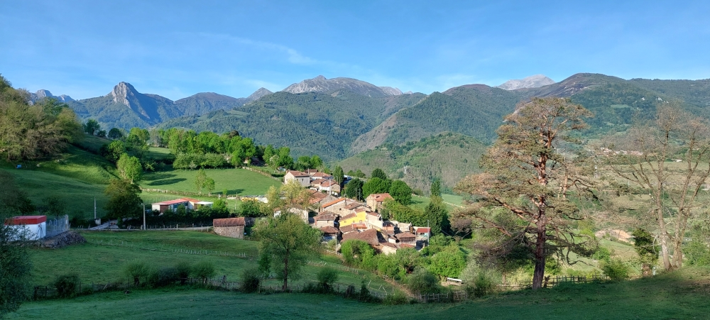
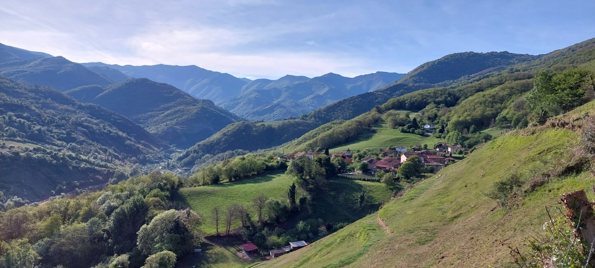
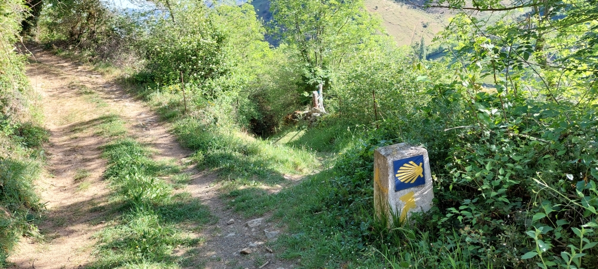
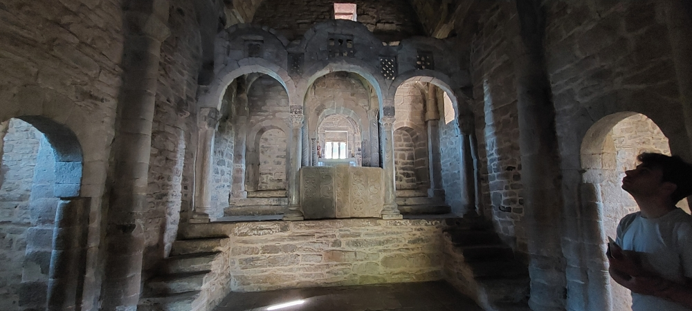
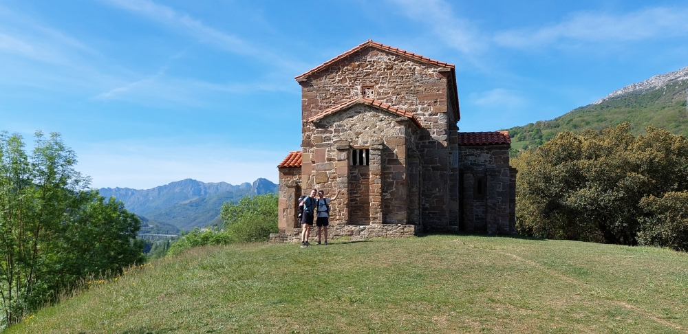
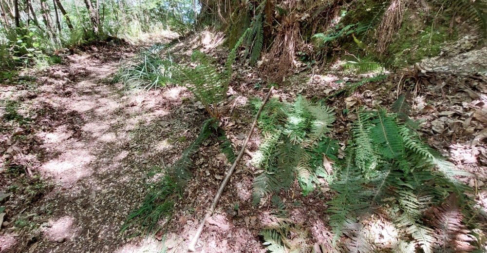

## Camino del Salvador 2023 

### Etappe_05: Bendueños → Mieres
2 Mai 2023

#### No te pases el desvío a la derecha
Die Abzweigung nach rechts nicht verpassen
Não perder o desvio para a direita
Don’t miss the turn-off to the right

- A partir de aquí dejamos atrás las montañas. ⁘  Von hier an lassen wir die Berge hinter uns.
- A partir daqui, deixamos as montanhas para trás ⁘ From here on, we’ll be leaving the mountains behind us.

#### Iglesia de Santa Cristina de LLena

Zwei Bekannte vom vergangenen Nachmittag ⁘ Dos conocidos de la tarde de ayer
Two people I met yesterday afternoon ⁘ Dois conhecidos da tarde de ontem
#### Eine kleine Pause, um neue Energie zu tanken,
denn bis Mieres ist es noch ein kleines Stückchen

- Uma pequena pausa para recarregar energias, pois ainda falta um pouco até Mieres.
- A quick break to recharge our batteries, as we’ve still got a bit to go before we reach Mieres.
- Un pequeño descanso para recargar energías, ya que aún queda un trocito hasta Mieres.
#### Mieres

Ich habe im Studentenwohnheim übernachtet, und obwohl ich mit meinem Rucksack auf dem Rücken und völlig erschöpft ankam, hat sich niemand daran gestört. Für die Studenten scheinen solche Situationen ganz normal zu sein.

Pasé la noche en la residencia de estudiantes y, aunque llegué con la mochila a la espalda y completamente agotado, a nadie le molestó. Para los estudiantes, este tipo de situaciones parecen ser algo totalmente normal.

Passei a noite na residência universitária e, apesar de ter chegado com a mochila às costas e completamente exausto, ninguém se importou. Para os estudantes, este tipo de situações parece ser perfeitamente normal.

I spent the night in the student hall of residence, and although I arrived with my rucksack on my back and completely exhausted, nobody seemed to mind. Situations like that seem to be quite normal for the students.

---
# →

🔁 [2023_2025_Camino-del-Salvador_Etappen](2023_2025_Camino-del-Salvador_Etappen.md)

↪ [2023_Etappe-07_Mieres_Oviedo](2023_Etappe-07_Mieres_Oviedo.md)

