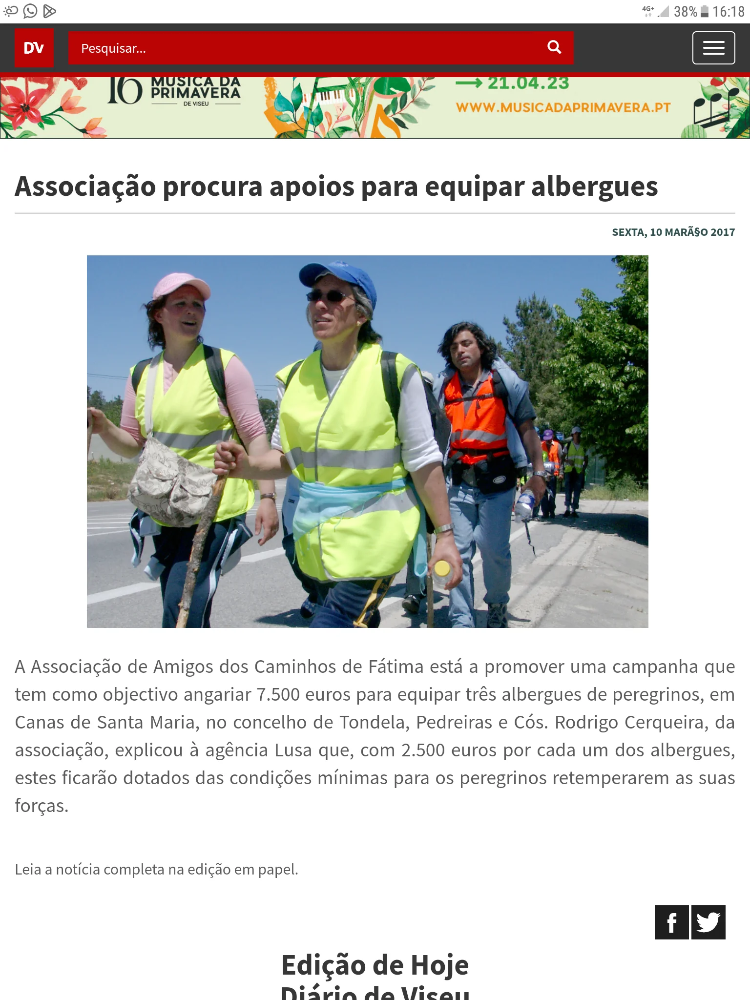

#  A Promessa Herdada

## A minha primeira peregrinação

🇵🇹 Tudo começou com uma promessa da minha avó, Graça de Jesus Cardoso: uma peregrinação a pé, de Ferreira de Aves até ao Santuário de Nossa Senhora de Fátima. Não sei ao certo quando nasceu este voto. Terá sido nos anos 40, quando o meu tio (cujo nome esqueci, embora me tenha sido dito) faleceu prematuramente, pouco após o batismo, entre 1946 e 1950, numa década também marcada por uma crise conjugal? Ou terá sido talvez entre meados dos anos 60 e 70, quando o irmão dela, o meu tio-avô Armando de Jesus Cardoso, foi detido — segundo as informações — na sequência de uma agressão física numa situação tensa? Talvez tenha sido o conjunto de muitas circunstâncias. 

O certo é que, por volta de 1976, debilitada pela idade e por graves problemas de saúde física e psicológica, a minha avó já não conseguiu cumprir a sua palavra. A minha mãe decidiu então assumir o fardo desse voto. Ano pós ano, foi adiando a partida, mas sempre que o dia 13 de Maio se aproximava, o peso daquela promessa pendente roubava-lhe a paz. No sábado, 6 de Maio de 2006, por volta do meio-dia, enquanto estávamos no terreno do Valongo, percebi que, pela idade e saúde , ela jamais conseguiria cumprir a herança espiritual que voluntariamente aceitara. No momento em que ela recordou a promessa por saldar, movido por um impulso e sem pensar, prometi-lhe:  "Eu vou lá cumprir a promessa". E assim foi. No dia 8 de Maio de 2026, às 4 horas da madrugada, fiz-me à estrada, a caminho de Fátima.

### Meu Tio-avô

>Quem conheceu o meu tio-avô sabia que ele era uma pessoa pacífica e, no seu comportamento, eram visíveis indícios desses acontecimentos, de tal forma que todos sabiam de algo, mas ninguém questionava, muito menos falava abertamente sobre o que tinha acontecido. Em vez disso, fizeram votos à Nossa Senhora de Fátima para superar esses momentos de angústia e incerteza. 
..., ... .
..., ... . 
..., ... .

Esta fotografia foi publicada a 10 de março de 2017 e tirada a 8 de maio de 2006, por volta das 14 horas, na IP3, perto do Lidl.
Nessa altura, a tia Elena já estava a receber cuidados no hospital de Viseu. E, se bem me lembro, o peregrino (o Zé? de Aldeia Nova), que tinha começado o caminho connosco em Ferreira de Aves, também foi ao hospital para fazer exames, depois de ter sentido dores na perna.  Mais tarde, ele disse que as dores que sentira se deviam ao esforço inicial e que, segundo os médicos, poderia ter continuado a caminhar. Devido à placa metálica que tinha na perna, temia que a situação pudesse agravar-se, mas depois de saber que estava tudo bem, lamentou não ter continuado a peregrinação.

🇩🇪 Das geerbte Gelübde

## Meine erste Wallfahrt

Alles begann mit einem Gelübde meiner Großmutter, Graça de Jesus Cardoso: einer Fußwallfahrt von Ferreira de Aves zum Heiligtum der Muttergottes von Fátima. Ich weiß nicht genau, wann dieses Gelübde entstand. War es in den 40er Jahren, als mein Onkel (dessen Namen ich vergessen habe, obwohl er mir genannt wurde) kurz nach seiner Taufe zwischen 1946 und 1950 vorzeitig verstarb, in einem Jahrzehnt, das auch von einer Ehekrise geprägt war? Oder war es vielleicht zwischen Mitte der 60er und 70er Jahre, als ihr Bruder, mein Großonkel Armando de Jesus Cardoso, – den Informationen zufolge – infolge einer körperlichen Auseinandersetzung in einer angespannten Situation festgenommen wurde? Vielleicht war es das Zusammenspiel vieler Umstände.

Tatsache ist, dass meine Großmutter um das Jahr 1976 herum, geschwächt durch ihr Alter und schwere körperliche sowie psychische Gesundheitsprobleme, ihr Versprechen nicht mehr einhalten konnte. Meine Mutter beschloss daraufhin, die Last dieses Gelübdes auf sich zu nehmen. Jahr für Jahr schob sie die Abreise hinaus, doch immer wenn der 13. Mai näher rückte, raubte ihr die Last dieses noch nicht erfüllten Versprechens den Seelenfrieden. Am Samstag, dem 6. Mai 2006, gegen Mittag, als wir uns auf dem Gelände von Valongo befanden, wurde mir klar, dass sie aufgrund ihres Alters und ihres Gesundheitszustands niemals in der Lage sein würde, das geistliche Erbe zu erfüllen, das sie freiwillig angenommen hatte. In dem Moment, als sie sich an das noch ausstehende Versprechen erinnerte, versprach ich ihr, von einem Impuls getrieben und ohne nachzudenken: „Ich werde das Versprechen erfüllen.“ Und so kam es auch. Am 8. Mai 2026, um 4 Uhr morgens, machte ich mich auf den Weg nach Fátima.

Dieses Foto wurde am 10. März 2017 veröffentlicht und am 8. Mai 2006 gegen 14 Uhr auf der IP3 in der Nähe des Lidl aufgenommen.

Zu diesem Zeitpunkt wurde Tante Elena bereits im Krankenhaus in Viseu versorgt. Und wenn ich mich recht erinnere, ging auch der Pilger (Zé? aus Aldeia Nova), der den Weg mit uns in Ferreira de Aves begonnen hatte, ins Krankenhaus, um sich untersuchen zu lassen, nachdem er Schmerzen im Bein verspürt hatte.  Später sagte er, dass die Schmerzen, die er verspürt hatte, auf die anfängliche Anstrengung zurückzuführen waren und dass er laut den Ärzten hätte weitergehen können. Wegen der Metallplatte in seinem Bein hatte er befürchtet, dass sich etwas verschlimmern könnte, aber nachdem er erfahren hatte, dass alles in Ordnung war, bereute er, nicht weitergelaufen zu sein.

---
### Mein Großonkel
>Wer meinen Großonkel kannte, wusste, dass er ein friedlicher Mensch war, und in seinem Verhalten waren Anzeichen dieser Ereignisse so deutlich zu erkennen, dass zwar jeder etwas ahnte, aber niemand Fragen stellte, geschweige denn offen darüber sprach, was geschehen war. Stattdessen legten sie Nossa Senhora de Fátima ein Gelübde ab, um diese Momente der Sorge und Ungewissheit zu überwinden.

---

Foto de 2006  publicada no Diário de Viseu no dia 10 de Março de 2017
Foto aus dem Jahr 2006, veröffentlicht im „Diário de Viseu“ am 10. März 2017

### 🇵🇹 Os últimos Peregrinos

Em 2006, fomos um dos últimos grupos de peregrinos desta região a caminho de Fátima; só depois de Coimbra é que encontrámos outros peregrinos. Nesse dia 8 de maio de 2006, alguns jornalistas aproximaram-se de nós e tiraram fotografias. Proibimos a sua publicação.

--- 
### 11 anos mais tarde

A 10 de março de 2017, eu estava a trabalhar na «Signalwerk Wuppertal», na Vohwinkelerstraße 268, no departamento de eletrónica, na «estação de medição de oscilações», e estava precisamente a analisar «as curvas características do recetor e do emissor», quando recebi uma chamada da minha irmã Fátima, de Paris, que me perguntou se eu estava em Portugal para cumprir um voto (promessa).

Quando ela me enviou uma captura de ecrã, não fiquei surpreendido por a fotografia ter sido publicada, pois na Alemanha fomos bem informados pela imprensa e pela televisão sobre uma nova lei europeia relativa à publicação de fotografias de terceiros. Se houver duas pessoas visíveis na fotografia, é obrigatório obter consentimento para a poder publicar. No caso de fotografias com três ou mais pessoas, o consentimento já não é necessário.

---

 🇩🇪 Die letzten Pilger

Im Jahr 2006 waren wir eine der letzten Pilgergruppen aus dieser Gegend auf dem Weg nach Fátima; erst hinter Coimbra trafen wir auf andere Pilger. An diesem 8. Mai 2006 kamen Journalisten auf uns zu und machten Fotos. Wir haben die Veröffentlichung untersagt.

---
### 11 Jahre später

Am 10. März 2017 war ich bei der Arbeit im „Signalwerk Wuppertal“, Vohwinkelerstraße 268, in der Elektronikabteilung am „Wobbeln-Messplatz“ und analysierte gerade „die Empfänger- und Sender-Kennlinien“, als ich einen Anruf von meiner Schwester Fátima aus Paris erhielt, die mich fragte, ob ich in Portugal sei, um ein Gelübde zu erfüllen.
Als sie mir einen Screenshot schickte, war ich nicht überrascht, dass das Foto veröffentlicht worden war, denn in Deutschland wurden wir durch die Presse und das Fernsehen gut über ein neues europäisches Gesetz zur Veröffentlichung von Fotos Dritter informiert. Sind zwei Personen auf dem Foto zu sehen, muss zwingend eine Einwilligung eingeholt werden, um es veröffentlichen zu dürfen. Bei Fotos mit drei oder mehr Personen ist eine Einwilligung nicht mehr erforderlich.

---

🔁 [Os_Caminhos](https://github.com/GomesDeSa-JA/Camino-del-Salvador_2023-2025/blob/main/Os_Caminhos.md)

↪ 

 ...→
