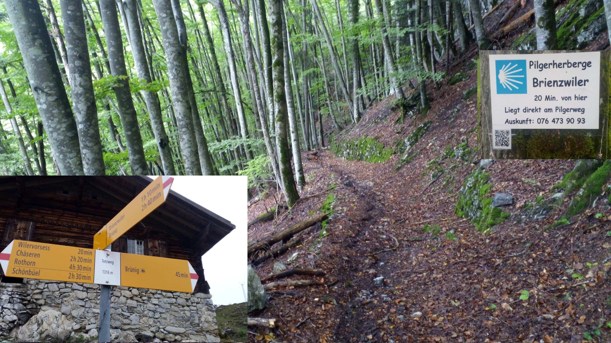
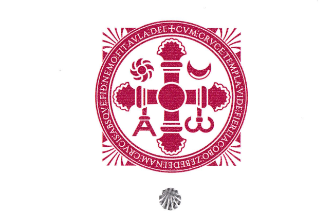
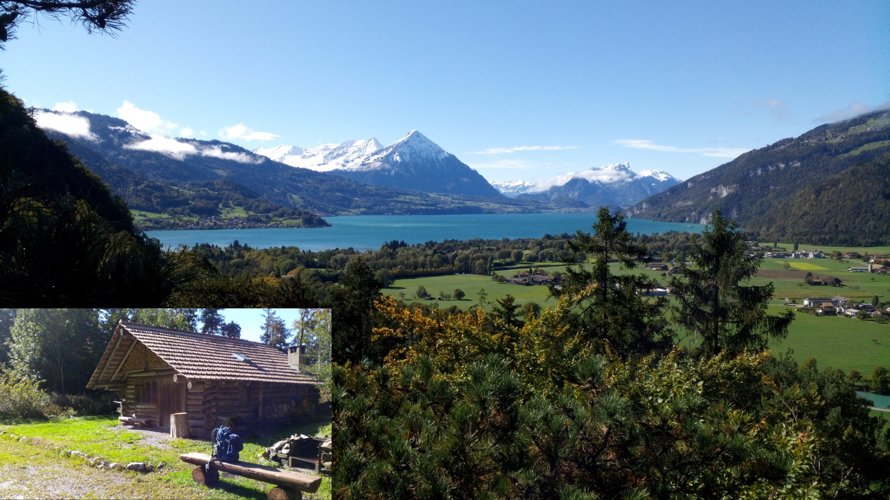

# O Meu Caminho
***Memórias, Credenciais e Horizontes por descobrir***

## 📜 A História da Minha Credencial 

🇵🇹 O início de tudo

Havia tempos em que eu apanhava o Eurolines para Portugal. Eram 24 horas de viagem sem paragens pelo meio, apertadas, com garrafões de vinho de 5 litros debaixo do banco e com farnéis de chouriço e presunto lá da terra, ou sacos de chocolate e rebuçados para os que lá tinham ficado. Depois, durante uma década e meia, fui sempre de comboio, no comboio noturno (D-Zug) e no Sul-Expresso, onde os lugares normais não se reservavam. Sorte tinha aquele que encontrava um assento livre; muitas vezes passávamos a noite encostados à porta, e quem encontrava um cantinho no corredor para se acocorar sempre podia fechar os olhos. O bate-papo aqui e um cigarro ali eram a nossa distração noturna para nos mantermos acordados. Mas com os novos comboios TGV e Thalys, tudo mudou; já não dá para abrir as janelas, respirar o ar fresco da noite e fumar um cigarro. Naqueles Tempos viajar de comboio era uma verdadeira aventura.

Nessa mesma altura, a Ryanair apareceu no ar e também se construíram as vias subterrâneas no Porto para o Metro ter ligação ao Aeroporto. Em duas ou três horas dá-se um salto e alcança-se meio mundo; quem abdicar de ir ao restaurante no fim de semana, consegue o dinheiro para o bilhete e ainda sobram uns trocados para a cerveja em Portugal. 

Tudo se complicou e, ao mesmo tempo, tudo se tornou tão fácil e rápido. Por isso, eu apanhava o avião da Renânia do Norte-Vestfália até ao Porto e, antes de seguir viagem para Viseu, decidia prolongar a minha estadia num hostel por mais um ou dois dias para conhecer a cidade. 

Ao deambular por aquelas ruelas à procura de um «Menu tradicional com sabores nórdicos», só tropeçava em francesinhas — aqueles sabores modernos que, segundo ouvi dizer, são muito apreciados pelos turistas. Eu não só tropecei nas francesinhas, mas também encontrei peregrinos que estavam a fazer o Caminho de Santiago pela "Via Lusitana". Despertaram a minha curiosidade e pensei em, um dia, fazer também este caminho. No dia seguinte, apanhei o comboio (Metro) e fui até Vila do Conde. É um saltinho. Nesse dia, fui à procura da sardinha, mas não encontrei pescadores nem marinheiros. Nessas voltas por lá, deparei-me com o Albergue de Peregrinos. Entrei para ver o ambiente e, como precisava de uma nova credencial para o próximo caminho, perguntei se tinham alguma. 

A senhora que me atendeu viu-me com a mochila pequena, não estava cansado, vinha todo fresquinho, e deve ter percebido que eu, naquela manhã, não era um peregrino do Caminho de Santiago, mas sim um turista banal. Por isso, atendeu-me com uma amabilidade distante, sem intenção de me oferecer um banco para me sentar e tirar as botas. Depois de lhe explicar o motivo da minha visita, mostrando uma credencial antiga já esgotada (sem campos livres para novos caminhos) que trazia na minha bolsa de cintura (pochete), consegui convencê-la das minhas intenções sérias. Com um tom suave, ela entregou-me esta nova Credencial de Peregrino. Já tem um campo preenchido com o carimbo do Albergue de CH-Brienzwiler ("Pilgerherberge CH-Brienzwiler"). Era a partir daqui que eu queria continuar para dar vida aos campos em branco desta credencial, mas essa é outra história...

Agora, não sei qual será o Caminho que vai narrar, com passos documentados nestes espaços em branco por percorrer, a história desta credencial.

---
# Mein Weg
***Erinnerungen, Pilgerausweise und zu entdeckende Horizonte***

## 📜 Die Geschichte meines Pilgerausweises

🇩🇪 Wie alles begann 

Es gab Zeiten, da bin ich mit dem Bus der  Eurolines nach Portugal gefahren. Das waren 24 Stunden Fahrt ohne Zwischenstopps, sehr eng, mit 5-Liter-Großflaschen unter dem Sitz und mit Provianttaschen voller Chouriço und Schinken aus der Heimat oder Tüten mit Schokolade und Bonbons für die Verwandten dort. Danach bin ich anderthalb Jahrzehnte lang immer mit dem Zug gefahren – mit dem Nachtzug (D-Zug) und dem Sul-Expresso, in denen man die normalen Sitzplätze nicht reservieren konnte. Glück hatte, wer einen freien Platz fand; oft verbrachten wir die Nacht an die Tür gelehnt, und wer ein kleines Plätzchen im Gang fand, um sich hinhocken zu können, konnte wenigstens mal die Augen schließen. Ein Plausch hier, eine Zigarette dort, das war unsere nächtliche Ablenkung, um wach zu bleiben. Aber mit den neuen TGV- und Thalys-Zügen hat sich alles geändert; man kann die Fenster nicht mehr öffnen, um die frische Nachtluft einzuatmen und eine Zigarette zu rauchen.

Genau zu dieser Zeit tauchte Ryanair am Himmel auf, und im Porto wurden die unterirdischen Tunnel gebaut, damit die Metro eine Anbindung an den Flughafen hat. In zwei oder drei Stunden macht man heute einen Sprung und erreicht die halbe Welt. Wenn man am Wochenende auf den Restaurantbesuch verzichtet, reicht das Geld schon für das Ticket, und es bleibt sogar noch etwas Kleingeld für ein Bier in Portugal übrig. 

Alles ist komplizierter geworden und gleichzeitig so einfach und schnell. Deshalb habe ich damals das Flugzeug von Nordrhein-Westfalen nach Porto genommen. Bevor ich weiter nach Viseu fuhr, beschloss ich, meinen Aufenthalt in einem Hostel um ein oder zwei Tage zu verlängern, um die Stadt kennenzulernen.

Beim Schlendern durch die engen Gassen auf der Suche nach einem „Traditionellen Menü nordischer Küche“ stieß ich an jeder Ecke auf Francesinhas – diese modernen Kreationen, die, wie ich hörte, bei Touristen sehr beliebt sind. Ich stolperte aber nicht nur über die Francesinhas, sondern traf auch Pilger, die den Jakobsweg auf der "Via Lusitana" gingen. Sie weckten meine Neugier, und ich dachte mir, dass ich diesen Weg eines Tages auch gehen möchte. Am nächsten Tag nahm ich die Metro nach Vila do Conde, das ist nur ein Katzensprung. An diesem Tag war ich auf der Suche nach Sardinen, aber Fischer oder Seeleute habe ich an dem Tag nicht getroffen. 

Bei meinen Runden dort stieß ich auf die Pilgerherberge. Ich ging hinein, um mir die Atmosphäre anzusehen, und da ich für meinen nächsten Weg einen neuen Pilgerausweis brauchte, fragte ich, ob sie welche da hätten.
Die Dame, die mich bediente, sah mich mit meinem kleinen Rucksack – nicht müde, völlig erholt – und dachte sich wohl, dass ich an diesem Morgen kein echter Jakobsweg-Pilger war, sondern nur ein ganz gewöhnlicher Tourist. Deshalb bediente sie mich mit einer distanzierten Freundlichkeit und war nicht gerade darauf aus, mir eine Bank anzubieten, damit ich mich hinsetzen und die Stiefel ausziehen konnte. Nachdem ich ihr den Grund meines Besuchs erklärt hatte – und mithilfe eines alten, bereits vollen Pilgerausweises ohne freie Felder für neue Wege, den ich in meiner Bauchtasche (Pochete) dabei hatte –, konnte ich sie von meinen ernsten Absichten überzeugen. Mit freundliche Stimme überreichte sie mir diesen neuen Pilgerausweis. 

>Er hat bereits ein ausgefülltes Feld mit dem Stempel der Pilgerherberge CH-Brienzwiler. Genau hier wollte ich anknüpfen, um die leeren Felder dieses Ausweises mit Leben zu füllen, aber das >ist eine andere Geschichte...

Jetzt weiß ich noch nicht, welcher Weg die Geschichte dieses Ausweises mit dokumentierten Schritten auf diesen noch unberührten weißen Feldern erzählen wird.

---

---
# Mi camino
***Recuerdos, Credenciales de Peregrino y Horizontes por descubrir***

## 📜 La Historia de mi Credencial de Peregrino

🇪🇸 Cómo empezó todo

Hubo un tiempo en que tomaba el autobús de Eurolines para ir a Portugal. Eran 24 horas de viaje sin paradas intermedias, muy apretados, con garrafas de vino de 5 litros debajo del asiento y con meriendas de chorizo y jamón de la tierra, o bolsas de chocolate y caramelos para los de allá. Después, durante una década y media, viajé siempre en tren, en el tren nocturno (D-Zug) y en el Sul-Expresso, donde los asientos normales no se reservaban. Suerte tenía aquel que encontraba un asiento libre; a menudo pasábamos la noche apoyados en la puerta, y quien encontraba un rincón en el pasillo para ponerse de cuclillas al menos podía cerrar los ojos. Una charla aquí y un cigarrillo allá eran nuestra distracción nocturna para mantenernos despiertos. Pero con los nuevos trenes TGV y Thalys todo cambió; ya no se pueden abrir las ventanas para respirar el aire fresco de la noche y fumar un cigarrillo.

En esa misma época apareció Ryanair en el aire y también se construyeron las vías subterráneas en Oporto para que el metro tuviera salida al aeropuerto. En dos o tres horas das un salto y alcanzas medio mundo; si dejas de ir al restaurante el fin de semana, el dinero te da para el billete y aún te sobran unas monedas para una cerveza en Portugal. 

Todo se complicó y, al mismo tiempo, todo se volvió tan fácil y rápido. Por eso, yo tomaba el avión desde Renania del Norte hasta Oporto y, antes de seguir camino hacia Viseu, decidía prolongar mi estancia en un hostal uno o dos días más para conocer la ciudad.

Al deambular por esas callejuelas en busca de un "Menú tradicional con sabores nórdicos", no hacía más que tropezar con francesinhas, esos sabores modernos que, según escuché, son muy apreciados por los turistas. No solo tropecé con las francesinhas, sino que también encontré peregrinos que estaban haciendo el Camino de Santiago por la "Via Lusitana". Despertaron mi curiosidad y pensé en hacer este camino yo también algún día. Al día siguiente tomé el tren (metro) y fui hasta Vila do Conde, es un saltito. Ese día fui en busca de sardinas, pero no encontré pescadores ni marineros, y en mis vueltas por allí me topé con el Albergue de Peregrinos. Entré para ver el ambiente y, como necesitaba una nueva credencial para el próximo camino, preguntó si tenían.

La señora que me atendió me vio con la mochila pequeña; no estaba cansado, llegaba lleno de energía, y debió de darse cuenta de que, aquella mañana, no era un peregrino del Camino de Santiago, sino un turista cualquiera. Por eso, me atendió con una amabilidad distante, sin intención de ofrecerme un banco para sentarme y quitarme las botas. Tras explicarle el motivo de mi visita y mostrarle una credencial antigua ya agotada (sin espacios libres para nuevos tramos) que llevaba en mi riñonera, logré convencerla de la seriedad de mis intenciones. Con un tono suave, me entregó esta nueva credencial de peregrino. Ya tiene un espacio rellenado con el sello del albergue de CH-Brienzwiler («Pilgerherberge CH-Brienzwiler»). Era a partir de aquí donde quería continuar para dar vida a los espacios en blanco de esta credencial, pero esa es otra historia... 

Ahora no sé cuál será el Camino que narrará, con pasos documentados en estos campos blancos por recorrer, la historia de esta credencial.

---
# My journey 
***Memories, Pilgrim’s Credentials and Horizons yet to be discovered***

## 📜 The story of my pilgrim’s credential

🇬🇧 How it all began 

There was a time when I used to take the Eurolines coach to Portugal. It was a 24-hour journey with no stops along the way, packed to the brim, with 5-litre bottles of wine under the seats and snacks of chorizo and local ham, or bags of chocolate and sweets for those back home. After that, for a decade and a half, I always travelled by train – on the night train (D-Zug) and the Sul-Expresso – where standard seats couldn’t be booked. Lucky was the person who found a free seat; we often spent the night leaning against the door, and whoever managed to find a corner in the aisle to crouch down in could at least close their eyes. A chat here and a cigarette there were our night-time distractions to keep us awake. But with the new TGV and Thalys trains, everything changed; you can no longer open the windows to breathe in the fresh night air and have a cigarette.

Around the same time, Ryanair took to the skies and the underground tunnels were built in Porto to connect the metro to the airport. In two or three hours, you can hop on a flight and reach half the world; if you skip going to a restaurant at the weekend, you’ll have enough money for the ticket and still have a few coins left over for a beer in Portugal. 

Everything got more complicated and, at the same time, everything became so easy and quick. That’s why I’d fly from North Rhine-Westphalia to Porto and, before continuing on to Viseu, I’d decide to extend my stay at a hostel for another day or two to explore the city.

As I wandered through those narrow streets in search of a ‘traditional menu with Nordic flavours’, I kept coming across francesinhas – those modern dishes which, from what I’d heard, are very popular with tourists. Not only did I come across francesinhas, but I also met pilgrims who were walking the Camino de Santiago via the ‘Via Lusitana’. They piqued my curiosity and I thought about walking this route myself one day. The next day I took the train (metro) and went to Vila do Conde – it’s just a short hop away. That day I was on the lookout for sardines, but I didn’t come across any fishermen or sailors, and whilst wandering around there I stumbled upon the Pilgrims’ Hostel. I went in to get a feel for the place and, as I needed a new pilgrim’s passport for my next journey, I asked if they had any.

The lady who attended to me saw me with my small rucksack; I wasn’t tired, I looked quite fresh, and she must have realised that, that morning, I wasn’t a pilgrim on the Way of St James, but just an ordinary tourist. So she treated me with a distant politeness, with no intention of offering me a bench to sit on and take off my boots. After explaining the reason for my visit, showing her an old, full pilgrim’s credential (with no blank spaces left for new routes) that I was carrying in my bum bag, I managed to convince her of my serious intentions. In a gentle tone, she handed me this new Pilgrim’s Credential. It already had one section stamped by the CH-Brienzwiler Pilgrims’ Hostel (“Pilgerherberge CH-Brienzwiler”). It was from here that I wanted to carry on to fill in the blank sections of this credential, but that’s another story..., 

>... and now I don't know which Camino will share its history, documenting my steps across these blank spaces yet to be traveled.

---

## A minha Credencial com Horizontes por descobrir

Bedeutung der Inschrift 

**CVM CRVCE - TEMPLA VIDE FIERI IACOBO ZEBEDEI  
NAM CRVCIS ABSQVE FIDE NEMO FIT AVLA DEI** 

**Diese Inschrift gehört zu den Weihekreuzen der Kathedrale von Santiago de Compostela.**

🇩🇪 „Sieh, wie dieser Tempel mit dem Kreuz für Jakobus, den Sohn des Zebedäus, errichtet wird; denn ohne den Glauben an das Kreuz wird niemand zur Wohnstätte Gottes.“

🇵🇹 „Vê como este templo é erguido com a Cruz para Tiago, filho de Zebedeu; pois sem a fé na Cruz ninguém se torna morada de Deus.“

🇪🇸 „Mira cómo este templo se hace con la Cruz para Santiago, hijo de Zebedeo; porque sin la fe en la Cruz nadie se convierte en morada de Dios.“

🇬🇧 “Behold how this temple is built with the Cross for James, son of Zebedee; for without faith in the Cross no one becomes a dwelling place of God.”

---

🔁 [Camino-del-Salvador_Etappen](Camino-del-Salvador_Etappen.md)

 ...→