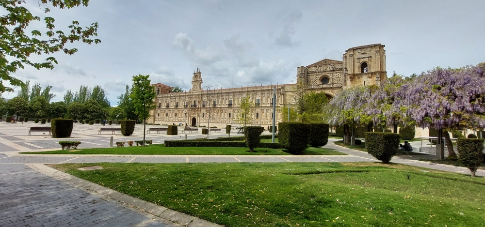
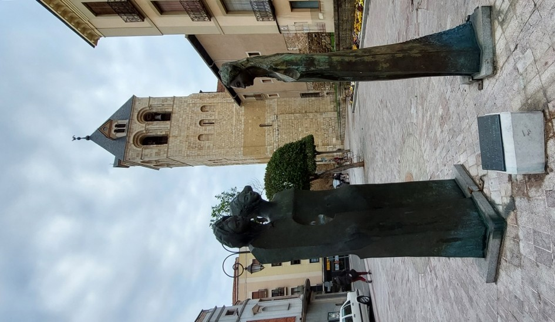
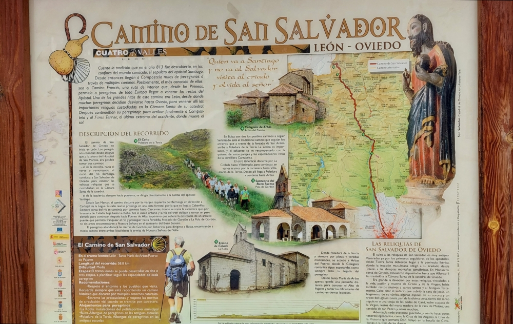
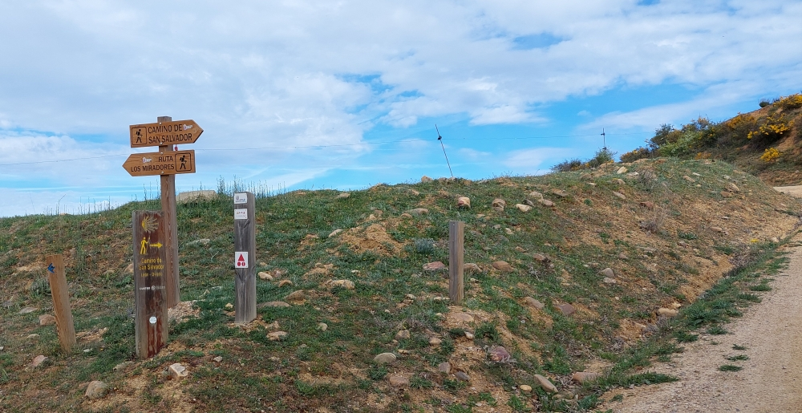
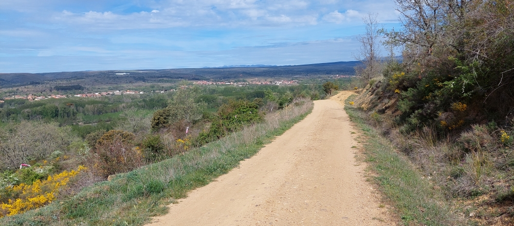
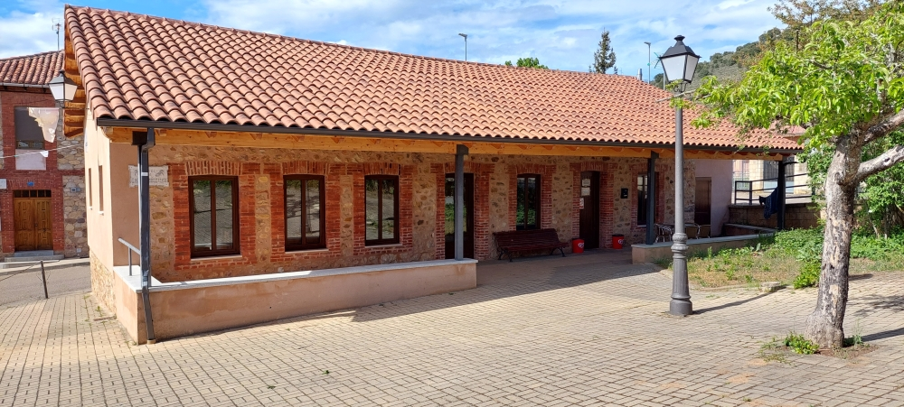
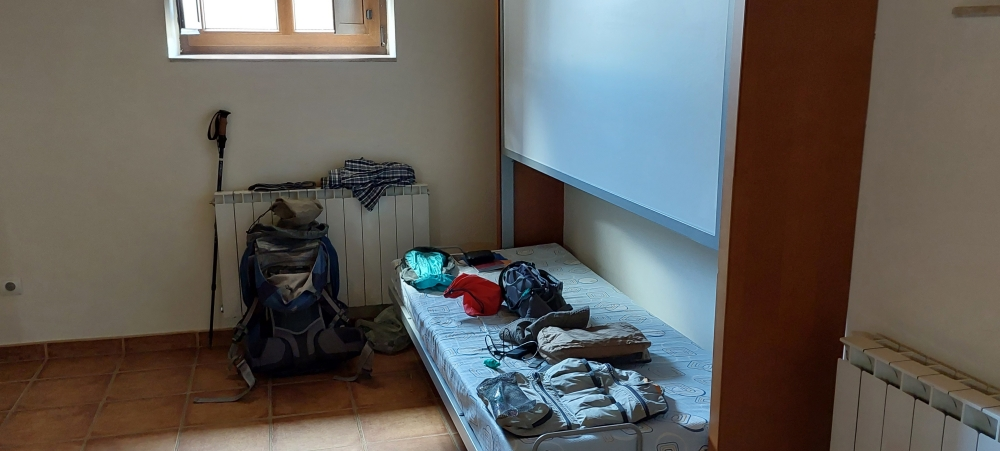

###### Top
## Camino del Salvador 2023 

###  León 
26 April 2023

Ankunft  ⁘  Chegada  ⁘  Llegada  ⁘  Arrival
#### Convento de San Marcos ⁘ Plaza de San Marcos

##### 🇩🇪 **Hinweis**  
Convento de San Marcos / Die Plaza San Marcos markiert den Beginn des Pilgerwegs „San Salvador“
Bleiben Sie auf dieser Seite des Flusses, da sich hier auch Pilger des Französischen Wegs kreuzen; achten Sie darauf, ihnen nicht zu folgen, und überqueren Sie daher nicht die Brücke.

Ich (wir) bin (sind) am Fluss Bernesga entlang bis zum Olympiastadion von León gegangen und habe (haben) bis dorthin die gelben Pfeile nicht befolgt; an dieser Stelle muss man  nach rechts abbiegen und gelangt auf die Hauptstraße, wo die gelben Pfeile in Richtung Cabajal de la Legua – Cabanillas weisen und eine beruhigende Orientierung bieten.
##### 🇬🇧 tip
Convento de San Marcos / Plaza de San Marcos marks the start of the ‘San Salvador’ pilgrimage route

Stay on this side of the river, as this is where you’ll also come across pilgrims on the Camino Francés; so be careful not to follow them and, for that reason, do not cross the bridge.

I (we) walked along the River Bernesga as far as the Estadio Olímpico de León without following the yellow arrows; at that point, you inevitably have to turn right and join the main road, where you’ll find the signposted and reassuring yellow arrows pointing towards Cabajal de la Legua – Cabanillas.
##### 🇵🇹 Dica
Convento de San Marcos /  Praça de San Marcos marca o início do Caminho dos Peregrinos «San Salvador»
Fique deste lado do rio, pois aqui também se cruzam peregrinos do Caminho Francês;  tenha cuidado para não os seguir e, portanto, não atravesse a ponte.

Eu (nós) segui(amos) ao longo do rio Bernesga até ao Estádio Olímpico de Leão e, até lá, não segui(amos) as setas amarelas; nesse ponto, temos que  virar à direita e entra-se na estrada principal, com as setas amarelas indicadoras e reconfortantes na direção de Cabajal de la Legua - Cabanillas.
##### 🇪🇸 nota 
Convento de San Marcos / La plaza de San Marcos marca el inicio del Camino de los Peregrinos «San Salvador». Quédate a este lado del río, ya que por aquí también pasan los peregrinos del Camino Francés; por eso, ten cuidado de no seguirles y, por lo tanto, no cruces el puente.

Yo (nosotros) seguí (seguimos) a lo largo del río Bernesga hasta el Estadio Olímpico de León y, hasta allí, no seguí (seguimos) las flechas amarillas; en ese punto, hay que girar a la derecha y se entra en la carretera principal, con las reconfortantes flechas amarillas que indican la dirección hacia Cabajal de la Legua - Cabanillas.

### Etappe_01: León - Cabanillas  (18,4 Km ) 
27 April 2023 
#### Monumento a las Infantas de Leon

Ein Foto am Morgen ⁘ Una foto por la mañana ⁘ Uma foto na manhã ⁘ A photo taken in the morning

#### Ich bin auf den richtigen Weg  ⁘  I’m on the right path ⁘ Voy por el buen camino  ⁘  Estou no caminho certo

#### 🇩🇪 Ab hier nur ich (wir) und die Natur
 

Am Wochenende sind bereits viele Wanderer und Sportler auf dem Wanderweg unterwegs, sodass man den Weg nicht mehr ganz für sich allein hat. 

🇪🇸 A partir de aquí, solo  yo (nosotros) y la naturaleza

Durante el fin de semana ya hay muchos excursionistas y deportistas en la ruta de senderismo, por lo que ya no se tiene el camino completamente para usted solo.

🇵🇹 A partir daqui, só eu (nós) e a natureza.

Ao fim de semana, já há muitos caminhantes e desportistas a percorrer o trilho, e já não se tem o caminho só para si.

🇬🇧 From here, it’s just me (us) and nature

 At the weekend, there are already plenty of walkers and sports enthusiasts out on the trail, so you no longer have the path all to yourself. 

#### Albergue de peregrinos de Cabanillas

 

*Ich habe 2023 in dieser Herberge übernachtet, und 2025 haben wir den überdachten Bereich und den Tisch genutzt, um uns auszuruhen und etwas zu essen*.

🇩🇪  Diese Unterkunft eignet sich besonders für Pilger, die die erste Etappe nicht bis nach La Robla verlängern möchten. Wer hier übernachten möchte, sollte vorher telefonisch nachfragen und vorsichtshalber etwas Verpflegung mitnehmen, da die Versorgungsmöglichkeiten im Ort begrenzt sind bzw nicht vorhanden sind.

Die Herberge befindet sich in einem Mehrzweckgebäude des Dorfes, das auch für Veranstaltungen genutzt wird. Für Pilger wurden an einer Wand vier klappbare Betten eingerichtet. Als ich 2023 dort übernachtete, gab es lediglich einen Kaffee- und Getränkeautomaten. Aus früheren Pilgerberichten wusste ich, dass diese Automaten nicht immer aufgefüllt waren.

Ich hatte jedoch Glück. Nach meiner Ankunft gönnte ich mir zunächst ein gut gekühltes Getränk aus dem Automaten. Am nächsten Morgen funktionierte auch der Kaffeeautomat problemlos und versorgte mich mit zwei Espressi – ein angenehmer Start in den zweiten Pilgertag.

Im Jahr 2024 machten Roze und ich hier während unserer Wanderung eine Pause. Die überdachten Sitzbänke luden zum Ausruhen ein, und mit einem kühlen Getränk aus dem Automaten konnten wir neue Kraft sammeln. Viele Pilger laufen achtlos daran vorbei, obwohl die Herberge nur etwa 50 Meter rechts vom Camino entfernt liegt. Selbst wenn man dort nicht übernachtet, ist sie ein hervorragender Ort für eine entspannte Rast.

---
##### 🇵🇹 Albergue de Peregrinos de Cabanillas 

*Fiquei hospedado neste albergue em 2023 e, em 2025, utilizámos a área coberta e a mesa para descansar e comer alguma coisa.*

É uma excelente opção para quem prefere dividir a primeira etapa antes de chegar a La Robla. No entanto, convém telefonar com antecedência e levar alguma comida, uma vez que as possibilidades de abastecimento na localidade são limitadas ou inexistentes.

O edifício funciona como centro comunitário e apenas uma pequena parte está adaptada para peregrinos, com quatro camas rebatíveis instaladas numa parede. Em 2023 existiam apenas máquinas automáticas de café e bebidas, que nem sempre estavam abastecidas, segundo relatos de outros peregrinos.

Felizmente tive sorte. À chegada pude beber uma bebida bem fresca e, na manhã seguinte, a máquina de café funcionou perfeitamente, oferecendo-me dois expressos que marcaram um excelente início para o segundo dia de caminhada.

Em 2024, Roze e eu fizemos aqui uma pausa. Aproveitámos os bancos cobertos para descansar e recuperar energias com bebidas frescas. Muitos peregrinos nem se apercebem deste local, situado apenas cerca de 50 metros à direita do caminho. Mesmo sem pernoitar, vale a pena parar aqui para descansar.

---
##### 🇪🇸  Albergue de Peregrinos de Cabanillas 

*Me alojé en este albergue en 2023 y, en 2025, utilizamos la zona cubierta y la mesa para descansar y comer algo.*
 
Es una buena alternativa para quienes prefieren no caminar hasta La Robla el primer día. Conviene llamar con antelación y llevar algo de comida,dado que las posibilidades de abastecimiento en la localidad son limitadas o inexistentes.

El edificio funciona principalmente como centro social del pueblo y dispone de cuatro camas abatibles para peregrinos. En 2023 solo había máquinas expendedoras de café y bebidas, que no siempre estaban abastecidas.

Tuve suerte: al llegar disfruté de una bebida bien fría y, a la mañana siguiente, pude empezar la etapa con dos cafés espresso.

En 2025, Roze y yo hicimos aquí una agradable pausa para descansar bajo la zona cubierta y recuperar fuerzas antes de continuar.

---
##### 🇬🇧  Albergue de Peregrinos de Cabanillas

*I stayed at this hostel in 2023, and in 2025 we used the covered area and the table to relax and have a bite to eat.*

It is an excellent option for pilgrims who do not wish to continue all the way to La Robla on the first day. It is advisable to call in advance and bring some food, as the local amenities are limited or non-existent.

The building mainly serves as the village community centre, with four fold-away beds installed for pilgrims. In 2023 there were only coffee and drink vending machines, which were not always fully stocked.

Fortunately, I was lucky. After arriving, I enjoyed a cold drink, and the following morning I was able to start the day with two espresso coffees.

In 2024, Roze and I stopped here for a break. The covered benches provided the perfect place to rest and recharge before continuing our journey.

---

🔁 [Camino-del-Salvador_Etappen](Camino-del-Salvador_Etappen.md)

↪ [Etapa-02_Cabanillas_La-Robla](Etapa-02_Cabanillas_La-Robla.md)

---
👣 *"Gehen ist des Menschen beste Medizin"*
Hippokrates von Kos, griechischer Arzt, um 460 v. Chr. – um 370 v. Chr.)

Ultreia et Suseia ! 🌟
 
 ...→