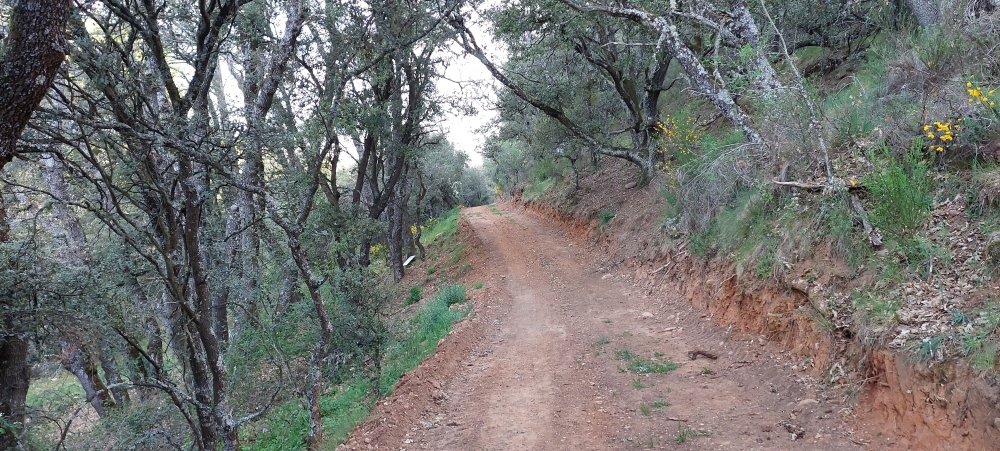
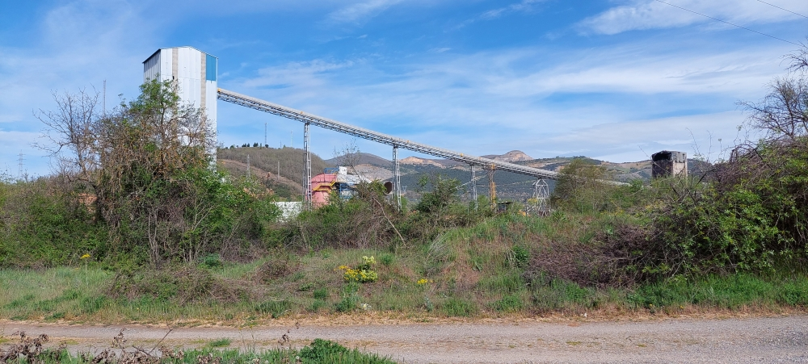
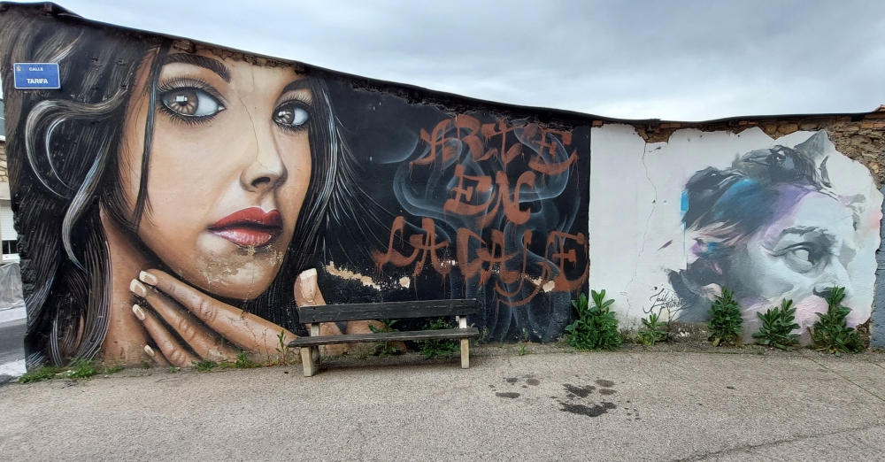
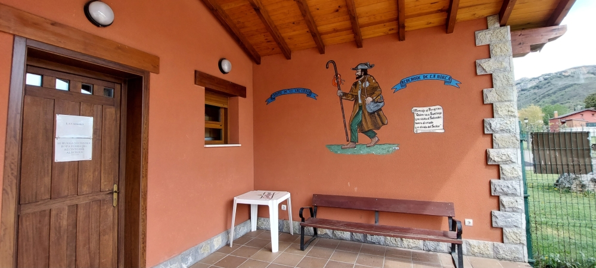

## Camino del Salvador 2023 

### Etappe_02: Cabanillas - La Robla (8,8 Km)
28 April 2023
#### 🇩🇪 Ohne Worte 

Sem palavras  ⁘  Without words ⁘ Sin palabras

#### 🇵🇹 Uma forma diferente de paisagismo 
 
 
🇩🇪 Eine etwas andere Art der Landschaftsgestaltung 

🇬🇧 A slightly different approach to landscaping

🇪🇸 Una forma diferente de diseñar el paisaje

---
#### 🇬🇧 Street art invites you to sit down 
– thanks, but on these sunny days I’d rather find a bit of shade.

I didn’t notice that in 2025; the poncho does restrict your view.

🇩🇪 Street Art lädt dazu ein, Platz zu nehmen, danke, aber an diesen sonnigen Tagen suche ich lieber ein bisschen Schatten.

Im Jahr 2025 ist mir das entgangen; der Poncho schränkt schon die Sicht ein.

🇵🇹 Arte urbana convida a sentar-se, obrigado, mas nestes dias de sol prefiro procurar um pouco de sombra.

Em 2025, isso passou-me despercebido; o poncho já limita a visão.

🇪🇸 El arte urbano invita a sentarse, gracias, pero en estos días soleados prefiero buscar un poco de sombra.

En el año 2025 se me pasó por alto; el poncho ya limita la visión.

#### 🇪🇸 Albergue de La Robla

- Eine Bank, die dazu einlädt, sich einen Moment hinzusetzen, die Wanderstiefel auszuziehen und tief durchzuatmen. Du bist angekommen.

- Um banco que te convida a sentar-se por um momento, a tirar as botas de caminhada e a respirar fundo. Chegaste.

- A bench that invites you to sit down for a moment, take off your walking boots and take a deep breath. You’ve arrived.

- Un banco que te invita a sentarte un momento, a quitarte las botas de montaña y a respirar hondo. Ya has llegado.

---

🔁 [Camino-del-Salvador_Etappen](Camino-del-Salvador_Etappen.md)

↪ [La-Robla_Poladura-de-la-Tercia](Etapa-03_La-Robla_Poladura-de-la-Tercia.md)

---

Mañana? *Un nuevo día, un nuevo camino!*

 Morgen? *Einer neue  Tag,  eine neue Weg!* 

Tomorrow?  *A new day, a new path!*

Amanhã?  *Um novo dia, um novo caminho!*

---

👣 *Buon Cammino!*

 ...→