## Camino del Salvador 2023 
### Etappe_03:  La Robla → Poladura de la Tercia
29 April 2023
#### 13 Portugiesen, eine eingeschworene Gemeinschaft 

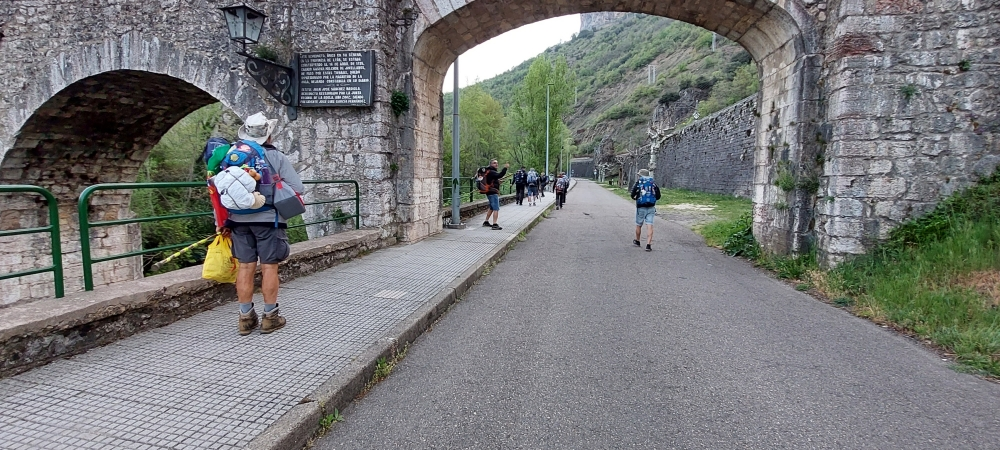

🇵🇹 Há anos que fazem peregrinações juntos; só isso já é algo especial

🇩🇪 Seit Jahren gehen sie gemeinsam auf Pilgerreisen; schon das allein ist etwas Besonderes

🇬🇧 They have been going on pilgrimages together for years; that in itself is something special

🇪🇸 Llevan años haciendo peregrinaciones juntos; eso por sí solo ya es algo especial

---
#### 🇵🇹 O grupo seguiu em frente, 
eu fiquei para trás; os meus pés pareciam, de alguma forma, pesados neste caminho

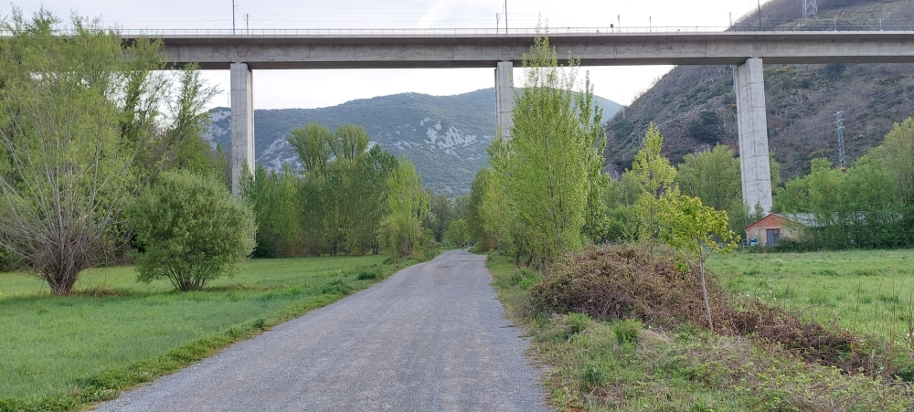

🇩🇪 Die Gruppe gingen weiter, ich ließe mich zurück fallen, meine Füsse waren irgendwie schwer auf diesen Weg.

🇬🇧 The group carried on; I fell behind – my feet felt somehow heavy on this path.

🇪🇸 El grupo siguió adelante; yo me quedé rezagado, ya que, por alguna razón, me pesaban los pies al caminar por ese sendero.

---
#### 🇬🇧 A link to the world

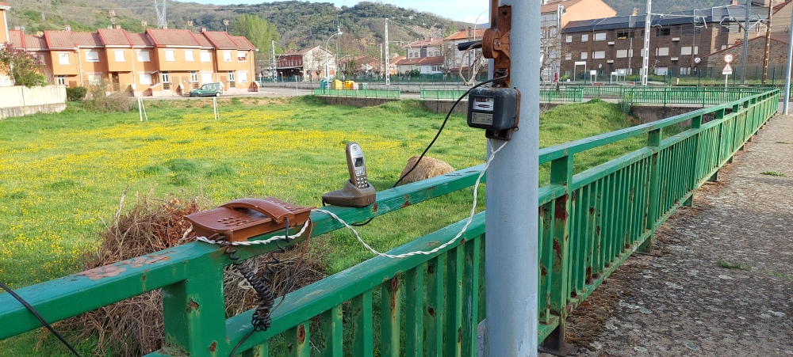

Even when you’re deep in the mountains, you can stay in touch with the world for free thanks to state-of-the-art communication systems. 

🇪🇸 Una conexión con el mundo
Aunque te encuentres en plena montaña, puedes mantenerte en contacto con el mundo de forma gratuita gracias a los sistemas de comunicación más modernos. 

🇩🇪 Eine Verbindung zu der Welt
Auch wenn man sich mitten in den Bergen befindet, kann man über modernste Kommunikationssysteme kostenlos mit der Welt in Verbindung bleiben. 

🇵🇹 Uma ligação com o mundo
Mesmo estando no meio das montanhas, é possível manter-se em contacto com o mundo gratuitamente através de sistemas de comunicação de última geração.

---
#### Transhumancia 

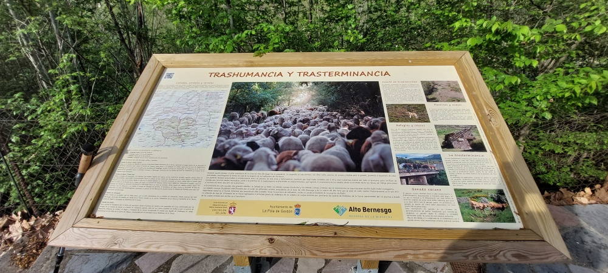
##### 🇪🇸 Transhumancia o pastoreo migratorio
**Un recuerdo de tiempos pasados.** 
Antiguamente, este camino era más que una simple ruta espiritual y de senderismo. Era un camino de vida.

**Significado y práctica**

- **Traslado estacional:** Desplazamiento del ganado en busca de climas y pastos favorables.
- **Dimensión cultural:** Acompañado de tradiciones, música, gastronomía y fiestas populares.
- **Importancia ecológica:** Contribuye a la sostenibilidad y la gestión de los ecosistemas de montaña.

##### 🇩🇪 _Transhumanz_ oder Wandertierhaltung
**Eine Erinnerung an vergangene Zeiten.** 
Früher war diese Weg mehr als nur nur einen spirituellen und Wanderweg. Es war  ein Weg des Lebens  

**Bedeutung und Praxis**

- **Saisonale Wanderung:** Viehtrieb auf der Suche nach günstigem Klima und Weideland.
- **Kulturelle Dimension:** Begleitet von Traditionen, Musik, Gastronomie und Volksfesten.
- **Ökologische Bedeutung:** Trägt zur Nachhaltigkeit und zum Management der Ökosysteme in den Bergregionen bei.

##### 🇬🇧 Transhumance or migratory livestock farming
**A reminder of times gone by.** 
In the past, this route was more than just a spiritual and hiking trail. It was a way of life

**Meaning and Practice**

- **Seasonal migration:** The movement of livestock in search of favourable climates and pastures.
- **Cultural dimension:** Accompanied by traditions, music, cuisine and folk festivals.
- **Ecological importance:** Contributes to the sustainability and management of mountain ecosystems

##### 🇵🇹 Transumância ou pastoreio nómada
**Uma recordação de tempos passados.** 
Antigamente, este caminho era mais do que apenas um percurso espiritual e de caminhada. Era um caminho de vida.

**Significado e Prática**

- **Movimento sazonal:** Mudança de gado (sobretudo ovinos) em busca de climas e pastos favoráveis.
- **Dimensão cultural:** Acompanhada por tradições, músicas, gastronomia e festas populares.
- **Importância ecológica:** Contribui para a sustentabilidade e gestão dos ecossistemas serranos

---
#### Ein Wolf beobachtet uns.
Schau in die Ferne, nach links, auf den Felsvorsprung dort oben; bleib auf dem Weg, dann wird dir nichts passieren.

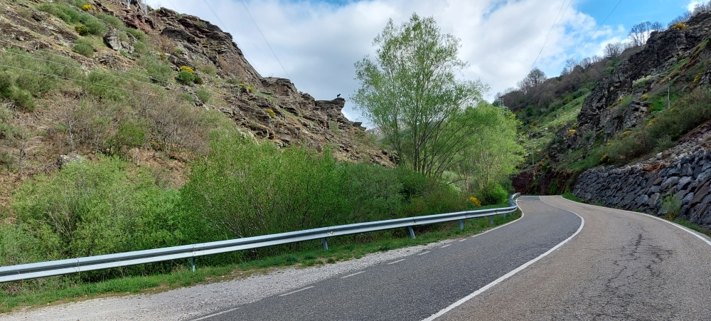

Im Jahr 2025 haben wir die Gefahr nicht bemerkt; die Regentropfen haben uns abgelenkt.

🇵🇹 Um lobo está a observar-nos.
Olha para longe, para a esquerda, para o saliente rochoso lá em cima; mantém-te no caminho e nada acontecerá.

Em 2025, não nos demos conta do perigo; as gotas de chuva distraíram-nos.

🇬🇧 A wolf is watching us.
Look into the distance, to the left, at the rocky outcrop up there; stay on the path, and nothing will happen.

In 2025, we didn’t realise the danger; the raindrops distracted us.

🇪🇸 Un lobo nos está observando.
Mira a lo lejos, a la izquierda, hacia ese saliente rocoso de ahí arriba; no te salgas del camino y no pasará nada.

En el año 2025 no nos dimos cuenta del peligro; las gotas de lluvia nos distrajeron.

---
#### 🇪🇸 Buiza
 Un lugar en el que me hubiera gustado quedarme un poco más, pero había llegado demasiado pronto para terminar aquí mi etapa diaria del Camino de Peregrinación. Di unos pasos más hasta la fuente del pueblo, bebí un sorbo de agua, llené mis botellas y volví a reflexionar. Miré el reloj y me dije a mí mismo: «Para la próxima vez», porque este lugar es realmente un lugar de ensueño.
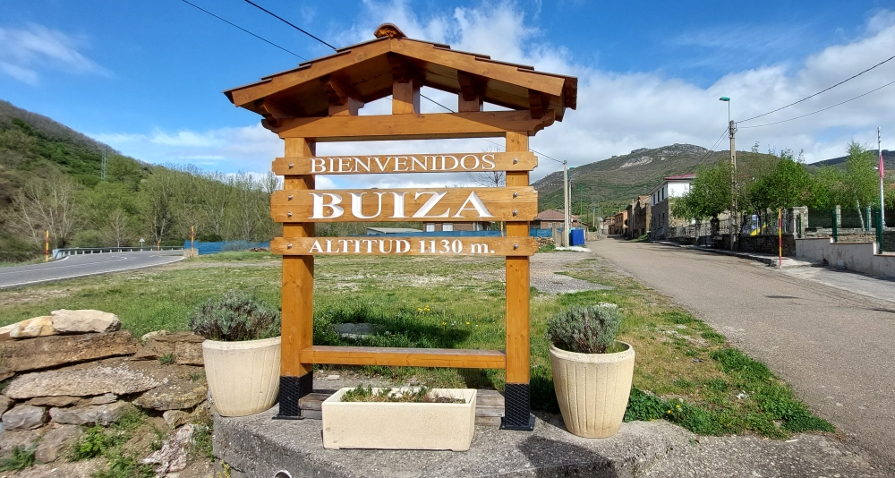

##### 🇩🇪  Buiza
Ein Ort, an dem man gerne noch etwas länger geblieben wäre, aber ich war zu früh angekommen, um meine Tagesetappe auf dem Pilgerweg hier zu beenden. Ich ging noch ein paar Schritte weiter bis zum Dorfbrunnen, trank einen Schluck Wasser, füllte meine Flaschen auf und dachte noch einmal nach. Ich schaute auf die Uhr und sagte mir: „Das nächste Mal“, denn dieser Ort ist wirklich ein traumhafter Ort.

##### 🇵🇹  Buiza
Um lugar onde se gostaria de ficar um pouco mais, mas eu tinha chegado demasiado cedo para terminar aqui a minha etapa diária do Caminho de Peregrinação. Segui mais alguns passos até à fonte da aldeia, bebi um gole de água, enchi as minhas garrafas e pensei novamente. Olhei para o relógio e disse a mim mesmo: «Para a próxima vez», porque este lugar é realmente um lugar de sonho.

##### 🇬🇧 Buiza
A place where I would have liked to stay a little longer, but I’d arrived far too early to end my daily stage of the Pilgrimage Route here. I walked a few more steps to the village fountain, took a sip of water, filled my bottles and thought about it again. I looked at my watch and said to myself: ‘Next time’, because this place really is a dream come true.

---
#### 🇩🇪 Der vergessene Weg nach Santiago
Kaum hatte ich begonnen, diesen Weg zu gehen, wurde schon meine Neugier auf einen neuen geweckt. Es gibt so viel zu entdecken. Wer weiß, aber mir läuft die Zeit davon.

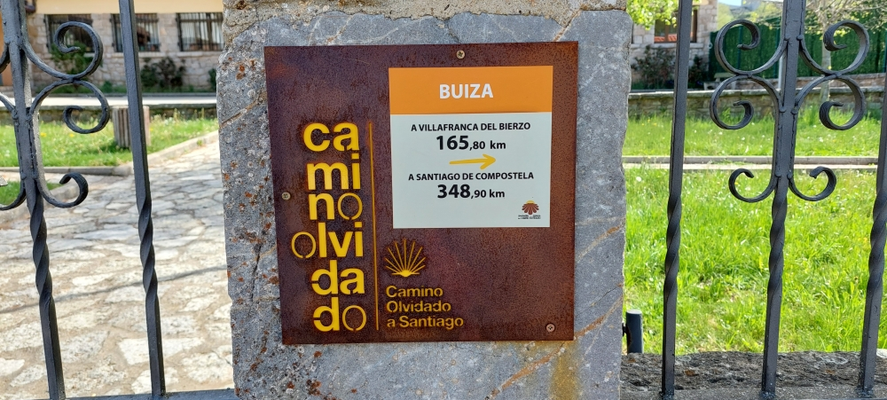

🇬🇧 The Forgotten Way to Santiago
No sooner had I set out on this path than my curiosity was piqued by a new one. There’s so much to discover. Who knows – but time is running out for me.

🇪🇸 Camino Olvidado a Santigo
Apenas había empezado a recorrer este camino cuando ya se había despertado mi curiosidad por uno nuevo. Hay tanto por descubrir. Quién sabe, pero se me acaba el tiempo.

🇵🇹 Caminho Esquecido a Santiago
Mal tinha começado a caminhar este caminho e já me despertaram a curiosidade por um novo. Há tanto para descobrir. Quem sabe, mas o tempo está a esgotar-se-me.  

---
#### 🇩🇪 Die Bilder sprechen für sich.
Das lässt sich nicht in Worte fassen.

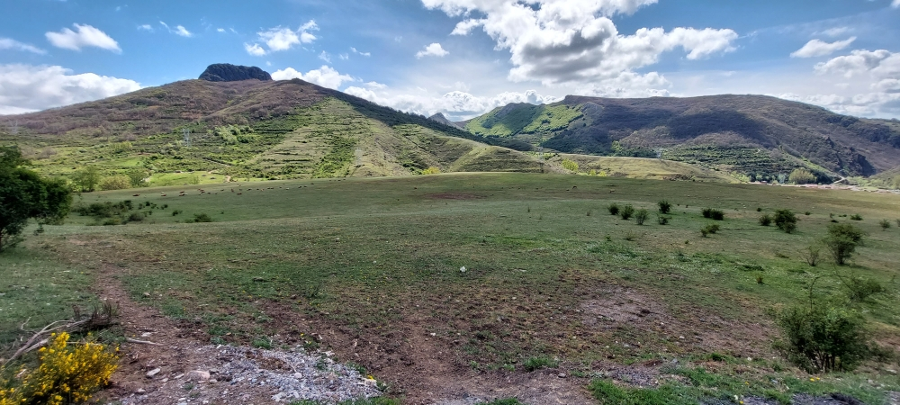

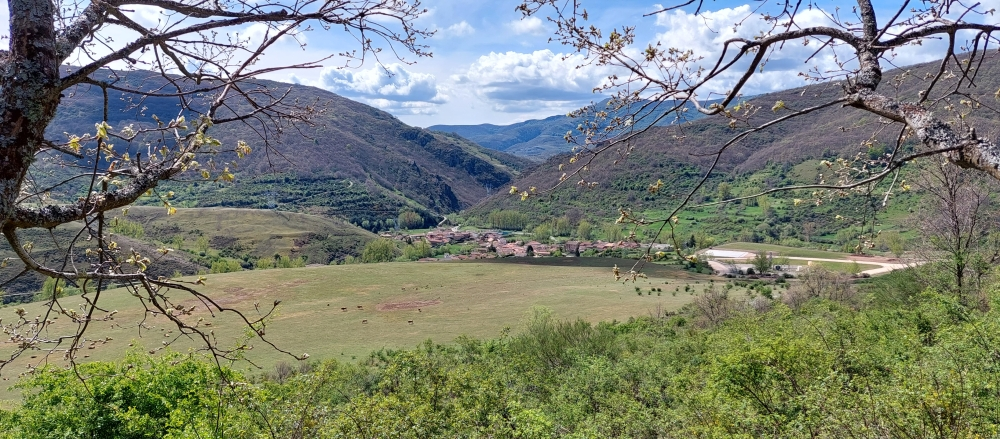

🇪🇸  Las imágenes hablan por sí solas.
No se puede explicar con palabras.

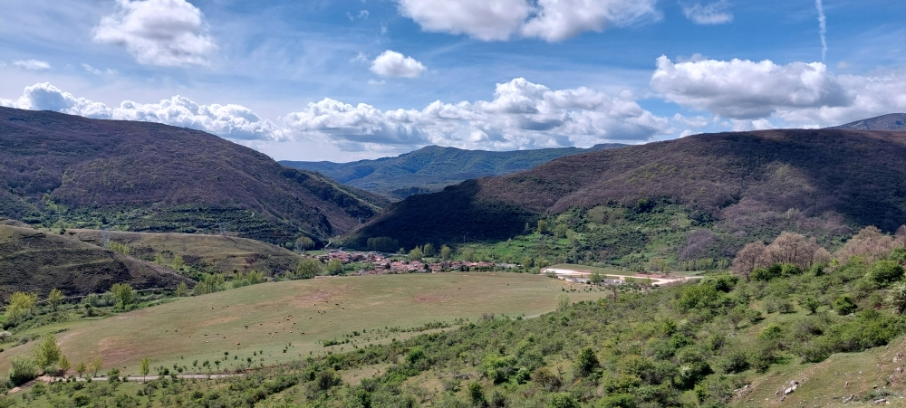

>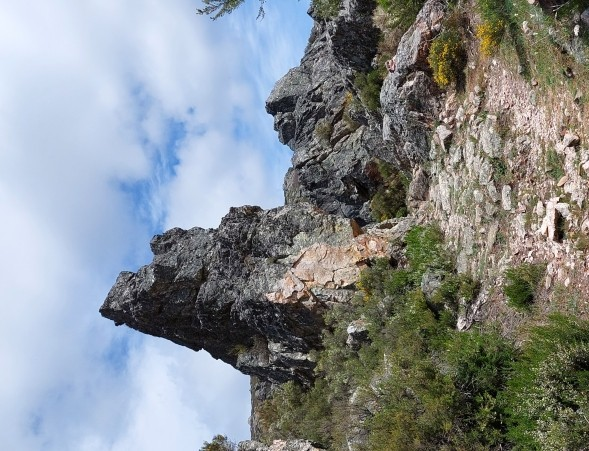

🇵🇹  As imagens falam por si.
Não se consegue explicar com palavras.

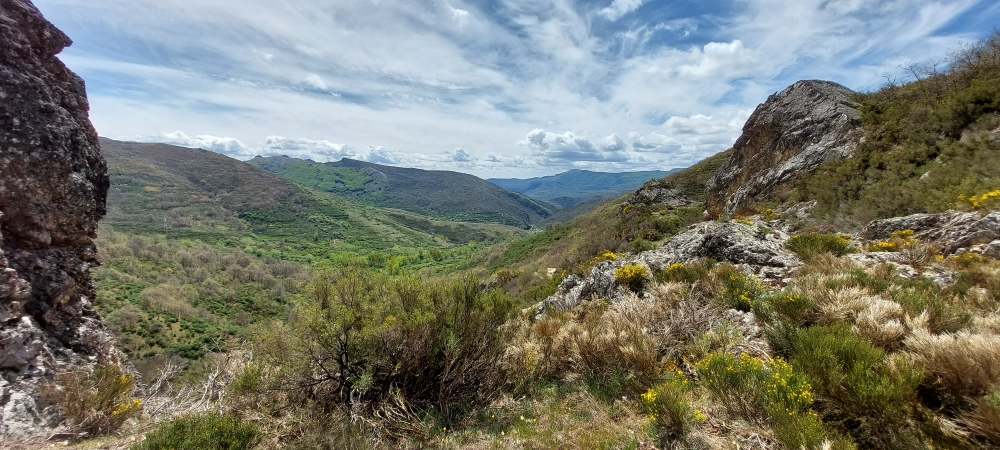

🇬🇧  The pictures speak for themselves.
It’s impossible to put into words.

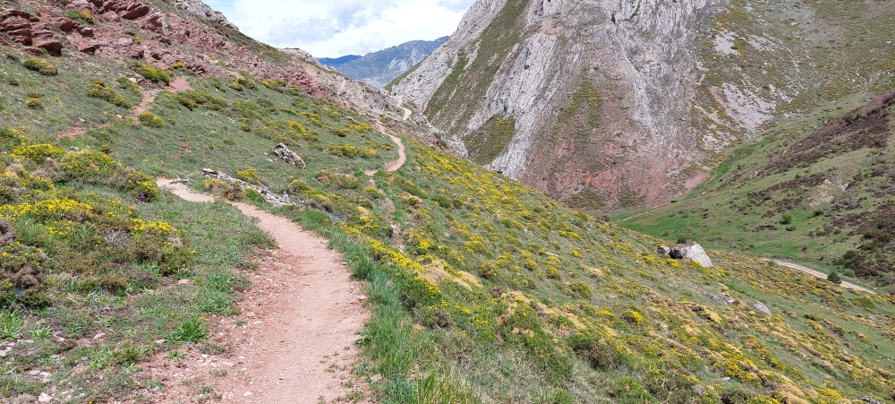

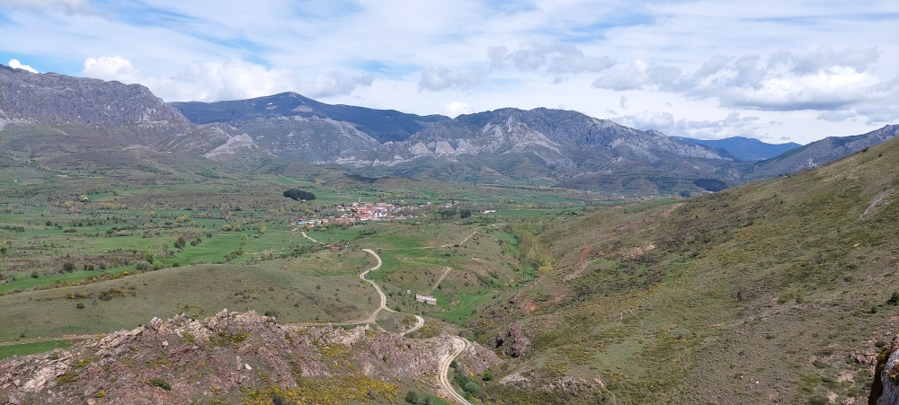

---
#### Poladura de la Tercia
##### 🇩🇪  Die Ankunft 
Am Ende dieser Etappe erreichte ich schließlich Poladura de la Tercia. Ich war der Letzte, der ankam, und alle Schlafplätze waren bereits belegt. Also sagte ich, dass ich mich auch mit einer kleinen Ecke unter einem Tisch irgendwo in der Herberge zufriedengeben würde. Das Betreiberpaar bat mich, mich zunächst auszuruhen – sie würden schon eine Lösung finden.

Ein paar Minuten später kamen sie mit einer Matratze zurück, die sie sich von den Nachbarn ausgeliehen hatten. Offenbar war ich nicht der Einzige, für den kein regulärer Schlafplatz mehr frei war: Im Erdgeschoss lagen im Wohn- und Speiseraum fünf oder sechs Matratzen nebeneinander auf dem Boden. So verbrachte ich die Nacht gemeinsam mit fünf oder sechs der dreizehn portugiesischen Pilger, die ich an diesem Morgen kennengelernt hatte.

**Diese Herberge** bietet nur das Nötigste, ist aber ein wahrer Luxus für alle, die gerade aus den Bergen kommen. Im Dorf gibt es weder einen Laden noch einen Minimarkt, sondern lediglich eine Bar mit Restaurant, die allerdings nicht immer geöffnet ist. Wer dort essen möchte, sollte am besten vorher reservieren.

Ich hatte keinen festen Plan, doch ich habe fast immer etwas Proviant dabei. Es gab Haferflocken, Käse, Schinken und ein paar Brühwürfel – allerdings fehlten Ballaststoffe und Vitamine. Da ich mich schon seit einigen Jahren mit Wildkräutern beschäftigte, wusste ich sofort, was ich zubereiten würde: eine Brennnesselsuppe mit Haferflocken und Brühwürfeln. Ich ging ans Flussufer und pflückte frische Brennnesseln. Einige meiner Mitpilger beobachteten mich neugierig und fragten sich vermutlich, ob das überhaupt schmecken würde.

Mir schmeckte die Suppe hervorragend. Und wie man bei uns so schön sagt: **„In den Bergen schmeckt alles gut.“**

Anschließend ging ich in die Bar und gönnte mir zwei kleine Bier à 0,3 Liter. In Spanien und Portugal ist das die übliche Größe, während sie in Deutschland eher eine Seltenheit ist – dort muss man zwischen den vielen 0,5-Liter-Kasten schon danach suchen.

Als ich zwei Jahre später mit Roze wieder dort war, wollte ich diese Köstlichkeit noch einmal zubereiten. Doch wir waren zu müde, um noch einmal zum Flussufer zu gehen und Brennnesseln zu sammeln. Für den Caminho de Salvador hatte ich mir im Jahr 2023 sieben Tage Zeit genommen; 2025 blieben uns für dieselbe Strecke nur noch fünf Tage.

---
##### 🇵🇹 A chegada

No final desta etapa, cheguei finalmente a Poladura de la Tercia. Fui o último peregrino a chegar e todas as camas já estavam ocupadas. Disse então que ficaria satisfeito até com um pequeno espaço debaixo de uma mesa, em qualquer canto do albergue. O casal responsável pediu-me que descansasse um pouco, pois encontrariam uma solução.

Poucos minutos depois regressaram com um colchão que tinham pedido emprestado aos vizinhos. Pelos vistos, eu não era o único sem cama: no rés do chão, na sala de estar e de refeições, havia cinco ou seis colchões alinhados no chão. Assim, passei a noite nesse espaço com cinco ou seis dos treze peregrinos portugueses que tinha conhecido naquela manhã.

Este albergue oferece apenas o essencial, mas é um verdadeiro luxo para quem acaba de atravessar as montanhas. Na aldeia não existe loja nem minimercado, apenas um bar-restaurante, que nem sempre está aberto. Quem quiser jantar deve fazer reserva com antecedência.

Eu não tinha um plano definido, mas quase sempre levo alguma comida comigo. Tinha flocos de aveia, queijo, presunto e alguns cubos de caldo, mas faltavam fibras e vitaminas. Como já há alguns anos me interessava por plantas silvestres comestíveis, soube imediatamente o que preparar: uma sopa de urtigas com flocos de aveia e caldo. Fui até à margem do rio apanhar urtigas frescas. Alguns dos meus companheiros de albergue observavam-me com curiosidade e provavelmente perguntavam-se se aquilo seria realmente saboroso.

Para mim, estava deliciosa. E, como costumamos dizer: **"Na montanha, tudo sabe bem."**

Mais tarde fui ao bar e ofereci-me duas cervejas pequenas de 0,3 litros. Em Espanha e Portugal, esse é o tamanho habitual, enquanto na Alemanha é uma medida pouco comum.

Quando voltei ali dois anos depois com a Roze, queria preparar novamente esta iguaria. Mas estávamos demasiado cansados para voltar à margem do rio apanhar urtigas. Em 2023 reservei sete dias para percorrer o Caminho de Salvador; em 2025 restavam-nos apenas cinco dias para fazer o mesmo percurso.

---
##### 🇪🇸 La llegada

Al final de esta etapa llegué por fin a Poladura de la Tercia. Fui el último peregrino en llegar y todas las camas ya estaban ocupadas. Así que dije que me conformaría incluso con un pequeño rincón debajo de una mesa, en cualquier parte del albergue. Los hospitaleros me pidieron que descansara un poco mientras encontraban una solución.

Pocos minutos después regresaron con un colchón que habían pedido prestado a unos vecinos. Al parecer, yo no era el único que se había quedado sin cama: en la planta baja, en la sala de estar y comedor, había cinco o seis colchones alineados en el suelo. Así pasé la noche con cinco o seis de los trece peregrinos portugueses que había conocido aquella misma mañana.

Este albergue ofrece solo lo imprescindible, pero para quien llega de cruzar las montañas resulta un auténtico lujo. En el pueblo no hay tienda ni supermercado, únicamente un bar-restaurante que no siempre está abierto. Quien quiera cenar allí debería reservar con antelación.

Yo no tenía ningún plan concreto, pero casi siempre llevo algo de comida conmigo. Tenía copos de avena, queso, jamón y algunos cubitos de caldo, aunque me faltaban fibra y vitaminas. Como desde hacía años me interesaban las plantas silvestres comestibles, enseguida supe qué iba a preparar: una sopa de ortigas con avena y caldo. Bajé hasta la orilla del río para recoger ortigas frescas. Algunos de mis compañeros del albergue me observaban con curiosidad y seguramente se preguntaban si aquello estaría realmente bueno.

A mí me supo deliciosa. Y, como solemos decir: **«En la montaña todo sabe bien».**

Después fui al bar y me tomé dos cervezas pequeñas de 0,3 litros. En España y Portugal ese es el tamaño habitual, mientras que en Alemania resulta bastante poco común.

Cuando regresé dos años después con Roze, quise preparar de nuevo esta delicia. Sin embargo, estábamos demasiado cansados para volver hasta la orilla del río a recoger ortigas. En 2023 había reservado siete días para recorrer el Caminho de Salvador; en 2025 solo nos quedaban cinco días para realizar el mismo recorrido.

---
##### 🇬🇧 The arrival

At the end of this stage, I finally arrived in Poladura de la Tercia. I was the last pilgrim to arrive, and all the beds were already taken. So I said I would be happy with a small space under a table somewhere in the hostel. The couple who ran the hostel told me to get some rest while they looked for a solution.

A few minutes later, they returned with a mattress they had borrowed from the neighbours. Apparently, I wasn't the only one without a proper bed: on the ground floor, in the combined living and dining room, five or six mattresses had been lined up on the floor. That night I slept there with five or six of the thirteen Portuguese pilgrims I had met earlier that morning.

This hostel offers only the bare essentials, but after coming down from the mountains, it feels like a luxury. There is neither a shop nor a small grocery store in the village, only a bar-restaurant, which is not always open. If you want to eat there, it is best to reserve in advance.

I didn't have a specific plan, but I almost always carry some food with me. I had oats, cheese, ham and a few stock cubes, but I was missing fibre and vitamins. Since I had been interested in edible wild plants for several years, I immediately knew what to make: a nettle soup with oats and stock cubes. I walked down to the riverbank and picked some fresh nettles. A few of my fellow pilgrims watched me with curiosity, probably wondering whether it would taste any good.

I thought it was delicious. And as we like to say back home: **"Everything tastes good in the mountains."**

Later, I went to the bar and treated myself to two small beers (0.3 litres each). In Spain and Portugal, this is the standard serving size, whereas in Germany it is quite uncommon.

When I returned two years later with Roze, I wanted to prepare this delicacy again. However, we were too tired to walk back to the riverbank to collect nettles. In 2023, I had set aside seven days for the Caminho de Salvador, but in 2025 we had only five days available to cover the same route.

---

🔁 [Camino-del-Salvador_Etappen](Camino-del-Salvador_Etappen.md)

↪ [Etapa-04_Poladura-de-la-Tercia_Payares](Etapa-04_Poladura-de-la-Tercia_Payares.md)

---

 _Bon Chemin_  
 
 ...→
 