# Camino del Salvador 2023 
### Etappe_03:  Poladura de la Tercia → Payares
30 April 2023

---
#### Bereit zum aufbrechen ⁘ Listo / Pronto para partir ⁘ Ready to set off

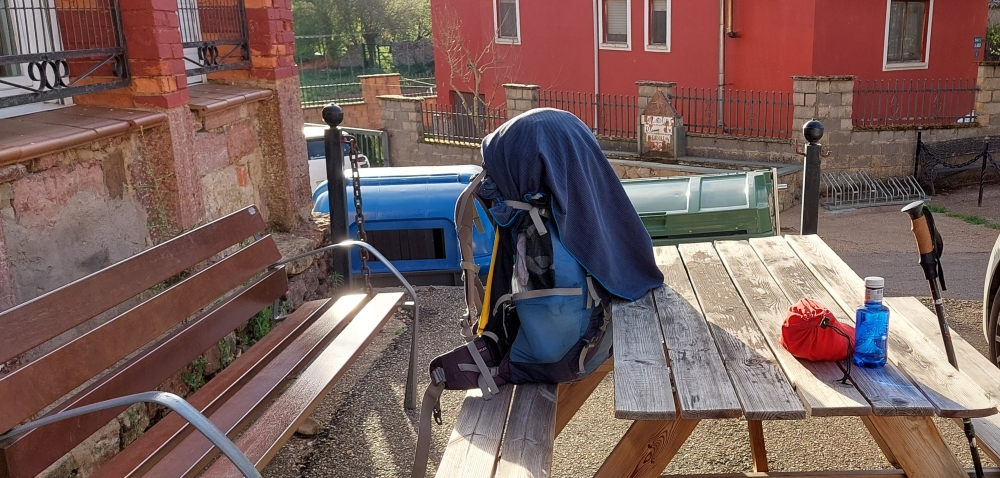

- Um ou outro quilo a menos já seria melhor, mas nessa noite fiquei feliz por poder deitar-me no meu saco-cama.

- Ein oder zwei Kilo weniger wären schon besser gewesen, aber an diesem Nacht war ich einfach froh, mich in meinen Schlafsack legen zu können. 

- Un kilo o dos menos habrían estado mejor, pero aquella noche me alegré simplemente de poder meterme en mi saco de dormir. 

- Losing one or two kilos would have been better, but that night I was just glad to be able to crawl into my sleeping bag.

--- 
#### Experience this wonderful path for yourself  
Even 1,000 words wouldn’t be enough to describe what you see and how it makes you feel.

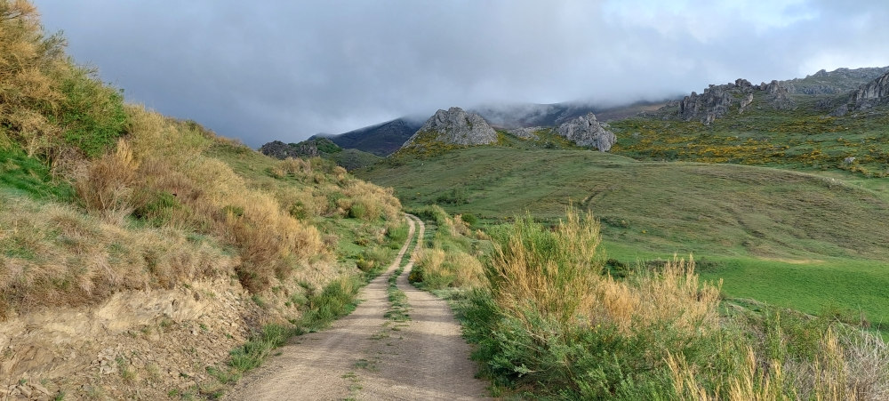

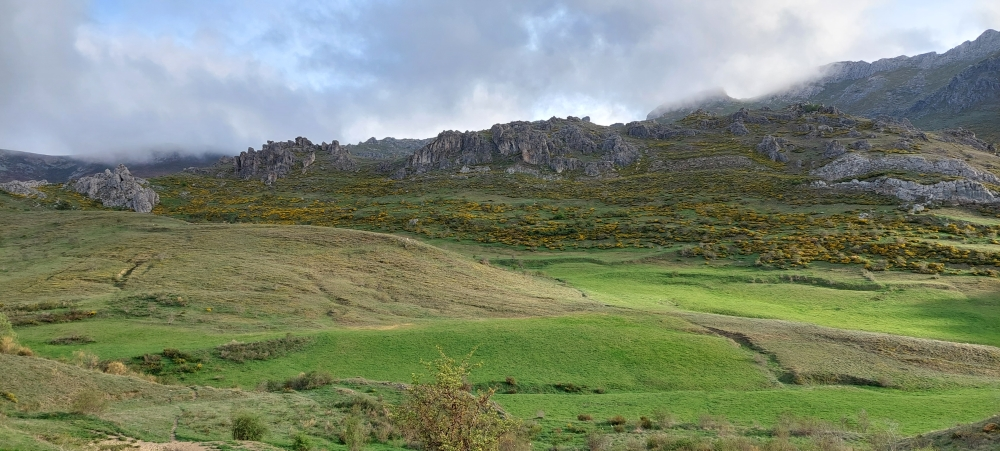

Conheça você mesmo este caminho fantástico
Nem com 1000 palavras conseguiria descrever o que se vê e o que se sente.

---
## ***Guten Morgen!***
- Ich glaube es hat mich verstanden, aber wenn du dir nicht sicher bist, dann sage einfache "**Buenos días!**"

- ***Good morning!***
I think it understood me, but if you're not sure, just say “**Buenos días!**”

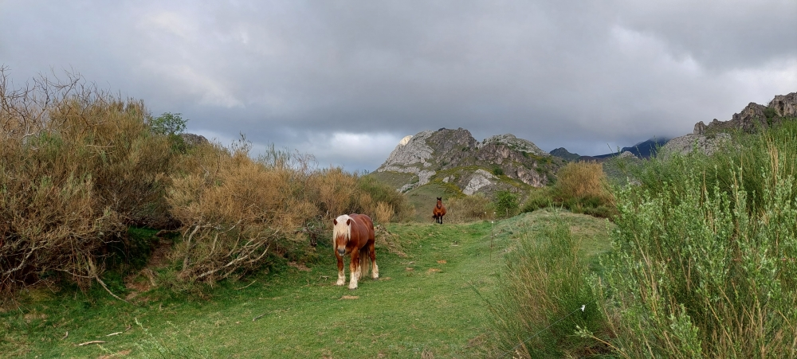

***Bom dia!*** 🐴

🇵🇹 Acho que ele me compreendeu; depois de uns dias por aqui, o meu português já soa mais a cântabro montañés. Ele deve estar a perguntar-se se eu me perdi. 

🇪🇸 Creo que me ha entendido; después de unos días por aquí, mi portugués ya suena más a cántabro montañés. Debe de estar preguntándose si me he perdido.

🇩🇪 Ich glaube, er hat mich verstanden. Nach ein paar Tagen hier klingt mein Portugiesisch schon eher nach kantabrischem Montañés. Wahrscheinlich fragt er sich, ob ich mich verlaufen habe.

🇬🇧  I think he understood me. After a few days here, my Portuguese already sounds more like Cantabrian Montañés. He must be wondering whether I've got lost.

---
#### Experience this wonderful path for yourself  
Even 1,000 words wouldn’t be enough to describe what you see and how it makes you feel.

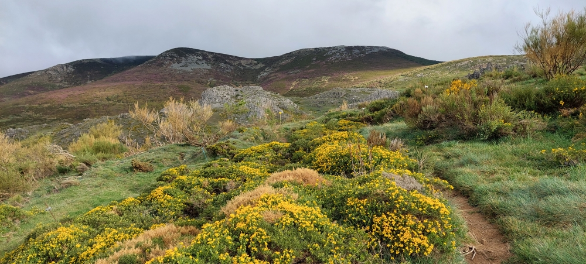

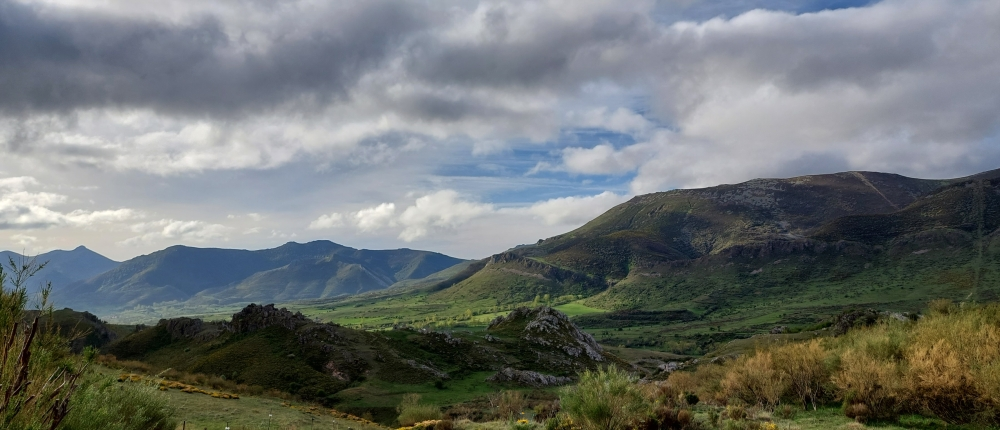

- Erlebe diesen wunderschönen Weg selbst. 
Mit 1000 Wörtern könnte ich nicht beschreiben, was man sieht und was man empfindet.

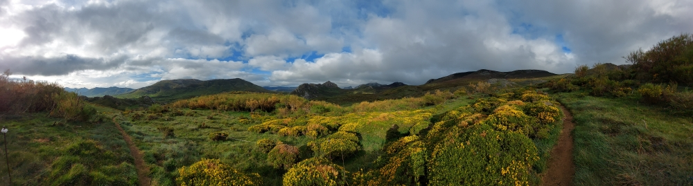

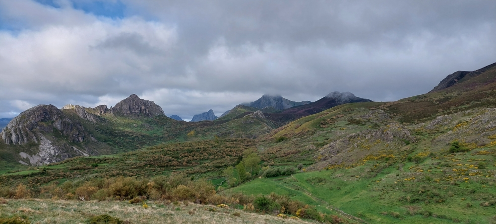

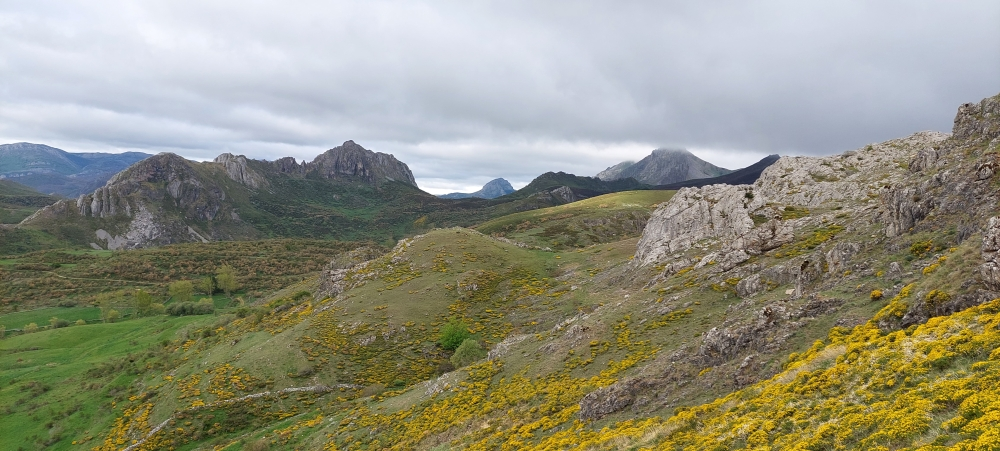

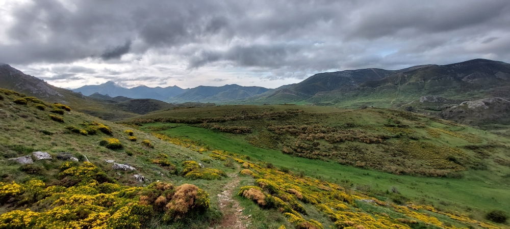

- Descubre por ti mismo este precioso sendero. 
Ni siquiera con mil palabras podría describir lo que se ve y lo que se siente.

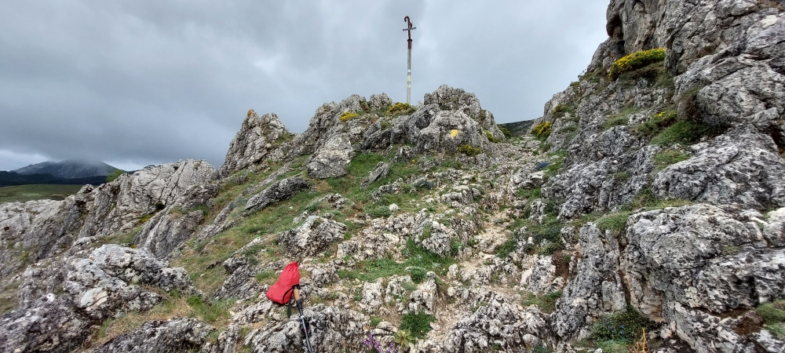

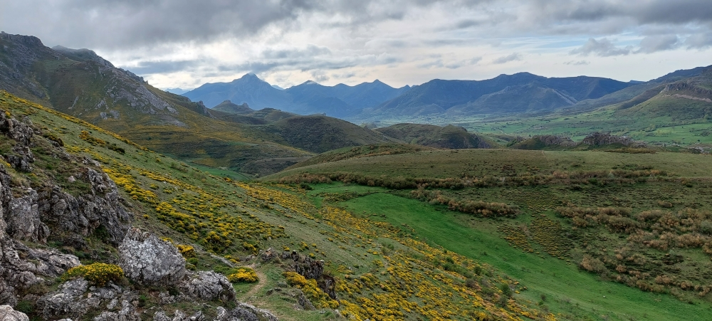

- → Don’t follow the wooden sign; that’s a different path 
- → No sigas el cartel de madera; ese es otro camino. 
- → Folgt nicht dem Holzschild; das ist ein anderer Weg. 
- → Não sigam o painel de madeira; esse é outro caminho

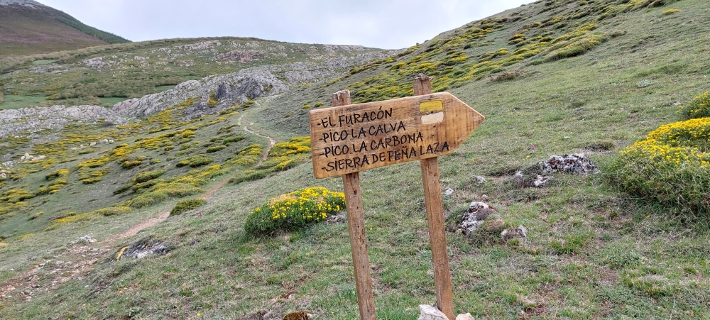

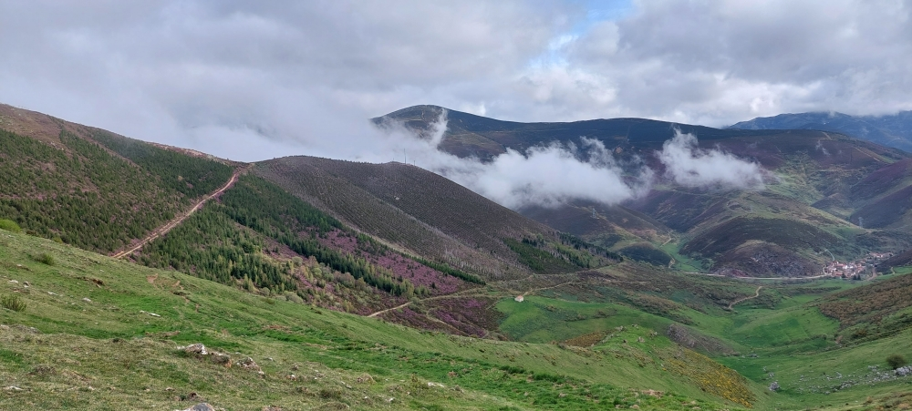

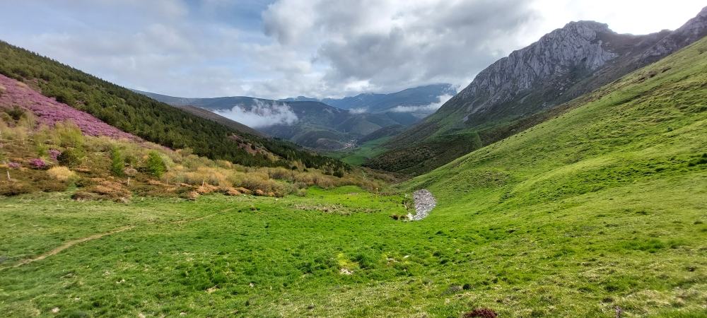

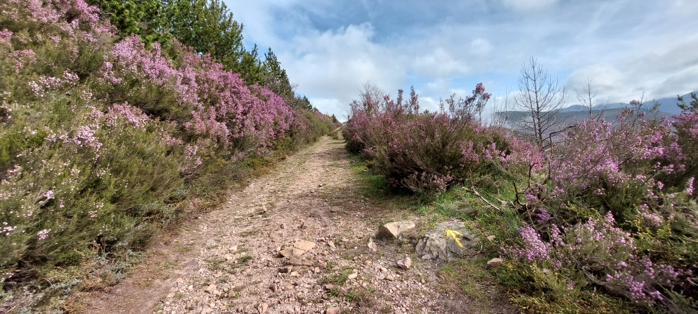

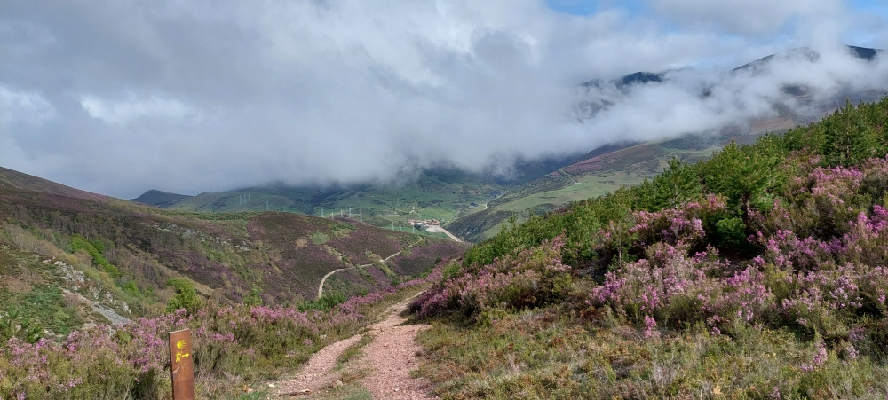

---
##### Noch etwa 1 Km bis Puerto de Pajares

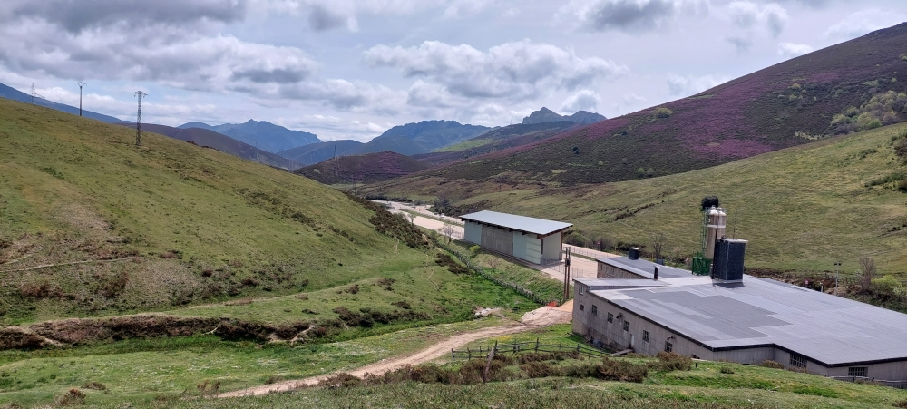
#### Einen verlorenen Schlafsack wurde gefunden

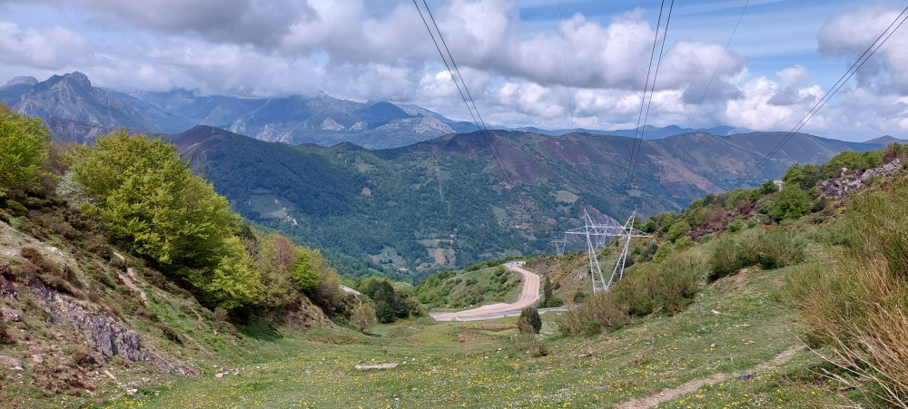
- Foi encontrado um saco-cama perdido 
- A lost sleeping bag has been found
- Se ha encontrado un saco de dormir perdido
#### Wunderschöne Ausblicke … und der verlorene Schlafsack.

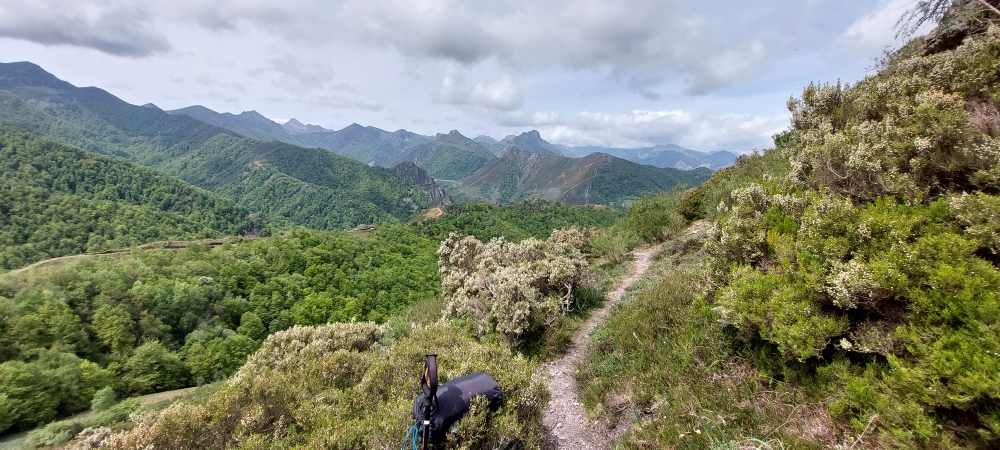

>***"Konzentriere dich auf das, was du gerade tust"***
>
> *Ich hatte bereits einen langen Abschnitt zurückgelegt, die Müdigkeit machte sich langsam bemerkbar, und man nimmt alles ganz anders wahr als noch am frühen Morgen, als ich voller Energie aufgebrochen war.*

🇩🇪 Der Weg führt bergab.
Dieser Abschnitt erfordert absolute Konzentration, unabhängig vom Wetter. Der Untergrund ist steinig und mit grobem Sand bedeckt, auf dem man leicht ausrutschen kann.

>***‘Focus on what you're doing right now’***
>
>*I had already covered a long stretch; tiredness was slowly setting in, and you perceive everything quite differently from how it was earlier that morning, when I had set off full of energy.*

🇬🇧 The path leads downhill. 
This section requires your full concentration, whatever the weather. The ground is stony and covered in coarse sand, on which it is easy to slip.

>***«Concentra-te naquilo que estás a fazer neste momento»***
>
>*Já tinha percorrido um longo trecho, o cansaço começava a fazer-se sentir e a forma como se percebe tudo é completamente diferente daquela do início da manhã, quando parti cheio de energia.*

🇵🇹 O caminho é a descer. Este troço exige concentração absoluta, independentemente das condições meteorológicas. O solo é pedregoso e está coberto de areia grossa, sobre a qual é fácil escorregar.

>***«Concéntrate en lo que estás haciendo ahora mismo»***
>
>*Ya había recorrido un largo tramo, el cansancio empezaba a hacerse notar poco a poco y uno percibe todo de forma muy diferente a como lo hacía a primera hora de la mañana, cuando había salido lleno de energía.*

🇪🇸 El camino discurre cuesta abajo. Este tramo requiere una concentración absoluta, independientemente de las condiciones meteorológicas. El terreno es pedregoso y está cubierto de arena gruesa, sobre la que es fácil resbalar.

---
#### 🇩🇪  Ein entspannter Spaziergang  im Wald

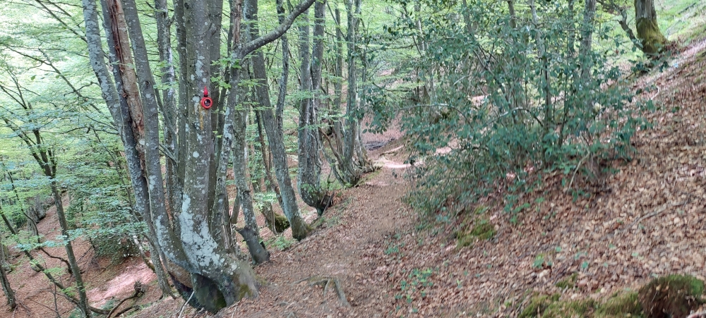 

- Zwei Jahre später konnte man nicht mehr von einem entspannten Spaziergang sprechen, denn der Boden war ziemlich rutschig.  Wir hatten gerade einen der schwierigsten Abschnitte hinter uns gebracht, und diese beruhigende Erinnerung führte dazu, dass ich später unachtsam wurde.

- **🇪🇸  Un paseo tranquilo por el bosque**
Dos años más tarde, ya no se podía hablar de un paseo tranquilo, ya que el suelo estaba bastante resbaladizo. Acabábamos de superar uno de los tramos más difíciles, y ese recuerdo tranquilizador hizo que más tarde bajara la guardia.

- **🇬🇧 A leisurely walk  in the woods** 
Two years later, it was no longer a leisurely stroll, as the ground was quite slippery. This carefree memory led to me becoming careless two years later.

 - **🇵🇹 Um passeio descontraído na floresta**
Dois anos depois, já não se podia falar de um passeio tranquilo, pois o chão estava bastante escorregadio. Tínhamos acabado de ultrapassar um dos troços mais difíceis e essa lembrança tranquilizadora fez com que, mais tarde, eu me descuidasse.

---
#### La Siesta
**🇪🇸 Por favor, no los molestéis**

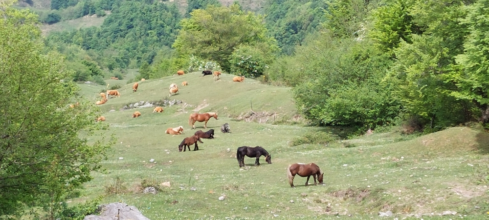

 **🇵🇹 Por favor, não os incomodem**
 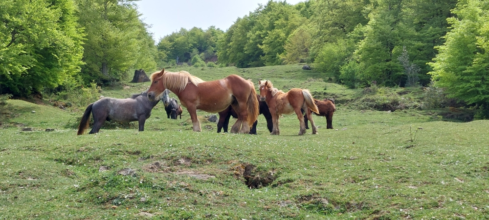

 **🇩🇪 Bitte die nicht stören**
 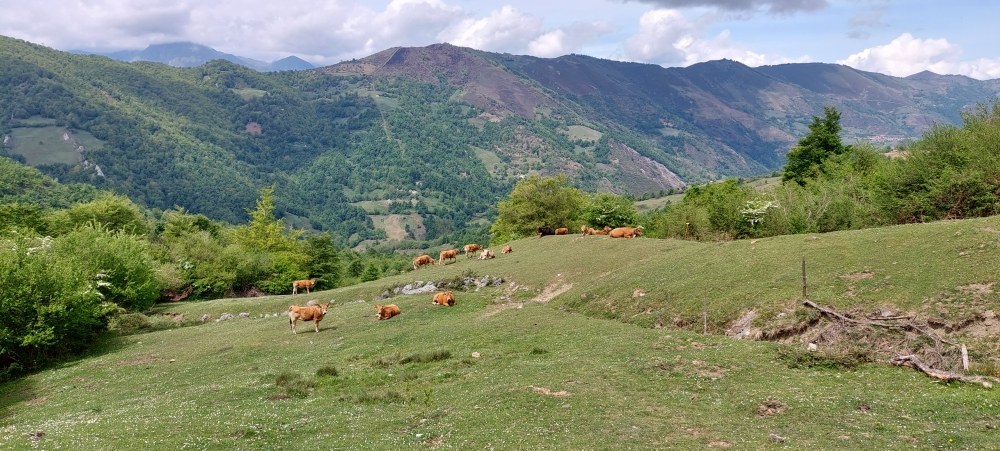

 **🇬🇧 Please don’t disturb them**
 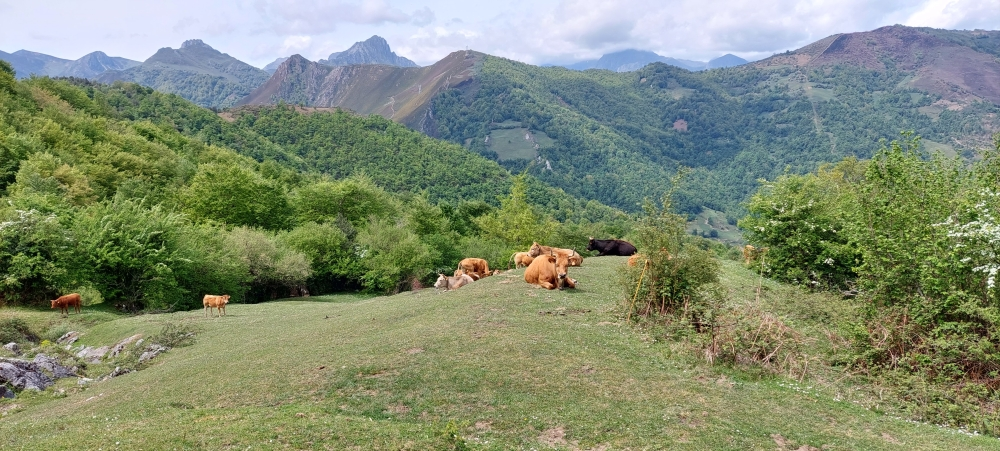
#### Ya casi he llegado a mi destino

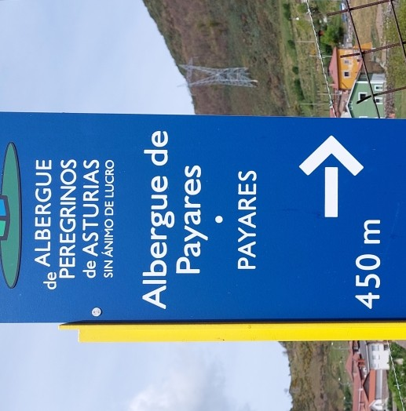
##### Albergue de Peregrinos de Pajares

🇪🇸 Recibí una cálida bienvenida. Después de que la hospitalera me asignara un lugar para dormir, hizo una llamada y consiguió localizar al dueño del saco de dormir perdido, que se encontraba a unos 20 km de allí. Ya no recuerdo si fue el coche del panadero o el de un conocido el que llevó el saco de dormir hasta su propietario. Pero de una cosa estoy seguro: aquella noche el peregrino ya no pasó frío.

---
🇩🇪 Ich wurde sehr herzlich empfangen. Nachdem mir die Gastgeberin / hospitalera einen Schlafplatz zugewiesen hatte, tätigte sie einen Anruf und fand den Besitzer des verlorenen Schlafsacks ausfindig, der sich etwa 20 km von hier entfernt befand. Ich weiß nicht mehr, ob es der Wagen des Bäckers oder der eines Bekannten war, der den Schlafsack zu seinem Besitzer brachte. Eines weiß ich jedoch sicher: In dieser Nacht musste der Pilger nicht mehr frieren.

---
🇵🇹 Fui recebido com muita simpatia. Depois de a hospitaleira me ter mostrado onde iria dormir, fez um telefonema e conseguiu localizar o proprietário do saco-cama perdido, que se encontrava a cerca de 20 km dali. Já não me lembro se foi o carro da padaria ou o de um conhecido que levou o saco-cama até ao seu dono. Mas de uma coisa tenho a certeza: nessa noite, o peregrino já não passou frio.

---
🇬🇧 I received a very warm welcome. After the hostess /hospitalera had shown me to my bed, she made a phone call and managed to locate the owner of the lost sleeping bag, who was about 20 km away. I can no longer remember whether it was the baker's vehicle or that of a friend who delivered the sleeping bag to its owner. But one thing I do know: that night, the pilgrim did not have to sleep in the cold.

---

🔁 [Camino-del-Salvador_Etappen](Camino-del-Salvador_Etappen.md)

↪ [Etapa-05_Payares_Benduenos](Etapa-05_Payares_Benduenos.md)

---

>***„Nur wo du zu Fuß warst, bist du auch wirklich gewesen.“***
>– Johann Wolfgang von Goethe, deutscher Dichter, 1749 – 1832

>**«Só onde andaste a pé é que realmente estiveste.»***
>Johann Wolfgang von Goethe, poeta alemão, 1749 – 1832

>**«Solo donde has caminado has realmente estado»***
>Johann Wolfgang von Goethe, poeta alemán, 1749 – 1832

> **“Only where you have walked have you truly been.”***
> Johann Wolfgang von Goethe, German poet, 1749–1832

 ...→
 