## Camino del Salvador 2023 

### Etappe_05: Payares → Bendueños
01 Mai 2023
#### Así empezó el día So begann der Tag 

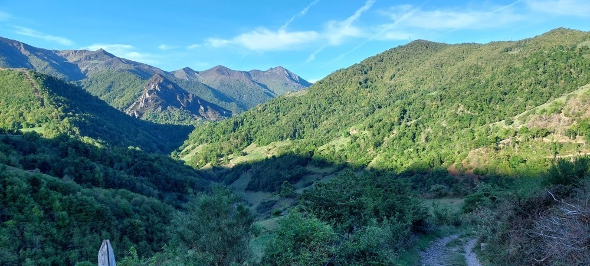

- That’s how the day began

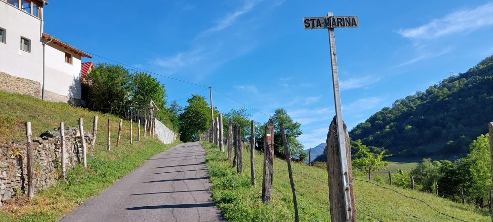

- Assim começou o dia 

#### Llanos de Somerón
**Albergue Cascoxu:** Sie befindet sich hinter dem Haus; dieses Jahr habe ich nicht hier übernachtet,  2025 aber schon
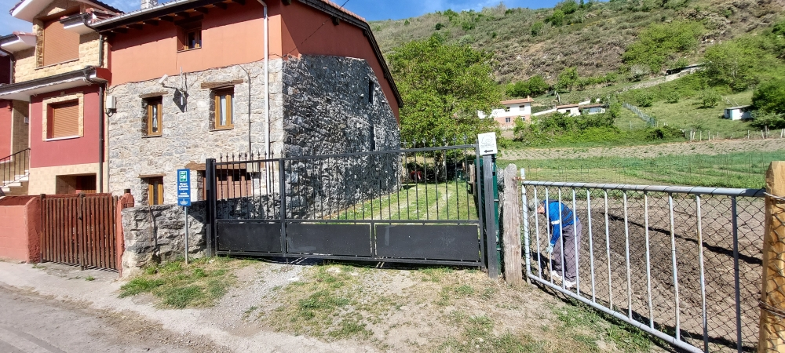

#### Der Augenblick ⁘ O Momento ⁘ The Moment ⁘ El momento
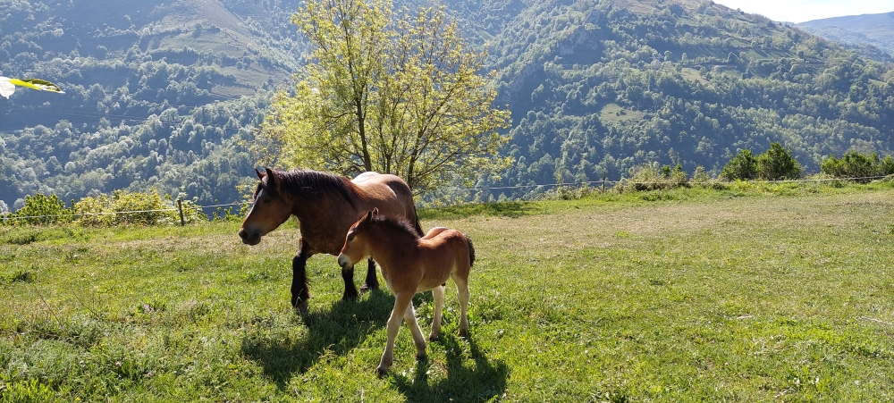

##### 🇩🇪 Ein wunderbarer Tag
Am Abend zuvor hatte ich gut zu Abend gegessen und gut geschlafen. An diesem Morgen genoss ich einfach den Augenblick und dachte mir, so könnte jeder Tag beginnen – als mich eine Stimme mit den Worten **„Buenos días“** ansprach. Es war ein älterer Herr, der gerade seinen morgendlichen Spaziergang in Llanos de Somerón machte. Nachdem wir gemeinsam diesen wunderbaren Tag gelobt hatten, riet er mir, der Straße bis ins Tal zu folgen, da dies sicherer sei. Zudem fügte er hinzu, dass der Weg, der am Berghang parallel zum Tal verläuft, an einigen Stellen sehr schwierig oder sogar unpassierbar sein könnte.

An diesem Morgen fühlte ich mich jedoch sehr wohl und vertraute meinem Bauchgefühl, also folgte ich seinem Rat nicht. Ich hätte es mir nie verziehen, wenn ich diesen wunderschönen Abschnitt nicht gegangen wäre. Der ältere Herr hatte allerdings recht: Auf einem etwa 50 Meter langen Stück musste ich meine Hände benutzen, um sicher voranzukommen. Während dieser gesamten Passage waren mir meine wertvollen Wanderstöcke im Weg, da ich meine Hände frei haben musste. Deshalb ist es im Grunde ratsam, seinem Rat zu folgen.

Als ich zwei Jahre später mit Roze diesen Weg erneut ging, hatte man diesen schwierigen Abschnitt trotz der Warnschilder ein wenig verbessert, auch wenn er nach wie vor schwer zu bewältigen ist. Da wir zu zweit waren und uns gegenseitig helfen konnten, fiel uns die Sache dieses Mal jedoch leichter.

---
##### 🇵🇹 Um dia maravilhoso
Na noite anterior eu tinha jantado bem e dormido bem. Naquela manhã, eu estava apenas aproveitando o momento e pensando que todo dia poderia começar assim, quando uma voz me cumprimentou com um **„Buenos días“**. Era um senhor idoso que fazia sua caminhada matinal em Llanos de Somerón. Depois de elogiarmos juntos aquele dia maravilhoso, ele me aconselhou a seguir pela estrada até o vale, pois seria mais seguro. Além disso, acrescentou que a trilha que corre pela encosta da montanha, paralela ao vale, poderia ser muito difícil ou até intransitável em alguns pontos.

Naquela manhã, porém, eu me sentia muito bem e confiei na minha intuição, por isso não segui o conselho dele. Eu nunca teria me perdoado se não tivesse percorrido esse trecho tão lindo. Mas o senhor idoso tinha razão: em um trecho de cerca de 50 metros, precisei usar as mãos para avançar com segurança. Durante toda essa passagem, meus valiosos bastões de caminhada só me atrapalharam, pois eu precisava das mãos livres. Por isso, no fundo, é recomendável seguir o conselho dele.

Quando voltei a fazer essa trilha com a Roze, dois anos depois, tinham melhorado um pouco esse trecho difícil, apesar dos avisos de perigo, embora ele continue sendo difícil de superar. Como estávamos em dois e podíamos nos ajudar mutuamente, a caminhada foi mais fácil desta vez.

---
##### 🇪🇸 Un día maravilloso

La noche anterior había cenado bien y dormido bien. Aquella mañana simplemente disfrutaba del momento e imaginaba que ojalá todos los días empezaran así, quando una voz me saludó com un **"Buenos días"**. Era un señor mayor que estaba dando su paseo matutino por Llanos de Somerón. Tras elogiar juntos aquel día tan maravilloso, me aconsejó que siguiera por la carretera hasta el valle, ya que era más seguro. Además, añadió que el sendero que discurre por la ladera de la montaña en paralelo al valle podía ser muy difícil o incluso estar intransitable en algunos tramos.

Sin embargo, aquella mañana me sentía muy bien y confié en mi instinto, por lo que no seguí su consejo. Jamás me lo hubiera perdonado si no hubiese recorrido este tramo tan hermoso. Pero el señor mayor tenía razón: en un tramo de unos 50 metros tuve que usar las manos para avanzar con seguridad. Durante todo ese paso, mis valiosos bastones de senderismo me estorbaron, ya que necesitaba tener las manos libres. Por eso, en el fondo, lo más recomendable es seguir su consejo.

Cuando volví a recorrer este sendero con Roze dos años después, habían mejorado un poco este tramo difícil a pesar de las advertencias, aunque sigue siendo complicado de superar. Como éramos dos y podíamos ayudarnos mutuamente, esta vez nos resultó más fácil.

---
##### 🇬🇧 A wonderful day

The night before, I had eaten a good dinner and slept well. That morning, I was simply enjoying the moment and thinking that every day should start like this, when a voice greeted me with a **„Buenos días“**.  It was an elderly gentleman who was out for his morning walk in Llanos de Somerón. After we both praised the wonderful day, he advised me to follow the road down into the valley, as it was safer. He added that the trail running along the mountainside parallel to the valley could be very difficult or even impassable in some places.

That morning, however, I felt very well and trusted my gut feeling, so I did not follow his advice. I would never have forgiven myself if I hadn't walked this beautiful section. But the elderly gentleman was right: on a stretch of about 50 meters, I had to use my hands to move forward safely. Throughout this entire passage, my valuable trekking poles were just in the way, as I needed my hands free. Therefore, it is actually advisable to follow his counsel.

When I walked this trail again with Roze two years later, this difficult section had been improved a little despite the warnings, even though it remains hard to navigate. Since there were two of us and we could help each other, it was much easier for us this time.

---
#### Da drüben in der Kurve muss man sich entscheiden 

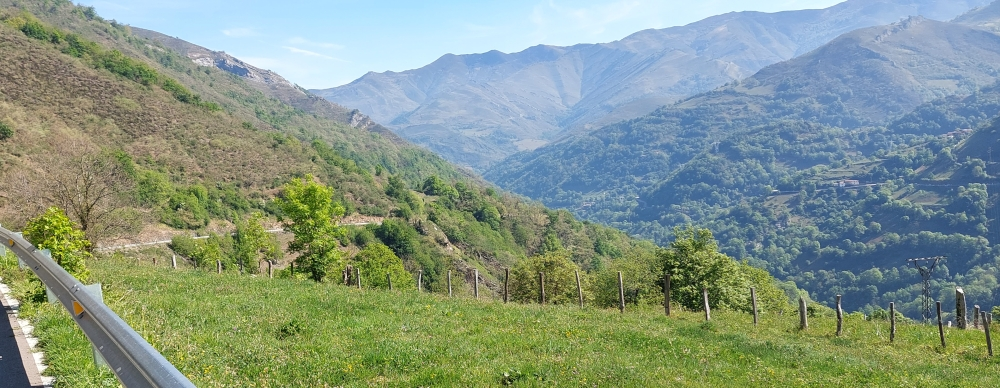

🇩🇪 Entweder nach links abbiegen und dem wunderschönen Wanderweg folgen oder ins Tal hinabsteigen und den sichereren Weg (Straße) nehmen.

- **It’s at that bend that you have to make your decision**
🇬🇧 Either turn left and follow the beautiful footpath, or head down into the valley and take the safer route (the road).

- **Lá na curva é aí que se tem de decidir**
🇵🇹 Ou virar à esquerda e seguir o belíssimo trilho, ou descer até ao vale e seguir pelo caminho mais seguro (estrada).

- **Allí, en la curva, es donde hay que decidir**
🇪🇸 O bien girar a la izquierda y seguir la preciosa ruta de senderismo, o bien bajar al valle y tomar el camino más seguro (la carretera).

#### Ein Blick zurück ⁘ Una mirada atrás ⁘ Um olhar para  trás ⁘ A look back
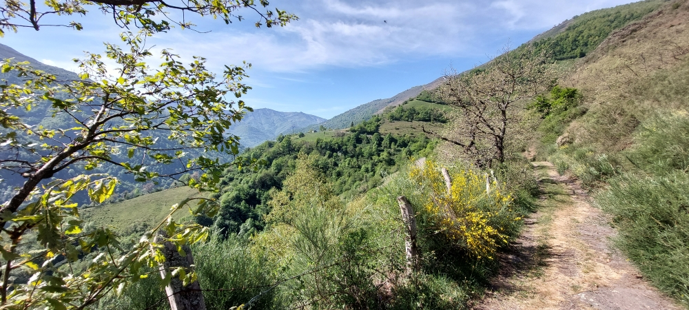

- Irgendwo hinter den Bergen begann meinen Weg 
- O nosso caminho começou algures, para além das montanhas
- Somewhere beyond the mountains, our way began
- En algún lugar más allá de las montañas comenzó nuestro camino
---
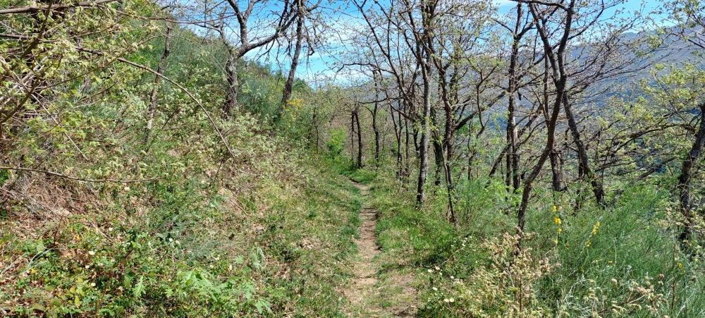

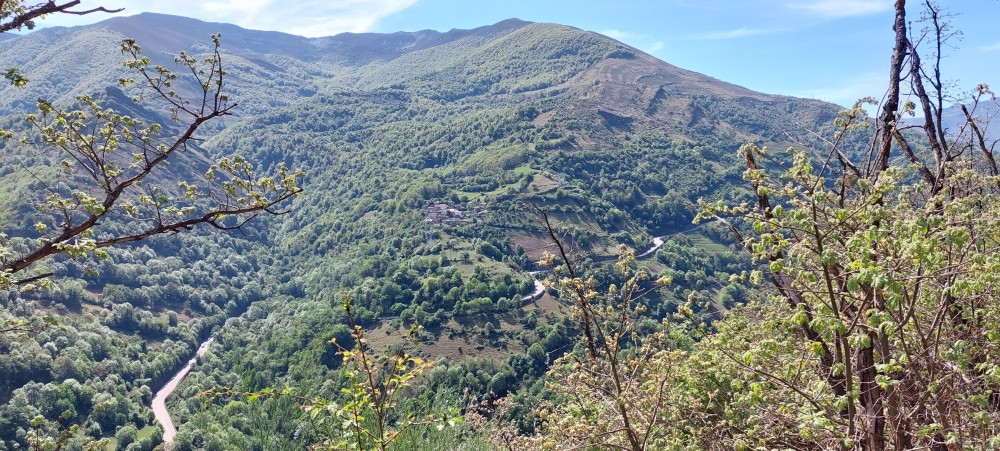

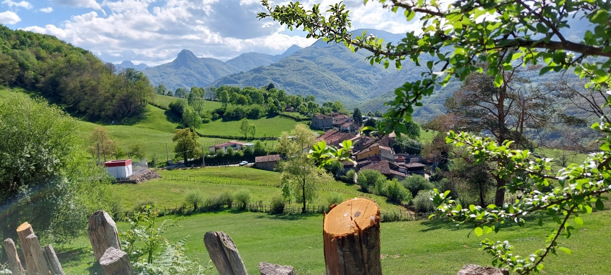
#### «Bienvenidos, peregrinos» en el Albergue parroquial Virgen de Bendueños
, así nos recibieron

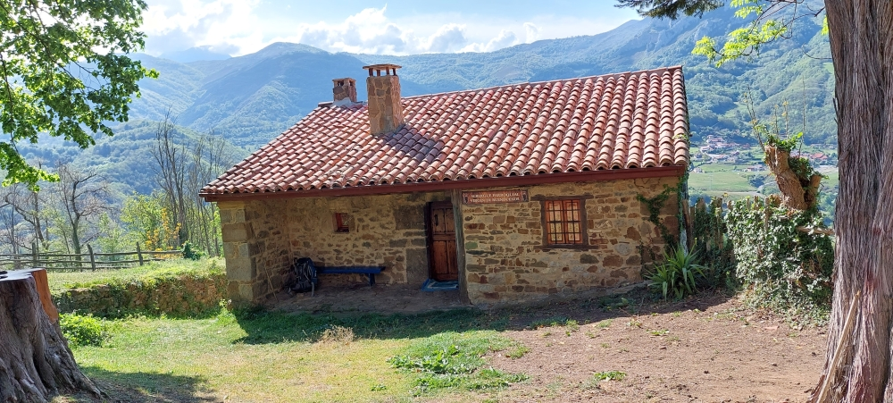

- „Herzlich willkommen, Pilger“, so wurden wir empfangen
- «Sejam muito bem-vindos, peregrinos», foi assim que fomos recebidos
- “A warm welcome, pilgrims” – that’s how we were greeted.

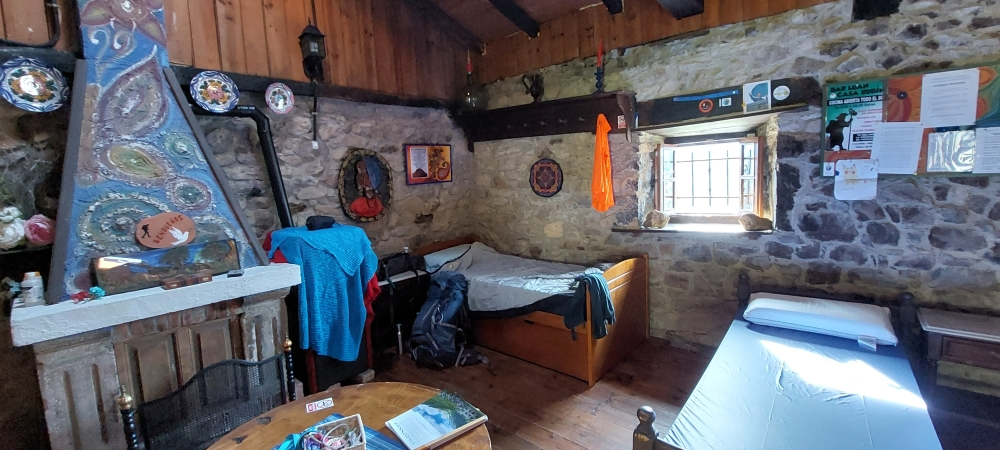

- Vamos começar a nos acomodar ⁘ Lasst uns es uns gemütlich machen
- Empecemos a acomodarnos ⁘  Let’s make ourselves comfortable

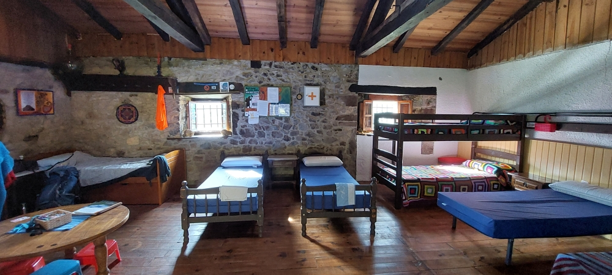
##### Uma estadia perfeita ⁘ Ein perfekter Aufenthalt ⁘ A perfect stay ⁘ Una estancia perfecta

🇩🇪 An diesem Tag waren wir vier Pilger, die in dieser Herberge übernachteten. Zwei junge Spanier, die ich am nächsten Tag in der „Ermita de Santa Marina“ wieder traf, und ein italienischer Pilger, den ich einige Wochen später in Muxía ebenfalls wieder traf.

Nachdem wir es uns gemütlich gemacht hatten, kam Sandra mit einem leckeren Eintopf. Nach dieser wunderschönen Unterkunft hatte ich eigentlich nicht mehr erwartet. Es ist wirklich ein wunderschöner Ort, um neue Energie für die nächste Etappe zu tanken.

🇵🇹 Nesse dia, éramos quatro peregrinos a pernoitar naquela pousada. Dois jovens espanhóis, com quem voltei a encontrar-me no dia seguinte na «Ermita de Santa Marina», e um peregrino italiano, com quem também voltei a encontrar-me algumas semanas mais tarde em Muxía.
Depois de nos instalarmos confortavelmente, a Sandra chegou com um delicioso (cozido) ensopado. Depois deste alojamento maravilhoso, sinceramente já não esperava mais nada. É realmente um lugar maravilhoso para recarregar energias para a próxima etapa.

🇪🇸 Ese día éramos cuatro peregrinos los que pasábamos la noche en ese albergue. Dos jóvenes españoles, a los que volví a encontrar al día siguiente en la «Ermita de Santa Marina», y un peregrino italiano, al que también volví a encontrar unas semanas más tarde en Muxía.
Después de ponernos cómodos, Sandra llegó con un delicioso guiso / cocido. Después de este maravilloso alojamiento, la verdad es que ya no esperaba nada más. Es realmente un lugar maravilloso para recargar energías antes de la siguiente etapa.

🇬🇧 On that day, there were four of us pilgrims staying at that hostel. Two young Spaniards, whom I met again the next day at the ‘Ermita de Santa Marina’, and an Italian pilgrim, whom I also met again a few weeks later in Muxía.
After we had settled in and made ourselves comfortable, Sandra arrived with a delicious stew. After staying in this wonderful accommodation, I honestly wasn't expecting anything more. It is truly a wonderful place to recharge your energy for the next stage of the journey.
#### Un lugar de silencio, paz y recogimiento
Si la iglesia está cerrada, pregúntale a Sandra; ella tiene la llave.

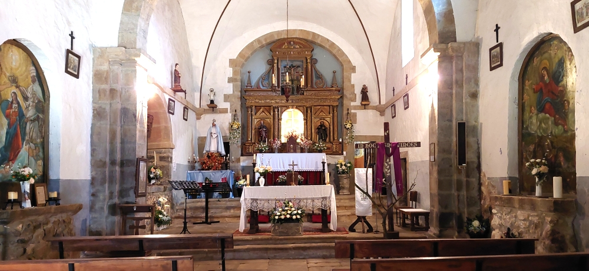

- Ein Ort der Stille. Zum Innehalten. Zum Kraftschöpfen
	Sollte die Kirche geschlossen sein, frag einfach Sandra – sie hat den Schlüssel.
	
- A place of silence, peace, and reflection. 
	If the church is closed, just ask Sandra—she has the key.
	
- Um lugar de silêncio, paz e reflexão. 
	Se a igreja estiver fechada, basta perguntar à Sandra — ela tem a chave.

---

🔁 [Camino-del-Salvador_Etappen](Camino-del-Salvador_Etappen.md)

↪ [Etapa-06_Benduenos_Mieres](Etapa-06_Benduenos_Mieres.md)

---

_좋은 길 되세요_ (jo-eun gil doeseyo) 

...→

