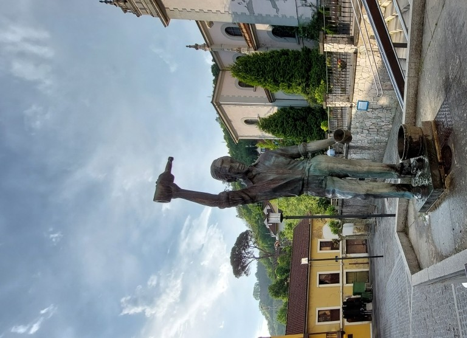
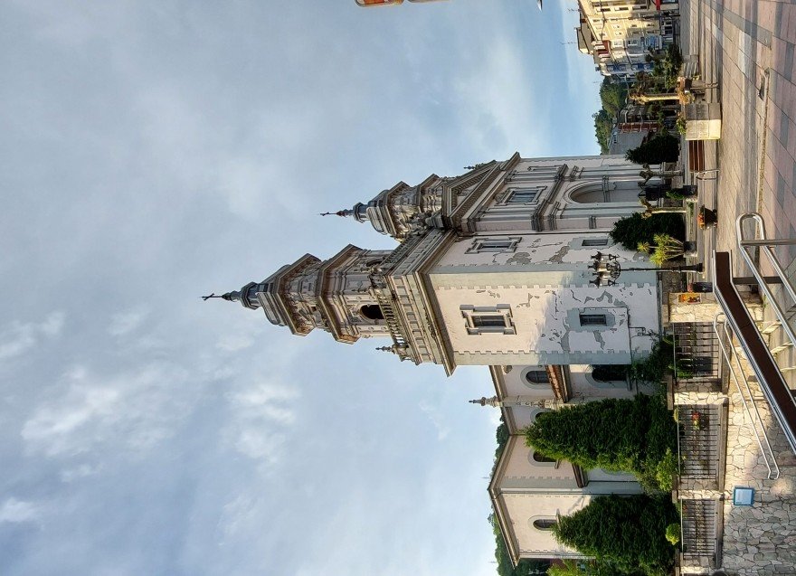
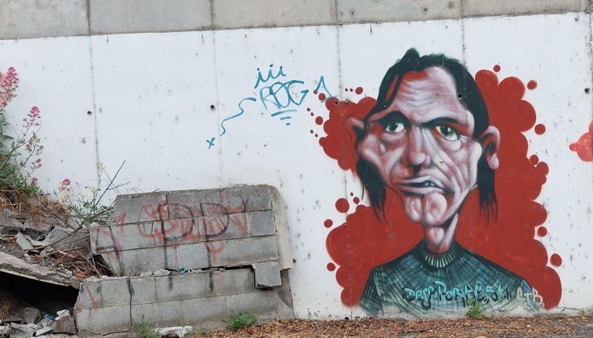
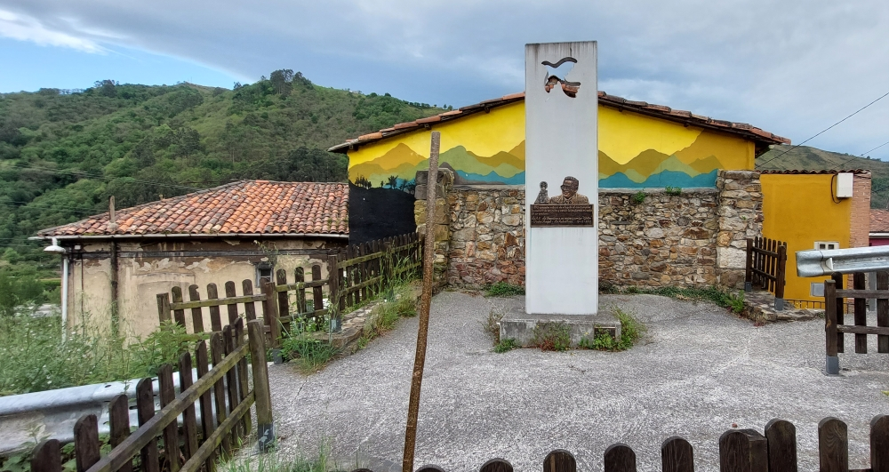
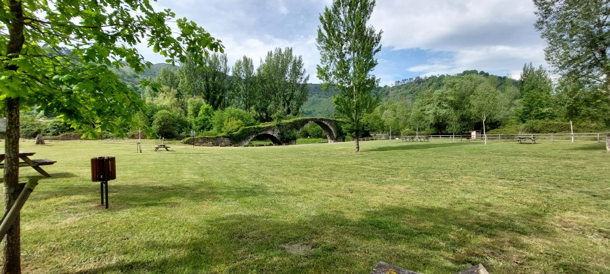
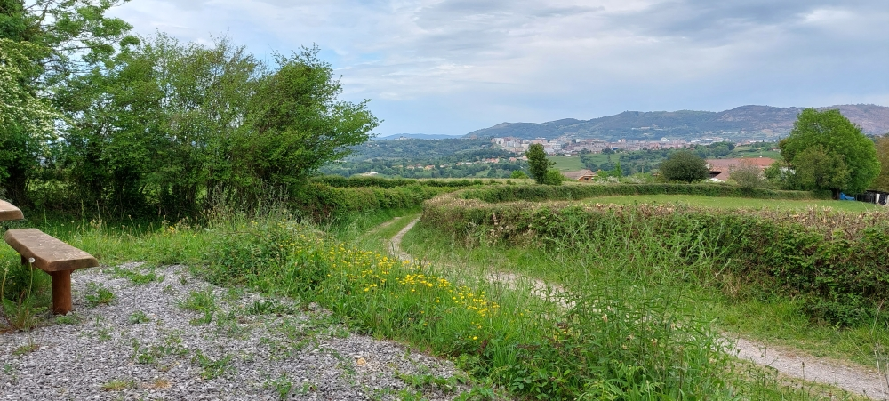
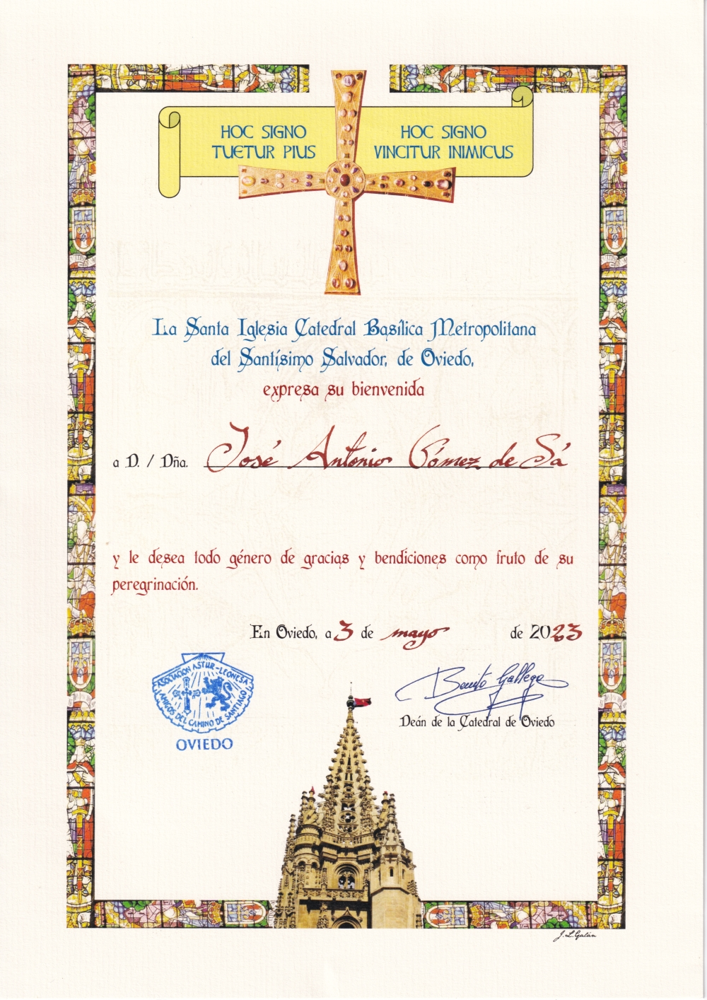
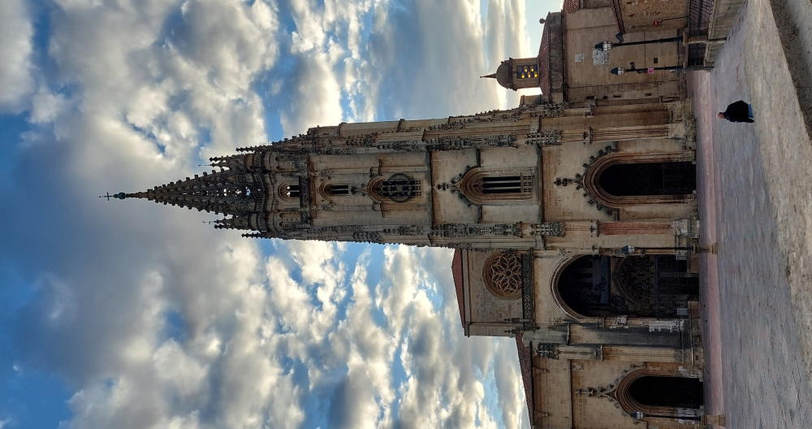

# Camino del Salvador 2023 

### Etappe_07: Mieres → Oviedo 
3 Mai 2023
#### El Escanciador de la Plaza de Requexu

#### Iglesia De San Juan

#### Ist das ein Selbstporträt oder ist es Kunst?
*Das habe ich noch nicht herausgefunden.*

- **Será isto um autorretrato ou será arte?** 
*Ainda não descobri.*

- **Is that a self-portrait or is it art?**  
*I haven’t worked that out yet.*	

- **¿Es un autorretrato o es arte?** 	
*Todavía no lo tengo claro.*

---
#### Padre Angel

🇩🇪 Ich habe meinem Wanderstock nicht viel Aufmerksamkeit geschenkt, obwohl er für mich eine unverzichtbare Stütze auf diesem Weg war, – genau wie die Menschen, die diesen Weg geprägt haben. Diejenigen, die hier waren, diejenigen, die hier sind, und diejenigen, die hier sein werden.

**Von Zeit zu Zeit sollten wir kurz innehalten und darüber nachdenken.**

🇵🇹 Não prestei muita atenção ao meu bastão de caminhada, apesar de ele ter sido para mim um apoio indispensável neste percurso, tal como as pessoas que marcaram este caminho. Aqueles que aqui estiveram, aqueles que aqui estão e aqueles que aqui estarão.

**De vez em quando, devemos fazer uma breve pausa para refletir sobre isso.**

🇬🇧 I haven’t paid much attention to my walking stick, even though it has been an indispensable source of support for me on this journey, just like the people who have shaped this path. Those who were here, those who are here, and those who will be here.

**From time to time, we should pause for a moment and reflect on this.**

🇪🇸 No le he prestado mucha atención a mi bastón de senderismo, aunque para mí ha sido un apoyo indispensable en este camino, al igual que las personas que han dejado su huella en él. Los que estuvieron aquí, los que están aquí y los que estarán aquí.

**De vez en cuando deberíamos detenernos un momento y reflexionar sobre ello.**

---
#### Die Brücke ⁘ A ponte ⁘ The bridge ⁘ El puente

Was verbindet sie? ⁘ O que é que ela liga? ⁘ What does it connect? ⁘ ¿Qué es lo que une?

---
#### _Siéntate un momento, ya casi has llegado_ .

- *Setz dich einen Moment hin, du bist fast da.*
- *Sit down for a moment – you’re almost there.*
- *Senta-te um momento, já estás quase a chegar.*

---
### La Salvadorana
hoc praesens scriptum Salvadoranam vocatum libenter ei concedit

„Das Pilgerzertifikat ist mehr als nur ein einfaches Zeugnis; es ist der Weg, den wir in uns tragen.“

„O certificado de peregrinação é mais do que um simples testemunho, é o caminho que levamos dentro de nós.“

„El certificado de peregrinación es más que un simple testimonio; es el camino que llevamos dentro de nosotros.“

„The pilgrimage certificate is more than just a simple testimony; it is the path we carry within us.“
## Catedral de San Salvador

-  

---
###   →  Mi camino Primitivo 2023 
Start: 04 Mai 2023
#### ...

🇪🇸 En el Camino Primitivo conocí a Roze, de Irati, en el estado brasileño de Paraná. Hablamos de nuestras experiencias como peregrinos y de lo que nos había llevado al Camino Primitivo. Ella había hecho el Camino Francés el año anterior y había oído muchos elogios sobre esta ruta tan bonita y exigente. Por eso decidió recorrerla.

No le di la razón ni la contradije, porque el Camino Primitivo es, sin duda, exactamente lo que dicen de él. Sin embargo, quien ya ha recorrido el Camino del Salvador se queda indeciso a la hora de decidir cuál de los dos es más bonito.

---

🇩🇪 Auf dem Camino Primitivo traf ich Roze aus Irati im brasilianischen Bundesstaat Paraná. Wir tauschten unsere Pilgererfahrungen aus und sprachen darüber, was uns auf den Camino Primitivo geführt hatte. Sie hatte ein Jahr zuvor den Camino Francés absolviert und dort viel über diesen schönen und anspruchsvollen Weg gehört. Deshalb hatte sie sich für den Camino Primitivo entschieden.

Ich widersprach ihr nicht, denn ohne Zweifel ist der Camino Primitivo genau das, was man über ihn sagt. Wenn man jedoch zuvor den Camino del Salvador gegangen ist, fällt die Entscheidung schwer, welcher von beiden d---er schönere Weg ist.

---

🇵🇹 No Camino Primitivo conheci Roze, de Irati, no estado brasileiro do Paraná. Conversámos sobre as nossas experiências enquanto peregrinos e sobre o que nos tinha levado ao Camino Primitivo. Ela tinha feito o Camino Francés no ano anterior e ouvira muitos elogios sobre este percurso belo e exigente. Foi por isso que decidiu percorrê-lo.

Não lhe dei razão nem a contradisse, porque o Camino Primitivo é, sem dúvida, exatamente aquilo que dizem dele. Porém, quem já percorreu o Camino del Salvador fica dividido na hora de decidir qual dos dois é mais bonito.

---

🇬🇧 On the Camino Primitivo, I met Roze from Irati, in the Brazilian state of Paraná. We exchanged pilgrimage experiences and talked about what had brought us to the Camino Primitivo. She had completed the Camino Francés the previous year and had heard many positive things about this beautiful and demanding route. That was why she chose it.

I did not disagree with her because the Camino Primitivo is undoubtedly exactly what people say it is. However, anyone who has already walked the Camino del Salvador will find it difficult to decide which of the two routes is more beautiful.

---

🔁 [Camino-del-Salvador_Etappen](Camino-del-Salvador_Etappen.md)

↪ [Etappe-01_Leon_La-Robla](Etappe-01_Leon_La-Robla.md)

---

***“Sage nicht, wenn ich Zeit dazu habe, vielleicht hast du nie Zeit dazu."*** 
***" Wenn nicht jetzt, wann dann?“***
Aus dem Talmud, einem der wichtigsten Schriftwerke des Judentums

***«No digas “cuando tenga tiempo”, porque quizá nunca lo tengas».***
***«Si no es ahora, ¿cuándo entonces?»***
Del Talmud, una de las obras escritas más importantes del judaísmo

***«Não digas “quando tiver tempo”, porque talvez nunca o tenhas».***
***«Se não for agora, então quando?»***
Do Talmude, uma das obras escritas mais importantes do judaísmo

***‘Don’t say “when I have time”, because you might never have it.’***
***‘If not now, then when?’***
From the Talmud, one of Judaism’s most important written works
 
 ...→