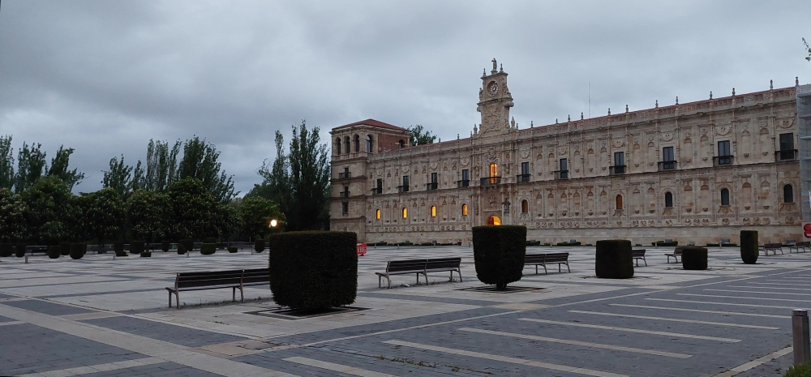
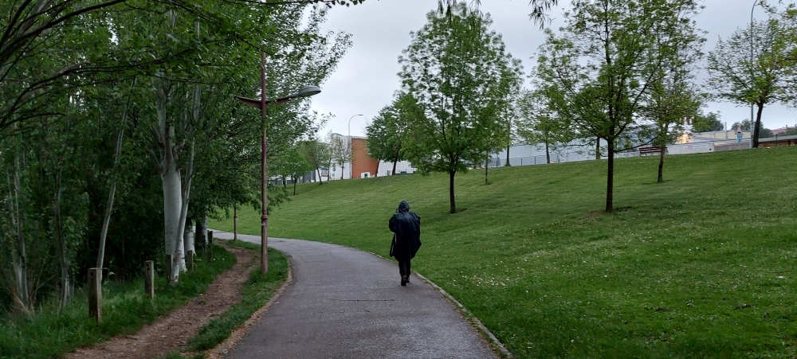
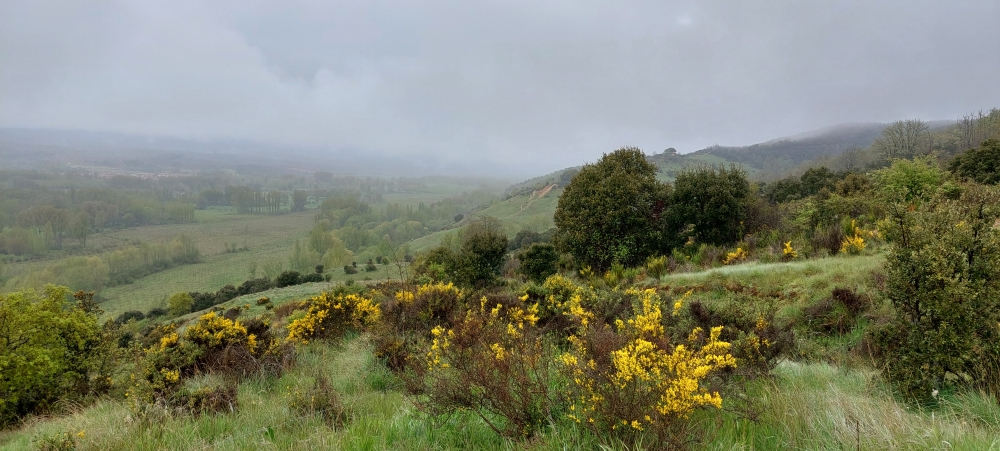
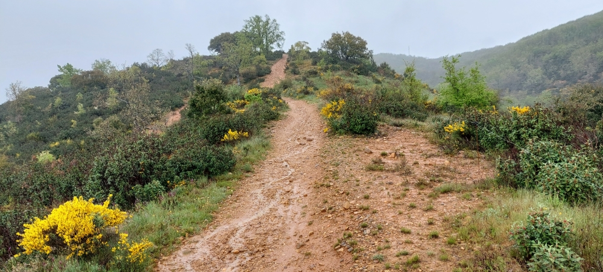
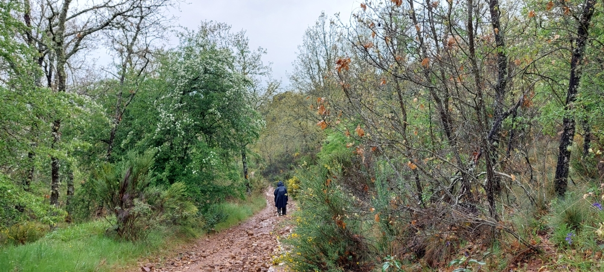
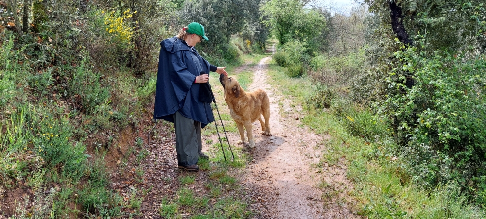
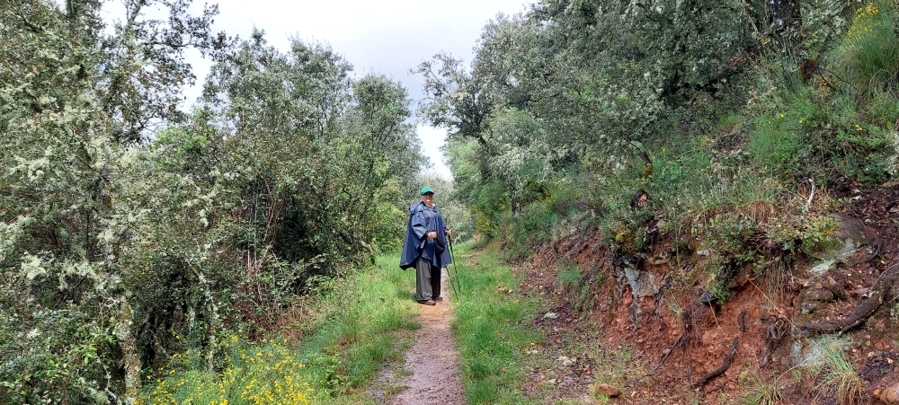
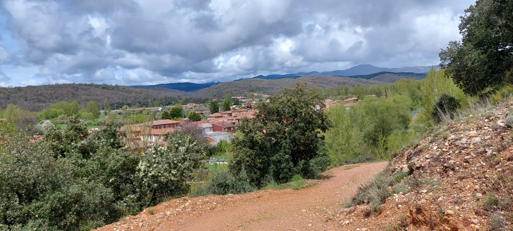

### 🇪🇸 Spanisch

## Camino del Salvador 2025 

> _Der Camino del Salvador begann für uns einen Tag später als geplant. Ein Gerichtstermin in Sintra hatte unsere sorgfältig vorbereitete Planung durcheinander gebracht. Trotzdem standen wir nun in León – voller Vorfreude auf einen Weg, von dem ich  sagen kann, dass er einer der schönsten Spaniens ist._

---
### Etappe 1: León – La Robla 
**Distanz:** 27,2 km ✦ ↑ 356 m ↓ 240 m  ✦  ca. 7 h 

04 Mai 2025 

---
#### 🇬🇧 We have a long journey ahead of us

- Eine lange Etappe steht uns bevor
- Temos uma longa etapa pela frente
-  Nos espera una etapa larga
#### 🇩🇪 Noch bevor wir den Pilgerweg angefangen haben, wurde unsere Motivation getestet. 

🇵🇹 Ainda antes de iniciarmos o caminho de peregrinação, a nossa motivação foi posta à prova.

🇬🇧 Even before we set out on our pilgrimage, our determination was put to the test.

🇪🇸 Aún antes de emprender el camino de peregrinación, nuestra motivación se puso a prueba.

#### 🇵🇹 Apesar disso, não é motivo para parar, vai ser um belo percurso.

🇩🇪 Trotzdem ist das kein Grund, stehen zu bleiben – es wird eine schöne Wanderung werden.

🇵🇹 A pesar de ello, no es motivo para parar, va a ser un recorrido precioso.

🇬🇧 Despite that, it’s no reason to stop – it’s going to be a lovely walk.

#### 🇩🇪  Was für eine Freude! 
Seid herzlich willkommen, Pilger 

Allein hütete er die Kuhherde; er sah uns, kam respektvoll auf uns zu und begrüßte uns freundlich. 
Ich wünschte, er hätte uns den ganzen Weg begleitet. Das ging jedoch nicht, er musste zurückkehren, denn er konnte die Herde nicht schutzlos den Wölfen überlassen.

🇵🇹 **Que alegria!**
Sejam muito bem-vindos, peregrinos  

Sozinho, ele cuidava do rebanho de vacas; viu-nos, aproximou-se respeitosamente e cumprimentou-nos amigavelmente.
Gostaria que ele nos tivesse acompanhado durante todo o caminho. No entanto, isso não foi possível, pois ele teve de regressar, já que não podia deixar o rebanho indefeso à mercê dos lobos. 

🇬🇧 **What a joy!**
A warm welcome, pilgrims!

He was alone watching over the herd of cows. When he saw us, he approached us respectfully and greeted us with kindness. I wish he could have accompanied us all the way. However, that was not possible; he had to return, as he could not leave the herd unprotected against the wolves.

 🇪🇸 **¡Qué alegría!**
¡Sed muy bienvenidos, peregrinos!

Estaba solo cuidando el rebaño de vacas. Al vernos, se acercó a nosotros con respeto y nos saludó con amabilidad. Ojalá hubiera podido acompañarnos durante todo el camino. Sin embargo, no era posible; tenía que regresar, ya que no podía dejar el rebaño desprotegido frente a los lobos.

---
### Es wird sonnig  ⁘ Vai estar sol
It’s going to be sunny ⁘ Va a hacer sol

#### Das Wetter scheint uns motivieren zu wollen, denn wir haben noch ein paar Meter vor uns.

- O tempo parece querer motivar-nos, pois ainda temos alguns metros para percorrer.
- The weather seems to be spurring us on, as we still have a few metres to go.
- Parece que el tiempo quiere animarnos, ya que aún nos quedan unos metros por recorrer.
#### Hay más fotos de ese día... ¿dónde están?
- There are more photos from that day – where are they?
- Há mais fotos desse dia – onde é que elas estão?
- Es gibt noch mehr Fotos von diesem Tag – wo sind sie denn?

---

🔁 [Camino-del-Salvador_Etappen](Camino-del-Salvador_Etappen.md)

↪ [Etappe-02_La-Robla_Poladura-de-la-Tercia](Etappe-02_La-Robla_Poladura-de-la-Tercia.md)

---
  
  _良い旅を_ (yoi tabi o)  
  
  _良い道を_ (yoi michi o) 
  
 ...→

