## Camino del Salvador 2025 

---
### Etappe_02:  La Robla → Poladura de la Tercia
05 Mai 2025
#### Um novo dia ⁘ A new day ⁘  Ein neuer Tag ⁘ Un nuevo día

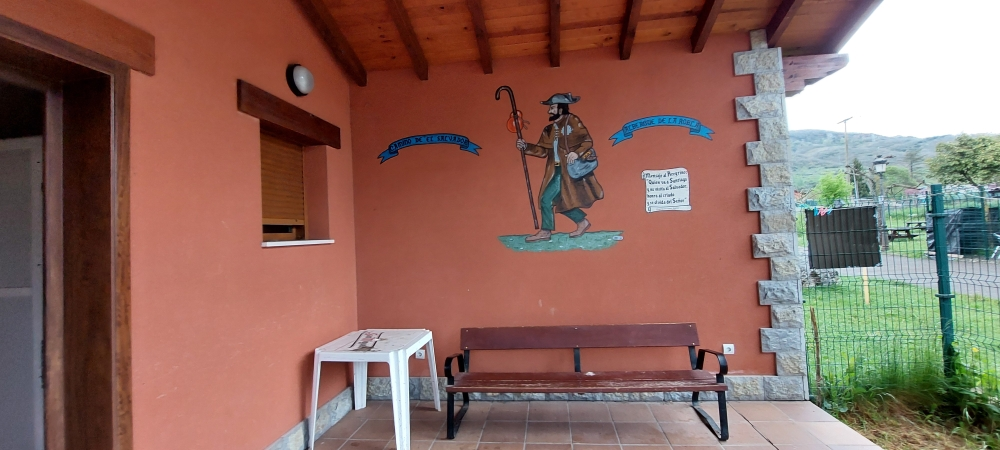

🇵🇹 Ontem aqui chegamos, hoje partimos novamente
para cumprir o que está escrito na parede.

> _«Quem vai a Santiago e não visita o Salvador, honra o servo e esquece o Senhor.»_

🇩🇪 Wir sind gestern hier angekommen; heute brechen wir wieder auf, um das zu erfüllen, was an der Wand geschrieben steht.

>_„Wer nach Santiago geht und den Salvador nicht besucht, ehrt den Diener und vergisst den Herrn.“_

🇬🇧 We arrived here yesterday; today we’re setting off again to fulfil what is written on the wall

>_„Anyone who goes to Santiago and does not visit El Salvador honours the servant and forgets the Lord.”_

🇪🇸 Llegamos aquí ayer; hoy volvemos a ponernos en marcha para cumplir lo que está escrito en la pared.

>_«Quien va a Santiago y no visita a Salvador, honra al siervo y se olvida del Señor»._

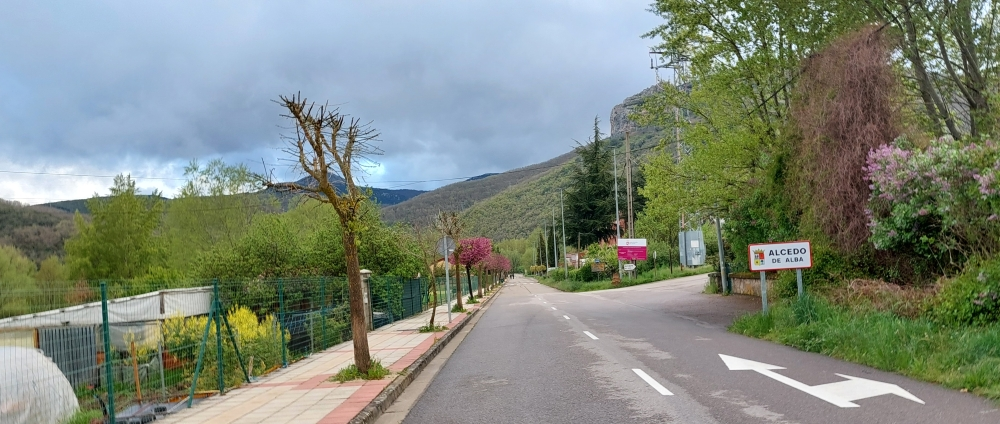

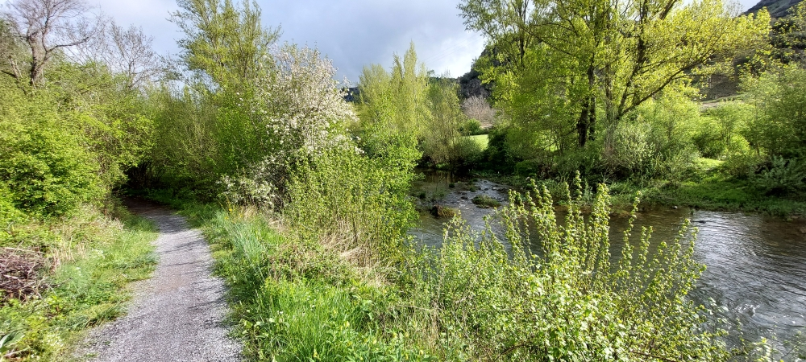

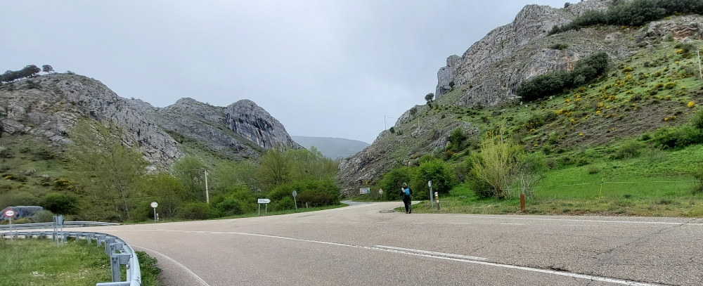
#### Depois de Buiza ⁘ After Buiza ⁘ Nach Buiza ⁘ Después de Buiza

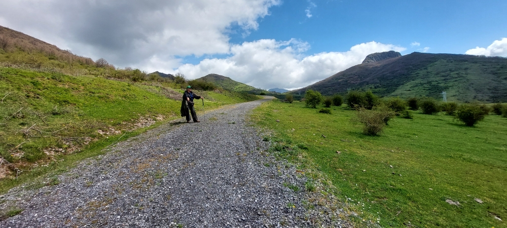
#### Dieser Weg muss man fühlen, es lässt sich nicht erklären.

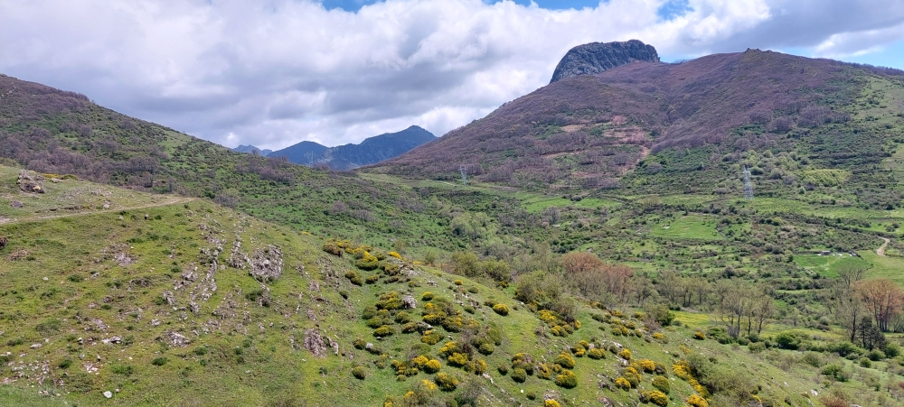

Esta caminho tem de se sentir, não se pode explicar.

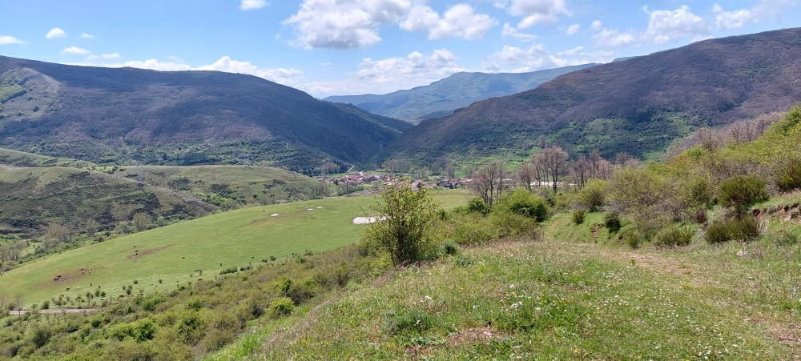

 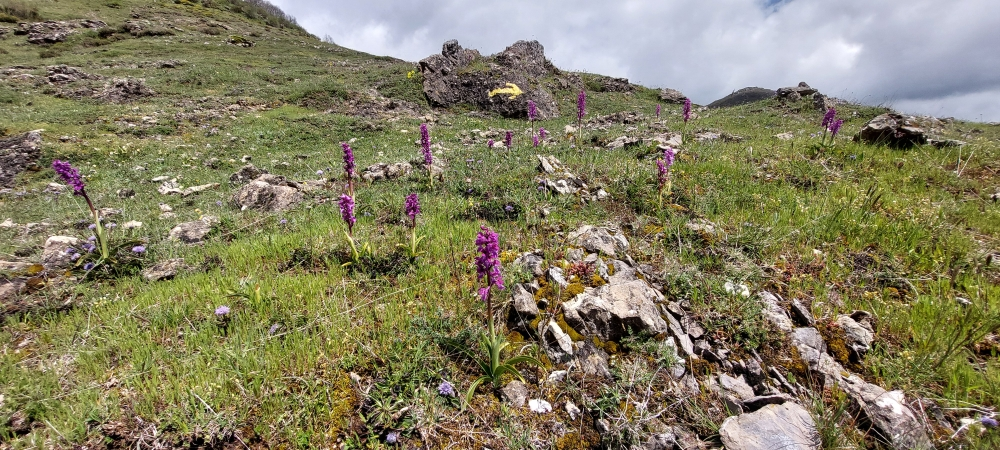
 Este camino hay que sentirlo, no se puede explicar.
 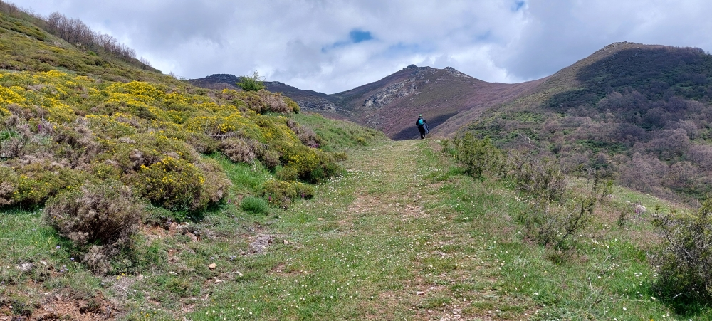

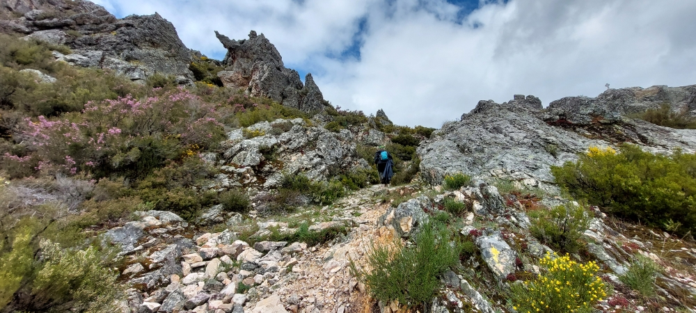

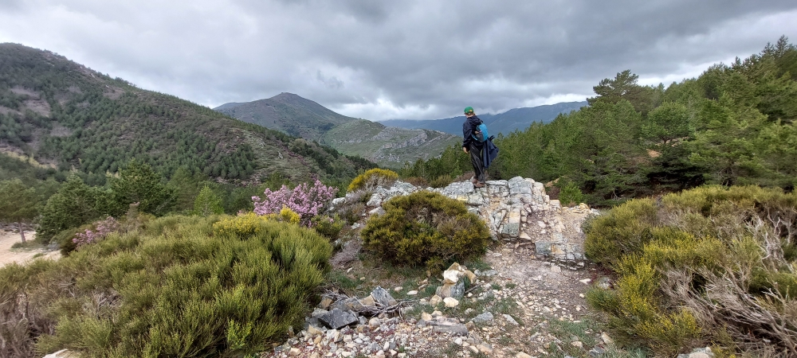

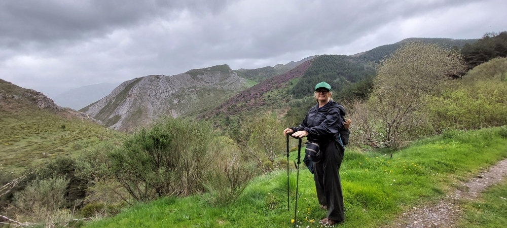

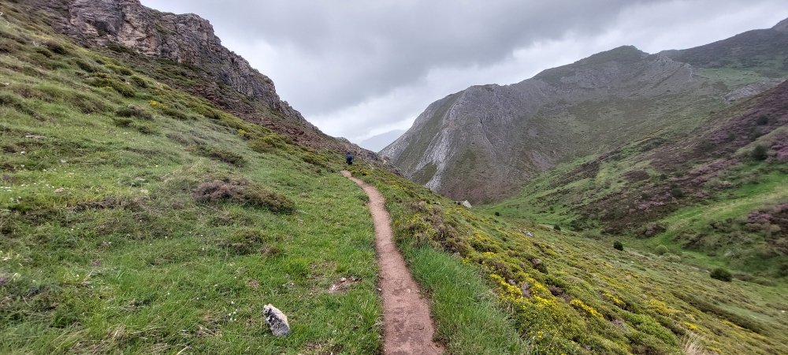
 
 You have to experience this path; it can't be explained.
 
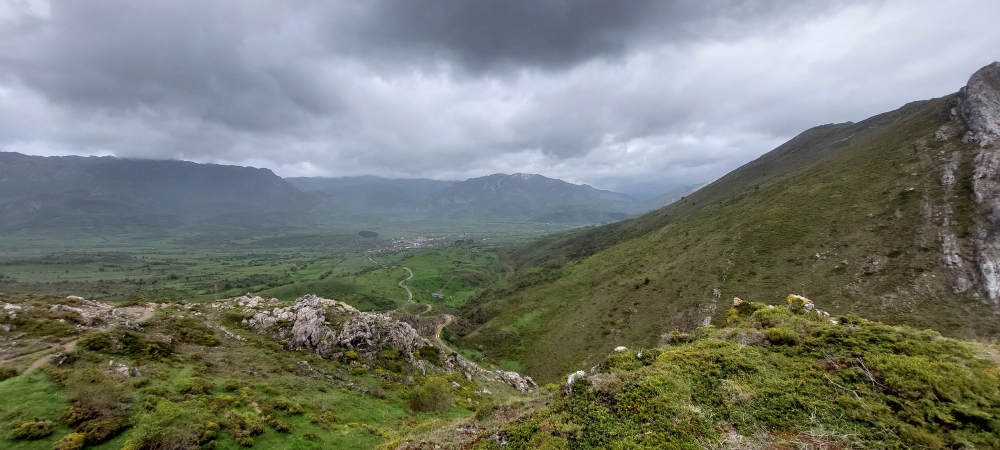

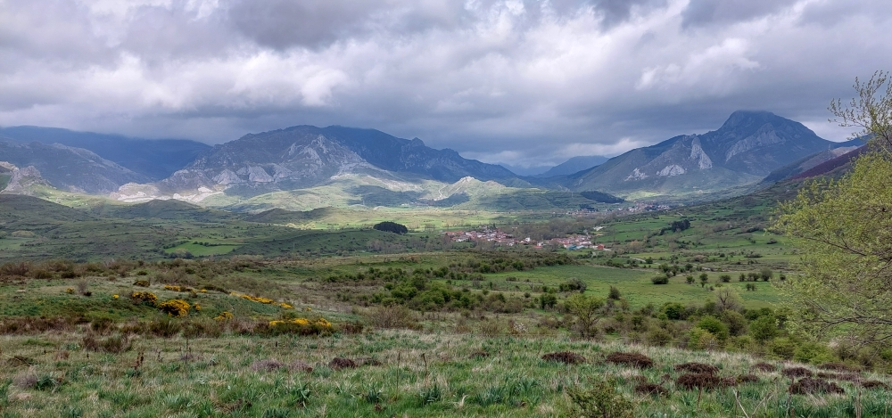

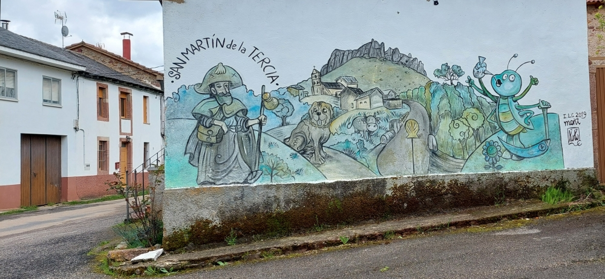
#### Poladura de la Tercia

🇪🇸 Esta vez teníamos suficiente espacio en el albergue. No hizo falta pedir prestado un colchón a los vecinos. Por suerte, el restaurante/bar estaba cerrado y tuvimos que prescindir de nuestra cerveza.
Muchas gracias por acogernos y por vuestra cálida hospitalidad.

🇩🇪 Diesmal hatten wir genug Platz in der Herberge. Es war nicht nötig, eine Matratze von den Nachbarn auszuleihen. Leider war das Restaurant/die Bar geschlossen, und wir mussten auf unser Bier verzichten.
Vielen Dank für die Aufnahme und die herzliche Gastfreundschaft.

🇵🇹 Desta vez, tínhamos espaço suficiente no albergue. Não foi preciso pedir um colchão emprestado aos vizinhos. Infelizmente, o restaurante/bar estava fechado e tivemos de abdicar da nossa cerveja.
Muito obrigado pela acolhida e boa hospitalidade.

🇬🇧 This time, we had plenty of space at the Albergue. We didn’t need to borrow a mattress from our neighbours. Unfortunately, the restaurant/bar was closed, so we had to do without our beer.
Thank you very much for the warm welcome and your kind hospitality.

---

🔁 [Camino-del-Salvador_Etappen](Camino-del-Salvador_Etappen.md)

↪[Etappe-03_Poladura-de-la-Tercia_LLanos-de-Someron](Etappe-03_Poladura-de-la-Tercia_LLanos-de-Someron.md)

---
> ***„Der Weg ist immer besser als die schönste Herberge.“***
> — Miguel de Cervantes, spanischer Schriftsteller, 1547 – 1616)

> _**«El camino siempre es mejor que la posada más hermosa.»**_  
> — _Miguel de Cervantes, escritor español (1547–1616)_

> _**«O caminho é sempre melhor do que a mais bela hospedaria.»**_  
> — _Miguel de Cervantes, escritor espanhol (1547–1616)_

> _**“The journey is always better than the most beautiful inn.”**_  
> — _Miguel de Cervantes, Spanish writer (1547–1616)_

 ...→

