## Camino del Salvador 2025

### Etappe_03: Poladura de la Tercia → LLanos de Somerón
06 Mai 2025
#### Der französische Pilger ⁘ The French pilgrim ⁘ El peregrino francés

##### 🇩🇪 Wir haben ihn nicht mehr gesehen

Er stand früh auf und war, ohne etwas zu versprechen, fest entschlossen, es zu schaffen.

Am Abend zuvor hatten wir in der Herberge von Poladura de la Tercia einen französischen Pilger getroffen, der seinen Weg irgendwo in der Nähe von Paris begonnen hatte und seit Februar unterwegs war. Wir sprachen über unsere Pläne für den nächsten Tag, und da uns ein Wandertag fehlte, kam die Idee auf, bis nach Bendueños zu gehen.

Ich wusste, dass selbst dann, wenn wir es bis zum Brunnen im Dorf Bendueños schaffen würden, nicht sicher war, ob wir anschließend auch den etwa einen Kilometer langen Anstieg bis zur Herberge bewältigen könnten. Ich kannte den Weg, doch was ich am Abend zuvor noch nicht wusste, war, dass uns nicht die Anstiege in den Bergen Sorgen bereiten würden, sondern die rutschigen und kräftezehrenden Abstiege vom Puerto de Pajares hinunter nach Pajares (Payares).

Er war bereits seit langer Zeit unterwegs, und aufgrund dieses Umwegs über den Caminho do Salvador und, wie ich glaube, später auch über den Caminho Primitivo wollte er endlich in Santiago ankommen. Deshalb rief er in Bendueños an, um einen Schlafplatz zu reservieren und so noch einige Kilometer zu sammeln und seinem Ziel näherzukommen.

Doch die Reservierung wurde von der Herberge in Bendueños abgelehnt, da man aus früheren Erfahrungen wusste, dass viele Pilger die anspruchsvollen Bergwege mit den flachen Etappen von "La Meseta" verwechseln.

Da ich die Herberge in Bendueños kannte, sagte ich ihm, dass er dort, falls er es bis Bendueños schaffen sollte, ganz sicher einen Schlafplatz bekommen würde.

Ich erklärte ihm außerdem, dass ich auch 2023 nicht reserviert hatte und bei meiner Ankunft lediglich anrufen musste und nach kurzer Wartezeit aufgenommen wurde. Ich glaube, genau darin liegt das eigentliche Problem: Die Pilger rufen an, und die Hospitaleros unterbrechen ihre Arbeit oder ihren Tagesablauf, um sie willkommen zu heißen – doch dann erscheinen manche von ihnen gar nicht.

Roze und ich waren froh, dass wir es bis nach Llanos de Somerón geschafft hatten. Dort fanden wir eine gemütliche Unterkunft, in der wir gut schlafen und etwas Gutes essen konnten. Im Nachhinein waren wir sogar froh, dass unsere Reservierungsanfrage am Vorabend nicht angenommen worden war. Hätten wir für diesen Tag reserviert, hätten wir den etwa einen Kilometer langen Anstieg vom Dorfbrunnen bis zur Herberge ganz bestimmt nicht mehr geschafft. So erschöpft waren wir.

Der französische Pilger war jung, und während wir erst seit zwei Tagen unterwegs waren, befand er sich bereits seit mehreren Monaten auf dem Jakobsweg und war deshalb deutlich besser in Form als wir.

Ich hoffe, eines Tages wieder in der Herberge von Bendueños zu übernachten und den Namen dieses französischen Pilgers herauszufinden. An sein Gesicht und an unsere Gespräche erinnere ich mich noch gut – aber Namen vergesse ich leider immer.

---
##### 🇵🇹 Nunca mais o vimos
Levantou-se cedo e, sem prometer nada, estava determinado a conseguir.

Na noite anterior, encontrámos um peregrino francês no albergue de Poladura de la Tercia. Tinha iniciado a sua peregrinação algures nas proximidades de Paris e caminhava desde fevereiro. Falámos sobre os nossos planos para o dia seguinte e, como nos faltava  um dia de caminhada, surgiu a ideia de irmos até Bendueños.

Eu sabia que, mesmo que conseguíssemos chegar à fonte da aldeia de Bendueños, não era certo que ainda tivéssemos forças para vencer a subida de cerca de um quilómetro até ao albergue. Conhecia o caminho, mas o que ainda não sabia naquela noite era que não seriam as subidas da montanha que nos causariam mais dificuldades, mas sim as descidas escorregadias e muito exigentes desde o Puerto de Pajares até Pajares (Payares).

Ele já caminhava há muito tempo e, por causa deste desvio pelo Caminho do Salvador e, creio eu, mais tarde também pelo Caminho Primitivo, queria finalmente chegar a Santiago. Por isso, telefonou para o albergue de Bendueños para reservar uma cama e assim percorrer mais alguns quilómetros, aproximando-se do seu objetivo.

No entanto, a reserva foi recusada, porque, devido a experiências anteriores, os responsáveis pelo albergue sabiam que muitos peregrinos confundiam os exigentes trilhos de montanha com as etapas planas de "La Meseta".

Como eu conhecia o albergue de Bendueños, disse-lhe que, se conseguisse lá chegar, teria certamente um lugar para dormir.

Expliquei-lhe também que, em 2023, eu igualmente não tinha feito qualquer reserva. Quando cheguei, bastou telefonar e esperar um pouco até ser recebido. Penso que é precisamente aí que reside o verdadeiro problema: os peregrinos telefonam e os hospitaleiros interrompem o seu trabalho ou a sua rotina para os receber, mas depois alguns acabam por não aparecer.

A Roze e eu ficámos felizes por termos conseguido chegar a Llanos de Somerón. Encontrámos um alojamento acolhedor, onde pudemos descansar bem e comer uma boa refeição. Olhando para trás, até ficámos satisfeitos por o nosso pedido de reserva na véspera não ter sido aceite. Se tivéssemos reservado para aquele dia, certamente já não teríamos conseguido vencer a subida de cerca de um quilómetro desde a fonte da aldeia até ao albergue. Estávamos completamente exaustos.

O peregrino francês era jovem e, enquanto nós caminhávamos apenas há dois dias, ele já seguia o Caminho há vários meses e encontrava-se, naturalmente, em muito melhor forma do que nós.

Espero um dia voltar a dormir no albergue de Bendueños e descobrir o nome daquele peregrino francês. Lembro-me perfeitamente do seu rosto e das conversas que tivemos, mas, infelizmente, esqueço-me sempre dos nomes.

---
##### 🇪🇸 Nunca volvimos a verlo

Se levantó temprano y, sin prometer nada, estaba decidido a conseguirlo.

La noche anterior habíamos conocido en el albergue de Poladura de la Tercia a un peregrino francés que había comenzado su camino en algún lugar cercano a París y que llevaba caminando desde febrero. Hablamos de nuestros planes para el día siguiente y, como todavía nos faltaba una jornada de camino, surgió la idea de llegar hasta Bendueños.

Yo sabía que, incluso si lográbamos llegar a la fuente del pueblo de Bendueños, no era seguro que después pudiéramos superar la subida de aproximadamente un kilómetro hasta el albergue. Conocía el camino, pero lo que aún no sabía aquella noche era que no serían las subidas de la montaña las que más nos preocuparían, sino los descensos resbaladizos y agotadores desde el Puerto de Pajares hasta Pajares (Payares).

Llevaba mucho tiempo caminando y, debido a este desvío por el Camino del Salvador y, creo, más tarde también por el Camino Primitivo, quería llegar por fin a Santiago. Por eso llamó al albergue de Bendueños para reservar una cama y así recorrer algunos kilómetros más y acercarse a su objetivo.

Sin embargo, la reserva fue rechazada porque, por experiencias anteriores, los responsables del albergue sabían que muchos peregrinos confundían los exigentes caminos de montaña con las etapas llanas de "La Meseta".

Como yo conocía el albergue de Bendueños, le dije que, si conseguía llegar hasta allí, tendría un lugar donde dormir con toda seguridad.

También le expliqué que en 2023 yo tampoco había hecho ninguna reserva y que, al llegar, solo tuve que llamar y esperar un poco hasta que me recibieron. Creo que ahí está el verdadero problema: los peregrinos llaman y los hospitaleros interrumpen su trabajo o su rutina para recibirlos, pero después algunos ni siquiera aparecen.

Roze y yo nos sentimos felices de haber llegado hasta Llanos de Somerón. Allí encontramos un alojamiento acogedor donde pudimos descansar bien y disfrutar de una buena comida. 
Mirando atrás, incluso nos alegramos de que nuestra solicitud de reserva de la víspera no hubiera sido aceptada. Si hubiéramos reservado para ese día, con toda seguridad ya no habríamos sido capaces de superar la subida de aproximadamente un kilómetro desde la fuente del pueblo hasta el albergue. Estábamos completamente agotados.

El peregrino francés era joven y, mientras nosotros solo llevábamos dos días caminando, él ya llevaba varios meses en el Camino y estaba, naturalmente, en mucha mejor forma que nosotros.

Espero volver algún día al albergue de Bendueños y averiguar el nombre de aquel peregrino francés. Recuerdo perfectamente su rostro y las conversaciones que mantuvimos, pero, por desgracia, siempre olvido los nombres.

---
##### 🇬🇧 We Never Saw Him Again

He got up early and, without making any promises, was determined to make it.

The evening before, we had met a French pilgrim at the hostel in Poladura de la Tercia. He had started his pilgrimage somewhere near Paris and had been walking since February. We talked about our plans for the following day, and since we still had one more day of walking ahead of us, the idea came up to continue as far as Bendueños.

I knew that even if we managed to reach the village fountain in Bendueños, there was no guarantee that we would still have the strength to climb the final kilometre up to the hostel. I knew the route, but what I did not yet know that evening was that it would not be the mountain climbs that would challenge us the most, but the slippery and exhausting descents from Puerto de Pajares down to Pajares (Payares).

He had already been on the road for a long time and, because of this detour along the Camino del Salvador and, I believe, later the Camino Primitivo, he was eager to finally reach Santiago. That is why he called the hostel in Bendueños to reserve a bed, hoping to cover a few more kilometres and move one step closer to his goal.

However, his reservation was declined because, based on previous experience, the hostel staff knew that many pilgrims confused these demanding mountain trails with the much flatter stages of the Vía de "La Meseta".

Since I knew the hostel in Bendueños, I told him that if he managed to get there, he would certainly be given a place to sleep.

I also explained that I had not made a reservation in 2023 either. When I arrived, I simply called, waited for a short while, and was welcomed in. I believe that this is the real problem: pilgrims call ahead, and the hospitaleros interrupt their work or daily routine to welcome them, only for some of those pilgrims never to arrive.

Roze and I were happy that we had made it as far as Llanos de Somerón. There we found a cosy place to stay, where we enjoyed a good night's sleep and a good meal. Looking back, we were actually glad that our reservation request the previous evening had not been accepted. If we had reserved for that day, we certainly would not have been able to manage the roughly one-kilometre climb from the village fountain to the hostel. We were simply too exhausted.

The French pilgrim was young, and while we had only been walking for two days, he had already spent several months on the Camino and was therefore in much better physical condition than we were.

I hope that one day I will stay again at the hostel in Bendueños and finally learn the name of that French pilgrim. I remember his face and the conversations we had very well, but I have always been terrible at remembering names.

Falls der Text als Kapitel eines Buches gedacht ist, kann ich ihn auch noch stilistisch etwas literarischer gestalten, ohne den persönlichen Charakter zu verändern.

Am Abend davor haben wir in die Herberg von Poladura de la Tercia einen französische Pilger getroffen, der schon irgendwo bei Paris seinen Weg angefangen hat und seit Februar unterwegs war.  Wir sprachen über unsere Pläne für den nächsten Tag und da uns eine Tag gefehlt hat , kam die idee bis Bendueños zu laufen. Ich wusste auch wenn wir es bis zu den Dorfbrunnen von Bendueños schaffen, war ich mir nicht sicher, ob wir von Dortbrunnen  die 1 km Aufstiege bis zu der Albergue  schaffen wurden. Ich kannte schon disenen Bergweg, aber was ich an den Abend davor nicht gewusst habe, war nicht den Aufstiege der Bergen  der uns sorgen machen soll, sondern die rutschige und kraftraubende Abstiege von Puerto de Pajares bis Pajares (Payares).

Er war schon sehr lange unterwegs und durch diese Umweg über den Camino del Salvador und ich glaube anschließend  den Camino Primitivo  wollte er endlich in Santiago ankommen, deswegen hat er in Bedueños angerufen um einen paar Km zu gewinnen um sich seinen Ziel näher zu kommen. 

---
#### Vivir y agradecer la creación de Dios 
- To live and give thanks for God’s creation. 
- Leben und Gottes Schöpfung danken
-  Viver e agradecer a criação de Deus

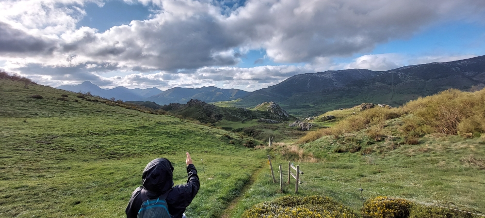

- You discover the true and wonderful life with your feet
- La vida auténtica y maravillosa la descubres con tus pies
- Das wahre und wundervolle Leben entdeckst du mit deinen Füßen
- É com os pés que descobres a vida verdadeira e maravilhosa

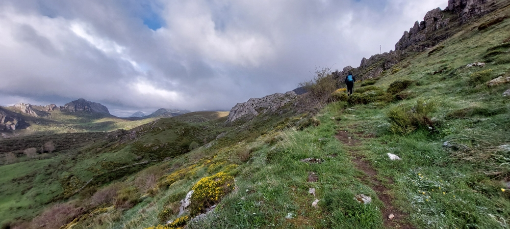

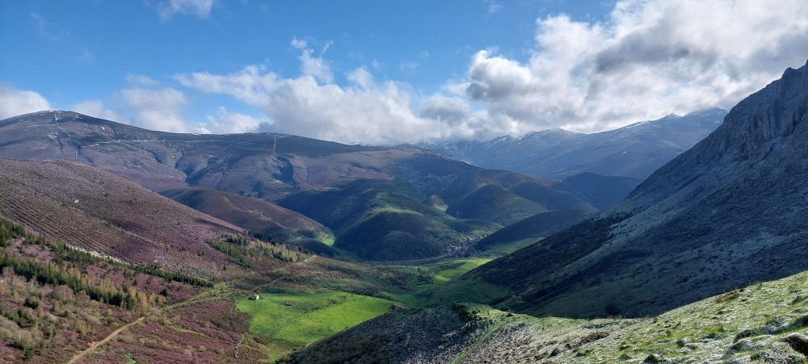

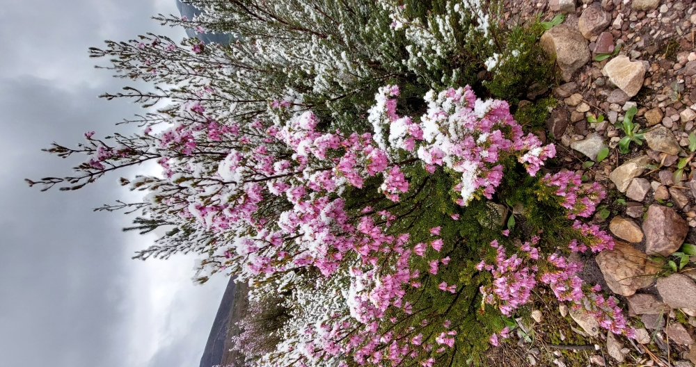

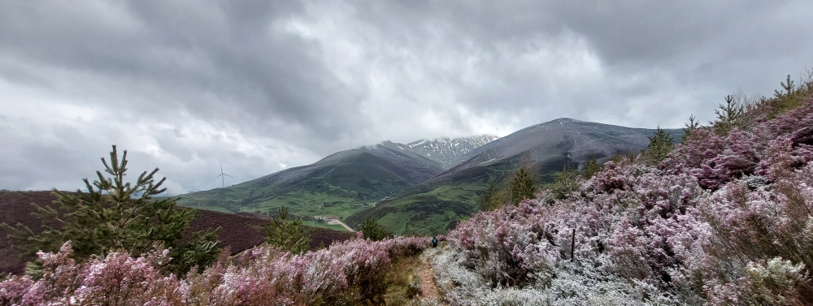

---
#### Puerto de Pajares
- Spätestens genau hier sollte man an dem Haus rechts abbiegen
- O mais tardar, é precisamente aqui que se deve virar à direita, junto à casa
- Como muy tarde, es precisamente aquí donde hay que girar a la derecha, junto a la casa

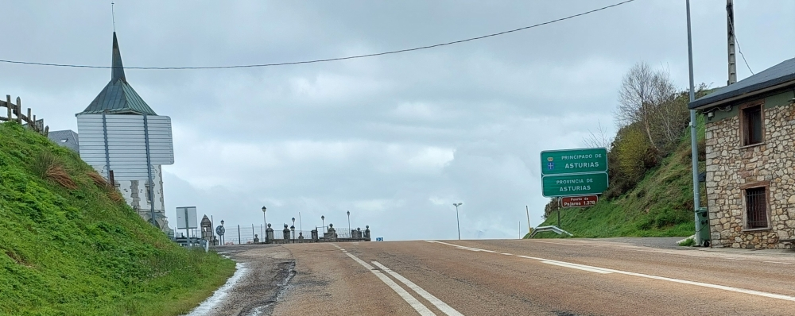
##### 🇩🇪 Spätestens genau hier sollte man an dem Haus rechts abbiegen 
Da der Pfad rechts von der Straße schlammig war, blieben wir zunächst auf der Straße. 
Wir hatten so große Sehnsucht nach einem Kaffee, dass wir zum ehemaligen „Parador de Turismo“ gingen. Leider war das Café geschlossen. Also suchten wir uns einen trockenen Ort, ruhten uns ein wenig aus und aßen etwas.

Als wir uns zum Aufbruch bereit machten, sah ich hinter den Leitplanken einen Weg, der nach Pajares führte. Deshalb beschlossen wir, dort entlangzugehen. Aufgrund des sandigen Bodens rutscht man auf diesem Weg leicht aus, und da es zuvor geregnet hatte, gab es auch einige sehr schlammige Abschnitte.

Ich rate davon ab, diesen Weg zu nehmen, insbesondere bei schlechtem Wetter.

Im Nachhinein hätten wir es vorgezogen, umzukehren und dem Weg nach rechts zu folgen.

Siehe Foto in  "2023_Etappe-04_Poladura-de-la-Tercia_Payares"  , im Abschnitt **„Ein verlorener Schlafsack wurde gefunden“**.

Dieser Abschnitt bleibt bis kurz vor Pajares schwierig. Wenn man vorher nach rechts abbiegt, überquert man die Straße und gelangt unweigerlich wieder auf diesen Weg zurück. Siehe dazu das Foto unten oder den Abschnitt **„Eine Atempause für ein Foto“**.

*Auf diesem Teil der Strecke haben wir beschlossen, keine Fotos zu machen und uns auch sonst nicht ablenken zu lassen, um uns voll und ganz auf den Weg und unsere Schritte konzentrieren zu können.*
##### 🇵🇹 O mais tardar, é precisamente aqui que se deve virar à direita, junto à casa
Como o caminho à direita da estrada estava enlameado, permanecemos inicialmente na estrada. Tínhamos tanta vontade de tomar um café que fomos até ao antigo „Parador de Turismo“. Infelizmente, o café estava fechado. Por isso, procurámos um lugar seco, descansámos um pouco e comemos alguma coisa.

Quando nos preparávamos para continuar a caminhada, vi, atrás dos rails de proteção, um caminho que seguia em direção a Pajares. Decidimos então seguir por esse caminho. Devido ao terreno arenoso, é fácil escorregar e, como tinha chovido anteriormente, havia também alguns troços bastante enlameados.

Não aconselho a seguir por este caminho, sobretudo com mau tempo.

Olhando para trás, teríamos preferido voltar para trás e seguir pelo caminho à direita.

Ver a foto  "2023_Etappe-04_Poladura-de-la-Tercia_Payares"   ,na secção **„Foi encontrado um saco-cama perdido“**.

Este troço continua difícil até pouco antes de Pajares. Se se virar à direita um pouco antes, atravessa-se a estrada e acaba-se inevitavelmente por voltar a este mesmo caminho. Ver a foto abaixo ou a secção **„Uma pausa para uma fotografia“**.

*Neste trecho do percurso, decidimos não tirar fotografias nem permitir outras distrações, para podermos concentrar-nos completamente no caminho e nos nossos passos.*

##### 🇪🇸 Como muy tarde, es precisamente aquí donde hay que girar a la derecha, junto a la casa

Como el sendero a la derecha de la carretera estaba embarrado, al principio seguimos por la carretera. Teníamos tantas ganas de tomar un café que fuimos hasta el antiguo „Parador de Turismo“. Por desgracia, el café estaba cerrado. Así que buscamos un lugar seco, descansamos un poco y comimos algo.

Cuando nos preparábamos para continuar la marcha, vi detrás de las barreras de protección un camino que llevaba hacia Pajares. Por eso decidimos seguir por allí. Debido al terreno arenoso, es fácil resbalar y, como había llovido anteriormente, también había algunos tramos muy embarrados.

No recomiendo tomar este camino, especialmente cuando hace mal tiempo.

Visto en retrospectiva, habría sido preferible dar la vuelta y seguir el camino de la derecha.

Véase la foto "2023_Etappe-04_Poladura-de-la-Tercia_Payares"  , en el apartado **«Se encontró un saco de dormir perdido»**.

Este tramo sigue siendo difícil hasta poco antes de Pajares. Si se gira a la derecha antes, se cruza la carretera y, inevitablemente, se vuelve a desembocar en este mismo camino. Véase la foto de abajo o el apartado **«Una pausa para una foto»**.

*En esta parte del recorrido decidimos no hacer fotografías ni permitir ninguna otra distracción, para poder concentrarnos plenamente en el camino y en nuestros pasos.*
##### 🇬🇧 At the latest, this is exactly where you should turn right, by the house
Since the path to the right of the road was muddy, we initially stayed on the road. We were so eager for a coffee that we went to the former „Parador de Turismo“. Unfortunately, the café was closed. So we looked for a dry place, rested for a while and ate something.

When we were getting ready to continue our walk, I saw a path behind the guardrails that led towards Pajares. We therefore decided to follow it. Because of the sandy ground, it is easy to slip, and since it had rained earlier, there were also some very muddy sections.

I do not recommend taking this path, especially in bad weather.

In hindsight, we would have preferred to turn back and follow the path to the right.

See photo  "2023_Etappe-04_Poladura-de-la-Tercia_Payares"  , in the section **“A lost sleeping bag was found”**.

This section remains difficult until shortly before Pajares. If you turn right earlier, you cross the road and inevitably end up back on this same path. See the photo below or the section **“A short break for a photo”**.

*On this part of the route, we decided not to take any photos or allow ourselves any other distractions, so that we could concentrate fully on the trail and on our steps.*

#### Ein Atempause für ein Foto 
- A short break for a photo

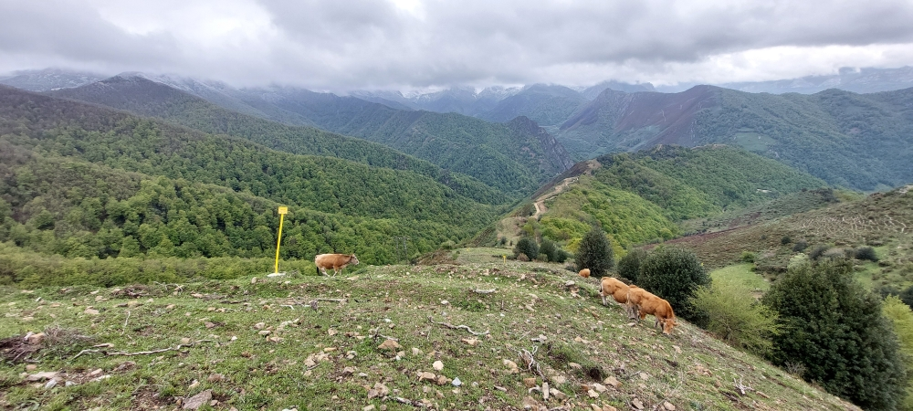

- Una pausa para una foto
- Uma pausa para uma fotografia

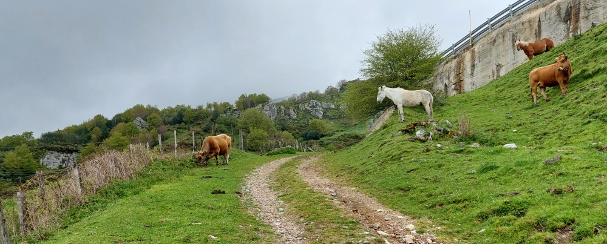
#### 2 Fotos: 
- eines aus dem Jahr 2023 und das andere aus dem Jahr 2025
- una de 2023 y la otra de 2025
-  one from 2023 and the other from 2025
- uma de 2023 e a outra de 2025

Foto von 06 Mai 2025
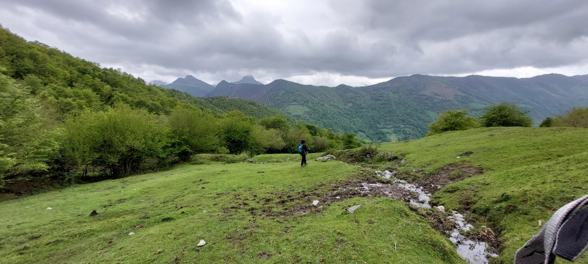

Foto von 30 April  2023

#### I wish all my falls were like this
- Que todas as minhas quedas fossem assim
- Ojalá todas mis caídas fueran así 
- Ich wünschte, alle meine Stürze wären so 

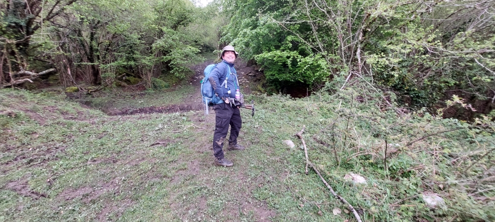
##### 🇩🇪 Gut gelandet, das macht glücklich
Gerade dort, wo wir uns am sichersten fühlen, rutschen wir aus.

Knie und Ellbogen sind noch unversehrt, ich hatte Glück, denn ich werde sie auf all meinen Wegen noch dringend brauchen; nur die Kleidung hat ein paar Flecken abbekommen.
Ob die Waschmaschine das genauso sieht … nun ja, niemand fragt sie, solange man überhaupt eine findet.
##### 🇵🇹 Aterrei bem, isso faz-me feliz
É precisamente onde nos sentimos mais seguros que escorregamos.

Os joelhos e os cotovelos ainda estão intactos, tive sorte, porque vou precisar deles em todos os meus caminhos; só a roupa ficou com algumas manchas.
Será que a máquina de lavar roupa pensa o mesmo… bem, ninguém lhe pergunta, desde que se consiga encontrar uma.
##### 🇬🇧 Landed safely – that makes me happy
It is precisely when we feel most secure that we slip up.

My knees and elbows are still in one piece; I was lucky, because I’m going to need them desperately on all my journeys; only my clothes have got a few stains on them.
Whether the washing machine sees it that way too… well, nobody asks it, as long as you can find one at all.
##### 🇪🇸 He aterrizado bien, eso me hace feliz
Es precisamente donde nos sentimos más seguros donde resbalamos.

Las rodillas y los codos siguen intactos, he tenido suerte, porque los voy a necesitar en todos mis caminos; solo la ropa ha quedado con algunas manchas.
¿Pensará lo mismo la lavadora?… Bueno, nadie le pregunta, mientras se encuentre una.

---
#### Santa Marina 

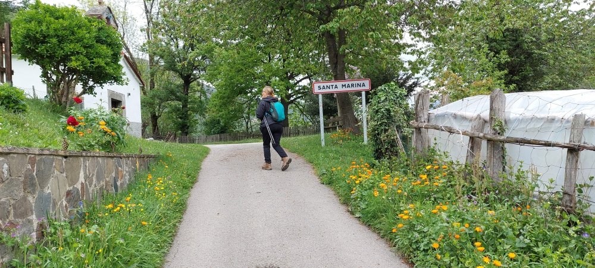
##### 🇩🇪 Llanos de Somerón ist nicht mehr weit
Und wir haben immer noch keinen Kaffee getrunken.
Selbst als wir durch Pajares kamen, war zu dieser Uhrzeit kein Café und keine Bar geöffnet, also sind wir weitergegangen. Zum Glück gibt es in der Herberge „Albergue Cascoxu“ eine Bar, sodass wir unseren Tag mit einem Bier ausklingen lassen können.
#####  🇵🇹 Llanos de Somerón já não fica longe
E ainda não tomámos café.
Mesmo quando passámos por Pajares, a essa hora não havia nenhum café nem bar aberto, por isso continuámos a caminhada. Felizmente, no albergue «Albergue Cascoxu» há um bar, pelo que podemos terminar o nosso dia com uma cerveja.

##### 🇪🇸 Ya no queda mucho para llegar a Llanos de Somerón
Y aún no nos hemos tomado un café.
Incluso cuando pasamos por Pajares, a esa hora no había ningún café ni bar abierto, así que seguimos adelante. Por suerte, en el «Albergue Cascoxu» hay un bar, así que podemos terminar el día con una cerveza.

##### 🇬🇧 Llanos de Somerón isn’t far now
And we haven’t had a coffee yet.
Even when we passed through Pajares, there weren’t any cafés or bars open at that time of day, so we carried on. Luckily, there’s a bar at the ‘Albergue Cascoxu’ hostel, so we can round off our day with a beer.

---

🔁 [Camino-del-Salvador_Etappen](Camino-del-Salvador_Etappen.md)

↪ [Etappe-04_LLanos-de-Someron_Pola-de-Lena](Etappe-04_LLanos-de-Someron_Pola-de-Lena.md)

---
>***„Der Mensch braucht Erde unter den Füßen, sonst verdorrt ihm das Herz.“***
>— _Gertrud von le Fort, deutsche Schriftstellerin, 1876 – 1971_

> _**«El ser humano necesita sentir la tierra bajo sus pies; de lo contrario, su corazón se marchita.»**_  
> — _Gertrud von le Fort, escritora alemana (1876–1971)_

> _**«O ser humano precisa da terra sob os pés; caso contrário, o seu coração definha.»**_  
> — _Gertrud von le Fort, escritora alemã (1876–1971)_

> _**“A person needs the earth beneath their feet; otherwise, the heart withers.”**_  
> — _Gertrud von le Fort, German writer (1876–1971)_

 ...→