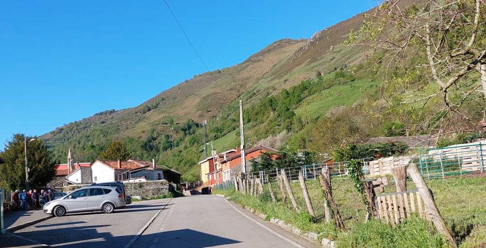
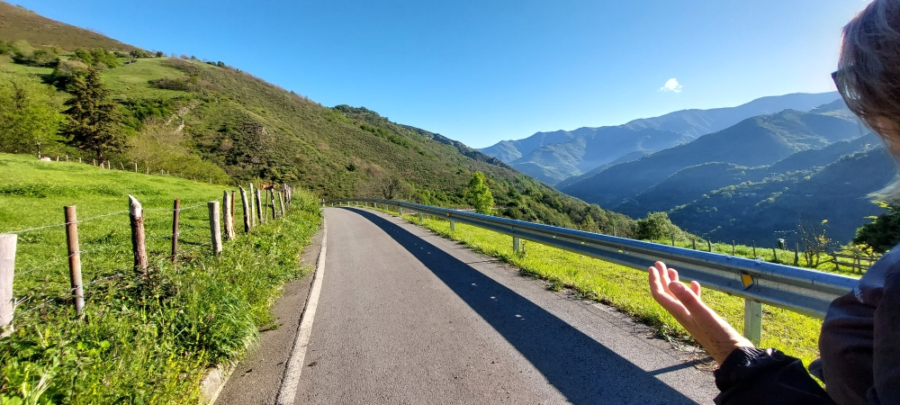
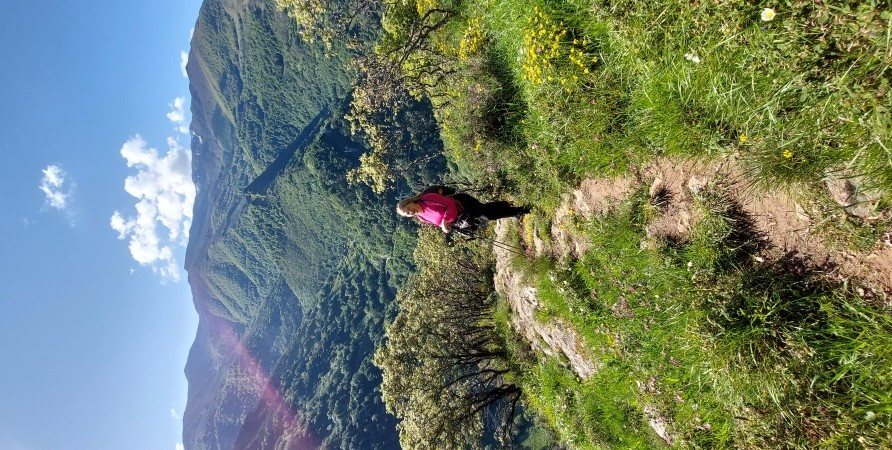
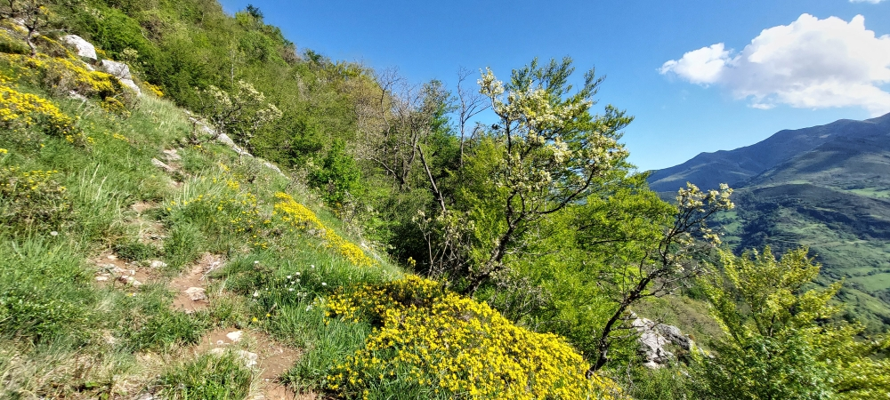
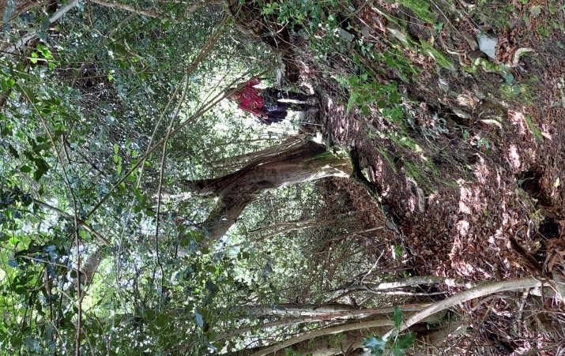
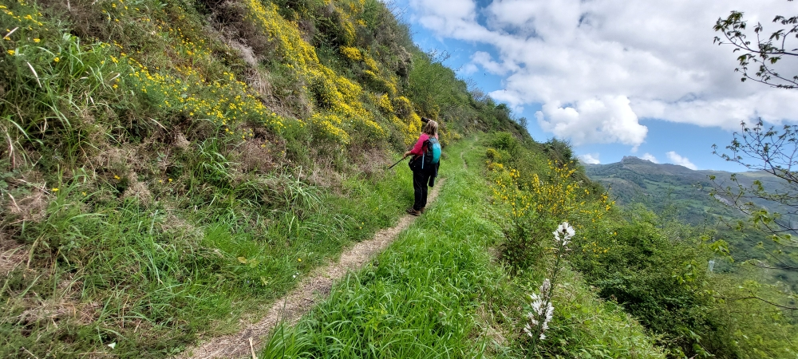
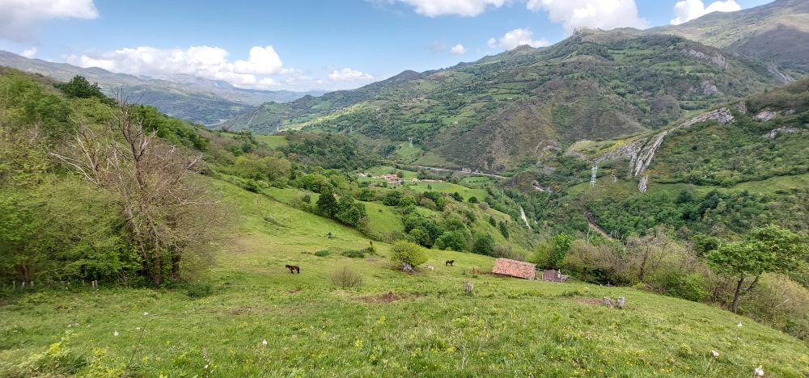
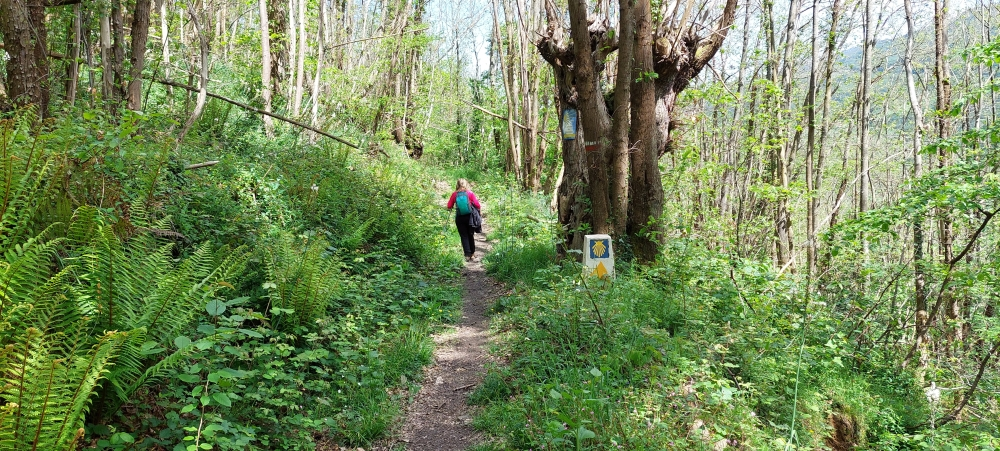
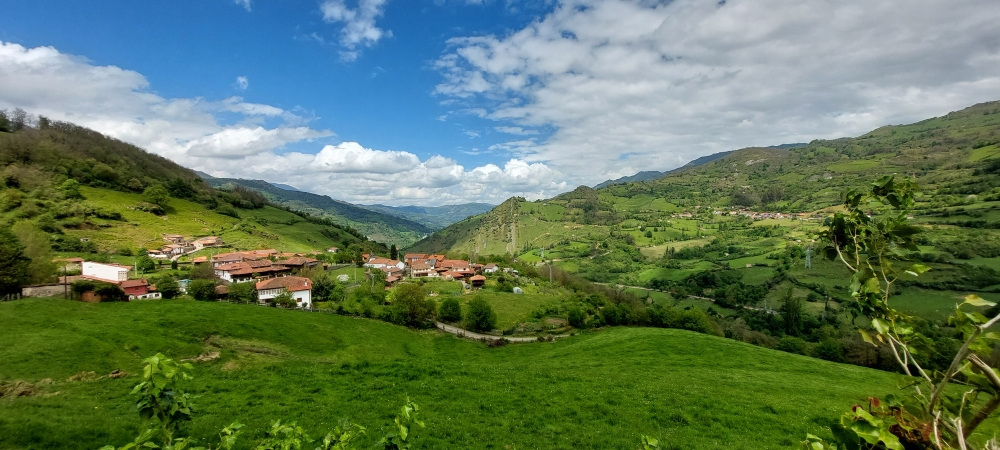
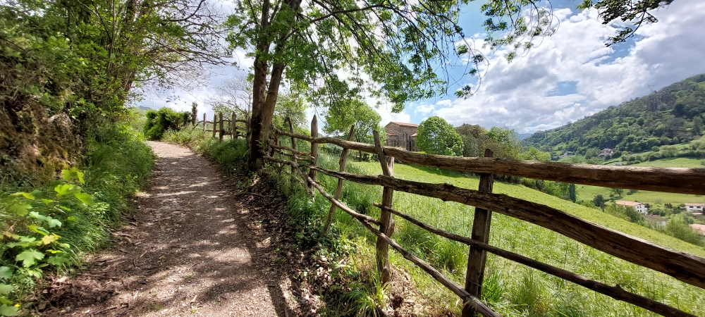

## Camino del Salvador 2025
---
### Etappe_04: LLanos de Somerón → Pola de Lena
07 Mai 2025

####  Decidimos ⁘ Wir haben uns entschieden ⁘ We’ve decided ⁘ Hemos decidido

- Der Weg durch den Tal ist sicher, aber ich glaube nicht, dass es so beeindruckend ist.
- O caminho pelo vale é seguro, mas acho que não é assim tão impressionante.
- The route through the valley is safe, But I don't think it's that spectacular.
- El camino que atraviesa el valle es seguro, pero no creo que sea tan impresionante.
#### 🇪🇸 A partir de aquí hay un tramo difícil de unos 50 m.

Hay dos tramos de entre 1 y 2 m de longitud en los que hay que tener las manos libres para poder utilizarlas como apoyo.

 🇩🇪 Ab hier folgt ein schwieriger Abschnitt von etwa 50 m.
 
Es gibt zwei Stellen von 1 bis 2 m Länge, an denen man die Hände frei haben muss, um sie als Stütze nutzen zu können.

🇵🇹 A partir daqui, há um troço difícil com cerca de 50 m.

Existem dois troços com 1 a 2 m de comprimento em que é necessário ter as mãos livres para poder utilizá-los como apoio.

🇬🇧 From here on, there is a difficult stretch of about 50 metres.

There are two sections, each 1 to 2 metres long, where you need to have your hands free so that you can use them for support.

#### The Hiking poles ⁘ Os Bastões ⁘ Die Wanderstöcke ⁘ Los Bastones

🇵🇹 Também aqui os bastões de caminhada são uma grande ajuda, uma vez que é fácil escorregar neste percurso, sobretudo quando chove.

🇩🇪  Auch hier sind Wanderstöcke eine große Hilfe, da man auf dieser Strecke leicht ausrutschen kann, vor allem wenn es regnet.

🇪🇸  También aquí los bastones de senderismo son de gran ayuda, ya que en este tramo es fácil resbalar, sobre todo cuando llueve.

🇬🇧 Hiking poles are a great help here too, as it’s easy to slip on this stretch, especially when it’s raining.

#### 🇩🇪 So etwas kommt schon mal vor.

- Irgendwo auf dieser Wegstrecke

Vielen Dank an die deutsche Pilgerin und Skandinavien-Kennerin.
Du hast den Gegenstand, den ich verloren hatte, den ganzen Weg über bei dir getragen.
Gerade als Roze und ich nach einem Plätzchen in der Sonne suchten, um eine kleine Pause zu machen und etwas zu essen, kamst du an uns vorbei und fragtest, ob wir etwas verloren hätten. Damit hatte ich nicht gerechnet, denn ich hatte mich schon damit abgefunden – solche Dinge passieren nun mal ab und zu. 

Ich habe deinen Namen irgendwo tief in meinem Gedächtnis gespeichert, aber wenn wir uns wieder begegnen, werde ich dich erneut zu einem Butterbrot mit Bärlauch einladen, auch wenn mein Hut nicht verloren geht. Und ich hoffe, dass es dir in der Herberge in Bendueños genauso gut gefallen hat wie mir zwei Jahre zuvor.
#### 🇪🇸 Estas cosas suelen pasar
 

- En algún punto de este tramo del camino

Muchísimas gracias a la peregrina alemana y conocedora de Escandinavia.
Te llevaste contigo el objeto que había perdido durante todo el camino.
Justo cuando Roze y yo buscábamos un rinconcito al sol para hacer una pequeña pausa y comer algo, pasaste junto a nosotros y nos preguntaste si habíamos perdido algo. No me lo esperaba, ya que me había conformado con la pérdida; estas cosas pasan de vez en cuando.  

He guardado tu nombre en lo más profundo de mi memoria, pero si volvemos a encontrarnos, te invitaré de nuevo a un bocadillo  con ajo silvestre, aunque no se me pierda el sombrero. Y espero que te lo hayas pasado tan bien en el albergue de Bendueños como yo dos años antes.
##### 🇵🇹 Coisas assim sempre acontecem

- Algures ao longo deste percurso

Muito obrigado à peregrina alemã e conhecedora da Escandinávia.
Levaste contigo o objeto que eu tinha perdido durante todo o percurso.
Justamente quando a Roze e eu procurávamos um cantinho ao sol para fazer uma pequena pausa e comer alguma coisa, passaste por nós e perguntaste se tínhamos perdido alguma coisa. Não estava à espera disso, pois já me tinha conformado com a perda – estas coisas acontecem de vez em quando.  

Guardei o teu nome algures no fundo da minha memória, mas quando nos voltarmos a encontrar, vou convidar-te novamente para um sanduíche com alho selvagem, mesmo que o meu chapéu não se perca. E espero que tenhas apreciado o albergue em Bendueños tanto quanto eu há dois anos.
#### 🇬🇧 Things like that happen from time to time.

- Somewhere along this stretch of the route

Many thanks to the German pilgrim who knows Scandinavia so well.
You brought with you the item I’d lost during the entire walk.
Just as Roze and I were looking for a sunny spot to take a short break and have a bite to eat, you walked by and asked if we’d lost anything. I wasn’t expecting that at all, since I’d already accepted the loss—these things happen from time to time.    

I’ve stored your name somewhere deep in my memory, but if we meet again, I’ll treat you to a buttered bread roll with wild garlic once more, even if I don’t lose my hat. And I hope you enjoyed the hostel in Bendueños just as much as I did two years ago.
#### Sie blieb; wir gingen noch einen bisschen weiter 

- Ela permaneceu; nós continuámos um pouco mais 
- She stayed; we walked a little further
- Ella se quedó; nosotros seguimos un poco más 
#### Pola de Lena

🇩🇪 Albergue de peregrinos San Martín
Wir haben es geschafft, vor 18:30 Uhr dort anzukommen, und wurden sehr herzlich empfangen. 

Vielen Dank für den tollen Aufenthalt.

🇵🇹 Albergue de peregrinos San Martín
Conseguimos chegar lá antes das 18h30 e fomos recebidos de forma muito bem-vinda. 

Muito obrigado por esta estadia tão agradável.

🇪🇸 Albergue de peregrinos San Martín
Conseguimos llegar antes de las 18:30 y nos recibieron muy cordialmente. 

Muchas gracias por esta estancia tan agradable.

🇬🇧 San Martín Pilgrims’ Albergue
We managed to arrive there before 6.30 pm and were given a very warm welcome. 

Thank you very much for a lovely stay.

---

🔁 [Camino-del-Salvador_Etappen](Camino-del-Salvador_Etappen.md)

↪ [Etappe-05_Pola-de-Lena_Oviedo](Etappe-05_Pola-de-Lena_Oviedo.md)

---
👣 _좋은 길 되세요_ (jo-eun gil doeseyo)  

 ...→

