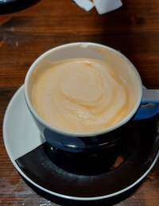
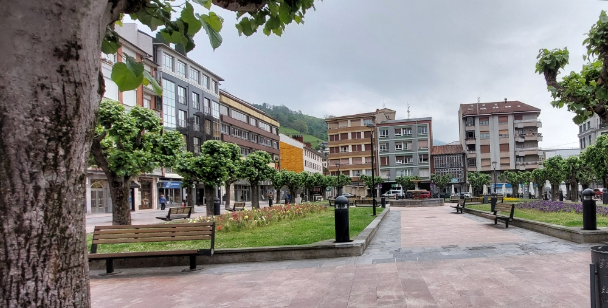
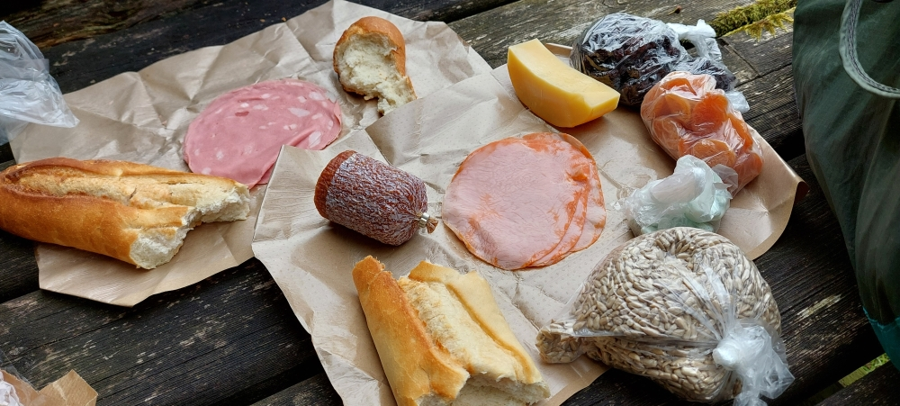
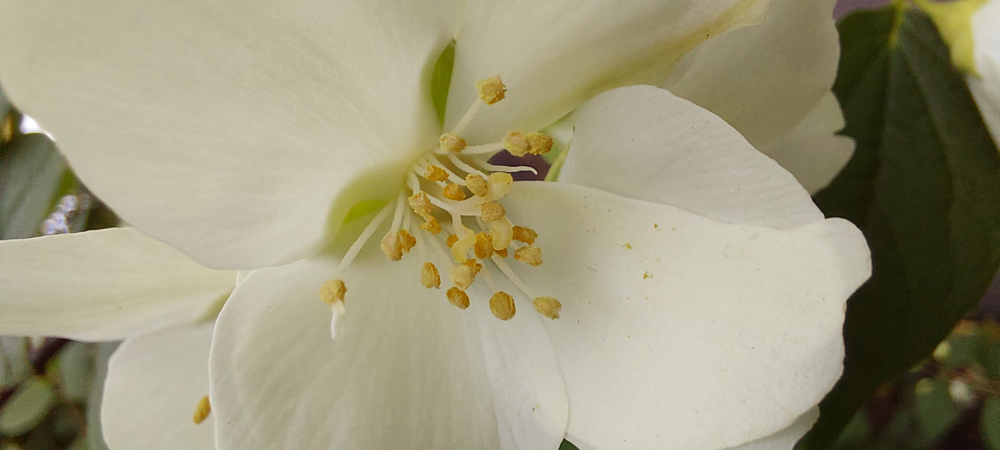
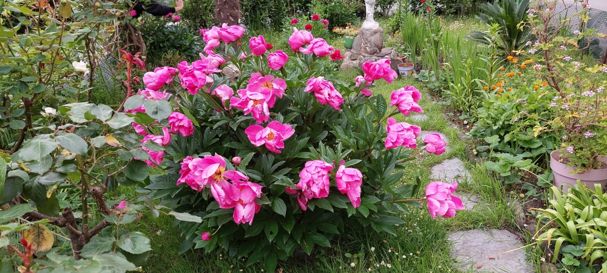
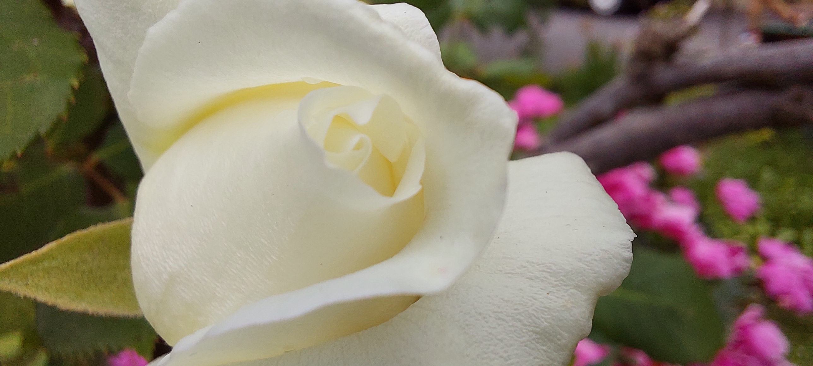
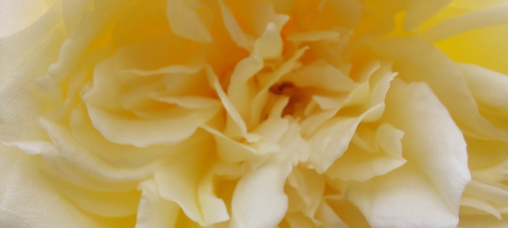
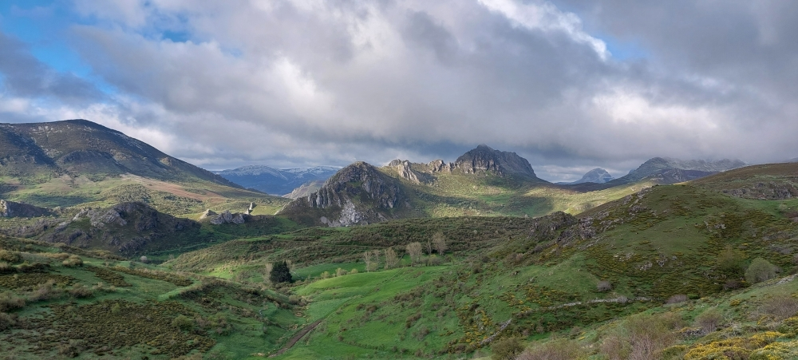

## Camino del Salvador 2025

### Etappe_05: Pola de Lena  → Oviedo
08 Mai 2025

> [!quote]
> 
> 🇪🇸
> > _**«Ya sea que vayas deprisa o despacio, el camino que tienes por delante sigue siendo el mismo.»**_  
> > — _Proverbio chino_
> > 
> > **Esa es la cuestión.**  
> > Sobre ello se puede debatir, y cada cual tendrá una opinión diferente.  
> 
> 🇵🇹 
> > _**«Quer vás depressa, quer vás devagar, o caminho à tua frente continua a ser o mesmo.»**_  
> > — _Provérbio chinês_
> >
> > **Essa é a questão.**  
> > Sobre isso pode-se discutir, e cada um terá uma opinião diferente.  
> 
> 🇩🇪
> > _**„Ob du eilst oder langsam gehst, der Weg vor dir bleibt derselbe.“**_  
> > — _Aus China_
> > 
> > **Das ist die Frage.**  
> > Darüber lässt sich diskutieren, und jeder wird eine andere Meinung dazu haben.  
> 
>  🇬🇧
> > _**“Whether you walk quickly or slowly, the road ahead remains the same.”**_  
> > — _Chinese proverb_
> >
> > **That is the question.**  
> >It is open to debate, and everyone will have a different opinion about it.  
> 
>- 

---

#### 🇩🇪 Heute beginnen wir den Tag ganz anders
- Mit einem einfachen Kaffee.

🇵🇹 Hoje começamos o dia de uma forma completamente diferente.
- Com um simples café

>-  

🇪🇸 Hoy hemos empezado el día de una forma totalmente diferente
- Con un simple café

🇬🇧 Today we’re starting the day in a completely different way
- With a simple cup of coffee

---
#### 🇪🇸 Simplemente disfrutar
🇬🇧 Just enjoy it
🇩🇪 Einfach genießen
🇵🇹 Simplesmente desfrutar

---
#### 🇬🇧 Civilisation
We have left behind the world shaped by God, and civilisation has got hold of us once again.
I hear strange noises that constantly wash over me.

**Are those cars?**

🇩🇪 Wir haben die von Gott geformte Welt hinter uns gelassen, und die Zivilisation hat uns wieder einmal. Ich höre seltsame Geräusche, die mich ständig überrollen. 

**Sind das Autos?**

🇵🇹 Deixámos para trás o mundo moldado por Deus, e a civilização apoderou-se de nós mais uma vez. Ouço ruídos estranhos que me atropelam constantemente. 

**Serão carros?**

🇪🇸 Hemos dejado atrás el mundo moldeado por Dios, y la civilización nos tiene atrapados una vez más. Escucho ruidos extraños que me arrollan constantemente. 

**¿Son coches?** 

---
#### 🇵🇹 A criação de Deus cuidada pelas mãos humanas
Pequenos oásis no meio da civilização.

 

- **God’s creation, tended by human hands**
Little oases in the heart of civilisation

- **Gottes Schöpfung, gepflegt von Menschenhand**
Kleine Oasen inmitten der Zivilisation

- **La creación de Dios, cuidada por la mano del ser humano**
Pequeños oasis en medio de la civilización

---

🔁 [Camino-del-Salvador_Etappen](Camino-del-Salvador_Etappen.md)

↪ [Camino-del-Salvador](Camino-del-Salvador.md)

[...→](#∞)

---
#### 6 Tage   ⁘    Dias   ⁘    Days 

> 🇩🇪 *Ich habe den Weg des Erlösers bereits zweimal zurückgelegt. Das erste Mal in 7 Tagen, das zweite Mal in 5 Tagen. Abschließend möchte ich diese Erfahrung mit der Schöpfungsgeschichte in Verbindung bringen, da der Weg des Erlösers von allen Wegen diese Geschichte am besten verkörpert.*
> 
> *Genau so viele Tage hatten wir für meinen zweiten Durchlauf ursprünglich auch geplant. Es sind die sechs Tage, die man sich für diesen unglaublichen Weg eigentlich nehmen sollte. Doch aufgrund von menschengemachten Terminen mussten wir die Reise auf fünf Tage verkürzen – deshalb mussten wir einen Teil dieser unglaublichen Strecke etwas schneller zurücklegen.*
 ---
> 🇪🇸 *Ya he recorrido el Camino del Redentor en dos ocasiones. La primera vez en 7 días, la segunda en 5 días. Para terminar, me gustaría relacionar esta experiencia con el relato de la Creación, ya que, de entre todos los caminos, el Camino del Redentor es el que mejor encarna este relato.*
> 
> *Exactamente esa cantidad de días habíamos planeado originalmente, y esos son los días que se deberían tomar para el Camino del Salvador. Debido a compromisos creados por el hombre, lo acortamos a cinco días, así que tuvimos que recorrer parte de esta increíble ruta un poco más rápido.*
 ---
> 🇵🇹 *Já percorri o Caminho do Salvador duas vezes. A primeira vez em 7 dias, a segunda vez em 5 dias. Para concluir, gostaria de relacionar esta experiência com a história da Criação, uma vez que, de todos os caminhos, o Caminho do Salvador é aquele que melhor encarna essa história.*
> 
> *Era exatamente esse o número de dias que tínhamos planeado inicialmente, e é exatamente esse o número de dias que se deve prever para o Caminho de Salvador. Tivemos de encurtar a caminhada para cinco dias devido a outros compromissos, razão pela qual  fomos obrigados a percorrer uma parte deste percurso incrível um pouco mais depressa.*

---
> *I have already completed the Path of the Saviour twice. The first time in 7 days, the second time in 5 days. Finally, I would like to link this experience to the story of Creation, as the Path of the Saviour, of all the paths, best embodies this story.*
> 
> *That’s exactly how many days we’d originally planned, and that’s exactly how many days you should allow for the Camino del Salvador. We’ve shortened the walk to five days due to other commitments, so we had to cover part of this incredible route a little more quickly.*

---

## Iter Sancti Salvatoris: Narratio Creationis Meae
###### ∞
### 🇩🇪 In sechs Tagen schuf Gott die Welt

- **Tag 1**: Gott macht das Licht und trennt es von der Finsternis (Tag und Nacht).
- **Tag 2**: Gott baut den Himmel über dem Wasser.
- **Tag 3**: Gott sammelt das Wasser, sodass trockenes Land entsteht, und lässt Pflanzen wachsen.
- **Tag 4**: Gott erschafft Sonne, Mond und Sterne für den Tag und die Nacht.
- **Tag 5**: Gott erschafft die Fische im Meer und die Vögel in der Luft.
- **Tag 6**: Gott macht die Landtiere und die Menschen (Mann und Frau).

**Ist das ein Zufall?**
### Am siebten Tag, Gott ruht sich aus und macht diesen Tag zu einem heiligen Tag.
***Und betracht was Er geschaffen hat.*** 
[🌍](#.)

---
### 🇪🇸 En seis días, Dios creó el mundo

- **Día 1:** Dios hace la luz y la separa de las tinieblas (el día y la noche).
- **Día 2:** Dios construye el cielo sobre el agua.
- **Día 3**: Dios reúne el agua para que aparezca la tierra seca y hace crecer las plantas.
- **Día 4:** Dios crea el sol, la luna y las estrellas para el día y la noche.
- **Día 5:** Dios crea los peces en el mar y las aves en el cielo.
- **Día 6:** Dios hace los animales terrestres y a los seres humanos (hombre y mujer).

**¿Será una coincidencia?**
### El séptimo día, Dios descansa y hace de este día un día santo.
***Y contempla lo que ha Creado.***
[🌍](#.)

---
### 🇵🇹  Em seis dias, Deus criou o mundo

- Dia 1: Deus faz a luz e separa-a das trevas (dia e noite).
- Dia 2: Deus constrói o céu sobre a água.
- Dia 3: Deus reúne a água para que surja a terra seca e faz crescer as plantas.
- Dia 4: Deus cria o sol, a lua e as estrelas para o dia e para a noite.
- Dia 5: Deus cria os peixes no mar e as aves no céu.
- Dia 6: Deus faz os animais terrestres e os seres humanos (homem e mulher).

**Será uma coincidência?**
### No sétimo dia, Deus descansa e faz deste dia um dia santo.
**E contempla o que Criou.** 
[🌍](#.)

---
### 🇬🇧  In six days, God created the world

- Day 1: God makes the light and separates it from the darkness (day and night).
- Day 2: God builds the sky over the water.
- Day 3: God gathers the water so that dry land appears, and lets plants grow.
- Day 4: God creates the sun, moon, and stars for the day and the night.
- Day 5: God creates the fish in the sea and the birds in the sky.
- Day 6: God makes the land animals and humans (man and woman).

**Is that a coincidence?**
### On the seventh day, God rests and makes this day a holy day.
**And He contemplates what He has created.**

---
# 🌍 
  
###### .
좋은 여행 되세요!   ⁘  Bun viadi!   ⁘ Guten Weg!   ⁘   Hyvää matkaa!   ⁘   Jó utat!   ⁘   رحلة موفقة  ⁘
Buon Cammino!   ⁘   İyi yolculuklar!   ⁘   God rejse!   ⁘  よい旅を！   ⁘  God tur!   ⁘   Bo Camiño! ⁘ 
Good Camino!   ⁘  Magandang paglalakbay!   ⁘   Goede reis!   ⁘   Bon viatge!   ⁘  Drum bun! ⁘   
Chúc thượng lộ bình an!   ⁘ Bon Chemin!   ⁘   一路順風   ⁘   Bom Caminho!   ⁘   Bon Camín! ⁘
一路顺风   ⁘  שיהיה לך מסע טוב   ⁘   Счастливого пути!   ⁘   Selamat jalan!   ⁘  शुभ यात्रा!   ⁘    
ভাল যাত্রা!   ⁘   Καλό δρόμο!   ⁘   Šťastnú cestu!   ⁘   Счастливого пути!   ⁘   Szczęśliwej drogi!   ⁘   Доброго шляху!   ⁘   Selamat jalan!   

 👣¡Buen Camino!

  

  
  

 
  
  
 
  
 
  
  
  
 
  
  

  

  
 

 